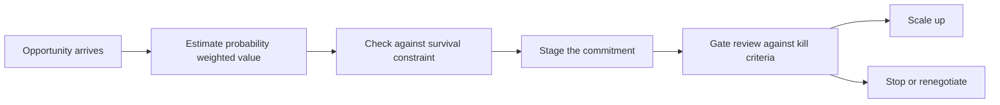

# Risk Adjusted Decision Making

> **Core skill:** Evaluating opportunities with expected value while protecting the downside — because an independent who runs out of business cannot take the next bet.

## Why This Matters

Independents face a stream of asymmetric-looking opportunities: a large fixed-price project with a vague spec, an equity-for-work startup engagement, a product bet that could pay for itself in a year. Untrained judgment evaluates these by their upside — the number quoted in the meeting — and treats uncertainty as a detail. Risk-adjusted thinking evaluates them by probability-weighted value and, critically, by what happens if they go wrong. The independent's portfolio of one has no diversification to absorb a bad year.

Expected value is the first tool: multiply each outcome by its probability and sum. It immediately exposes offers that are exciting but thin. But expected value alone recommends bets that a firm of one cannot survive — a 60 percent chance of a great year and a 40 percent chance of personal insolvency has a fine average and an unacceptable tail. So the second tool is the survival constraint: never risk what you need for what you do not need, prefer reversible commitments, and stage large bets so a failure costs a fraction rather than everything.

The discipline extends to portfolio design. Anchor work — reliable, lower-margin engagements — pays the baseline and buys the right to take bets. Bets — higher-value, higher-uncertainty plays — create the upside. A healthy independent year sets a deliberate ratio between them, reviews it quarterly, and does not let either type silently crowd out the other.

## Expected Value for a Firm of One

| Opportunity | Value If Won | Probability | Expected Value | Time Cost | Notes |
|-------------|--------------|-------------|----------------|-----------|-------|
| Anchor retainer renewal | 300,000 | 90 percent | 270,000 | Moderate | Predictable; low variance |
| Large fixed-price project | 800,000 | 50 percent | 400,000 | High, concentrated | Estimation risk; cash timing risk |
| Product bet phase | 600,000 potential | 30 percent | 180,000 | High, deferred | Long payback; learning value |

The large project wins on expected value and still deserves scrutiny: a 50 percent miss rate on your only major engagement is a coin flip on the year, and the time cost is the same in the losing case as in the winning one. Add the time dimension and the ranking can reverse.

## The Survival Constraint

| Rule | Why It Protects the Firm | In Practice |
|------|--------------------------|-------------|
| Never bet the firm | A single catastrophic loss ends the game, not the round | Cap any single exposure near a tenth of reserves |
| Stage commitments | Real information arrives cheaply in small steps | Paid discovery, phased pilots, kill criteria before start |
| Prefer reversible moves | Reversibility is worth paying for | Month-to-month over annual; trial before platform |
| Price in the downside | The losing case has a cost too | Check the plan survives the worst realistic case |
| Keep the option value of cash | Reserves buy the next, better opportunity | Cash hoarded for fear is one error; cash bet away is another |

## The Opportunity Scorecard

Weight the criteria once; score opportunities against them; discuss any score that surprises you.

| Criterion | Weight | Score Questions |
|-----------|--------|-----------------|
| Strategic fit | 20 percent | Does it build toward the position you want? |
| Near-term cash | 20 percent | When does money actually arrive and how certain is it? |
| Margin | 15 percent | After true costs, does it clear the minimum rate? |
| Risk of nonpayment | 15 percent | Client history, contract terms, deposit offered |
| Relationship and referral value | 10 percent | Could this become recurring revenue or a reference? |
| Learning and option value | 10 percent | Does it open doors worth more than its price? |
| Time cost and opportunity cost | 10 percent | What is displaced, and is this the best use of those weeks? |

## Staging and Kill Criteria

A staged commitment turns one large risk into a series of small, informative ones. Every stage has a spend gate and a stop condition written in advance — before the sunk cost makes stopping feel like failure.

| Stage | Commitment | Gate to Continue | Kill Condition |
|-------|------------|------------------|----------------|
| Paid discovery | Days of scoped analysis | Scope and estimate hold together | Spec remains unresolvable |
| Pilot phase | Small fixed delivery | Stakeholder adopts the work | Usage or acceptance absent |
| Phase one | Core build with milestones | Milestones hit and invoices paid | Payment terms breached |
| Scale | Full engagement or investment | Unit economics or outcomes proven | Evidence contradicts the thesis |



## Practical Applications

```markdown
## Opportunity Scorecard
- Opportunity and client:
- Size, timing, and probability of payment:
- Worst realistic case and its cost:
- Exposure as a share of reserves:
- Strategic fit score:
- Time cost in weeks and what it displaces:
- Stage plan with gates:
- Kill criteria written in advance:
- Decision and review date:
```

## Common Pitfalls

| Pitfall | Why It Is a Problem | Better Approach |
|---------|---------------------|-----------------|
| **Expected value worship** | A great average can still conceal a company-ending tail | Apply the survival constraint after the EV math |
| **Best-case anchoring** | The quoted number becomes the planned number | Plan on the worst realistic case; upside is bonus |
| **Sunk cost continuation** | Money already spent argues for spending more | Kill criteria written before starting, honored after |
| **Ignoring time opportunity cost** | Profitable work can still be the wrong work | Value displaced alternatives in every scorecard |
| **No staged commitments** | Full exposure from day one to unknown work | Paid discovery and pilots before scale |
| **Analysis paralysis** | Endless scoring becomes anxiety, not decision | Decide at the stated deadline with the information present |
| **Taking everything** | Focus and standards erode across too many bets | Keep a deliberate ratio of anchor work to bets |

## Success Indicators

- Decisions cite probability, downside, and exposure — not just the headline value
- Single-opportunity exposure never threatens survival; staging is normal practice
- Kill criteria exist in writing and are actually honored when tripped
- Anchor work and bets maintain a deliberate, reviewed balance
- Declined opportunities are explained by scorecard logic, calmly and without regret

## Related Topics

- [[03_Financial_Planning_for_Solopreneurs]]: reserves are what make survivable risk-taking possible
- [[05_Bootstrapping_vs_Funding]]: funding is a risk-transfer decision judged the same way
- [[06_Unit_Economics_of_Small_Products]]: product bets stand or fall on payback and retention evidence
- [[career-path/03_Staff_Engineer/03_Technical_Strategy/02_Technology_Betting|Technology Betting (Staff)]]: bet sizing and reversibility logic from the staff engineer path
- [[career-path/02_Senior_Software_Engineer/08_Engineering_Economics_and_Trade_Offs/00_overview|Engineering Economics and Trade Offs (Senior)]]: the trade-off foundations applied to business decisions

## Summary

Risk-adjusted decision making combines two instruments: probability-weighted value and a survival constraint that caps exposure, stages commitments, and prefers reversibility. Score opportunities against written criteria, decide at the deadline, and honor kill criteria without letting sunk costs argue. Run anchor work to fund the baseline and deliberate bets to create upside — so that every loss is affordable and every win is still available.

