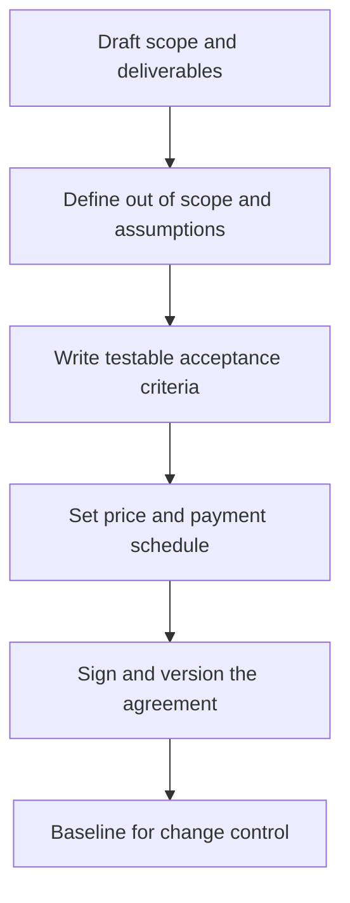

# Statements of Work and Commitments

> **Core skill:** Writing statements of work that make commitments explicit — deliverables, boundaries, assumptions, and acceptance — so delivery begins with shared expectations.

## Why This Matters

A statement of work is the constitution of an engagement. Everything that later becomes a dispute — what was included, what was assumed, what "done" means, who owes what and when — is either settled in the SOW or left to memory, and memory is a losing arbiter. Clients are not adversaries; they are simply differently informed, and a precise document protects both sides from the gaps between those perspectives. The SOW is how a professional relationship starts with a shared map instead of a shared assumption.

The commercial stakes are concrete. Engagements without written commitments drift into scope that was never priced, acceptance that arrives late or never, and payment terms that were "understood" but never defined. Each of these erodes margin quietly and trust loudly. The independent who can point to a signed, specific, line-by-line agreement resolves borderline moments in minutes instead of weeks — and looks organized while doing it, which compounds into referrals.

Writing the SOW is also a design exercise. If you cannot state the deliverables, the out-of-scope, and the acceptance criteria precisely, you do not yet understand the engagement well enough to price it. The drafting process exposes the unknowns while they are still cheap to resolve — before the contract, not after.

## The Anatomy of a Statement of Work

| Section | What It Locks Down | Common Failure |
|---------|--------------------| ---------------|
| Deliverables | Exactly what will be produced, itemized | Lists activities instead of outcomes |
| Scope boundaries | Explicit out-of-scope items | Absent, so everything is implicitly included |
| Assumptions | Conditions the plan depends on | Left in the proposal, dropped from the contract |
| Client responsibilities | Access, decisions, reviews, environments | Unstated, so waiting becomes your problem |
| Acceptance criteria | The testable definition of done per deliverable | Vague, or written after delivery |
| Timeline and milestones | Dates with their dependencies | Dates divorced from client dependencies |
| Price and payment | Amounts, schedule, deposits, expenses | "Payment on completion" with completion undefined |
| Change process | How changes are requested, priced, approved | No clause, so change becomes negotiation |
| IP and confidentiality | Who owns what, who may know what | Assumed rather than assigned |
| Termination | How either side exits, and what is owed | Absent, so exits become disputes |

## Commitment Language

| Weak Phrasing | Why It Fails | Stronger Commitment |
|---------------|--------------|---------------------|
| Best efforts | Unmeasurable; disputes have no test | Deliverables accepted against written criteria |
| Approximately by end of quarter | Approximate is not a date | Dated milestones conditioned on named dependencies |
| Reasonable revisions | Reasonable for whom | Two revision rounds included; further rounds priced |
| Ongoing support as needed | Unlimited obligation in five words | Up to N hours monthly, scoped, at stated rate |
| Final payment on completion | Completion undefined | Payment schedule tied to acceptance events |

## Acceptance Criteria in Practice

Acceptance criteria are the difference between a handshake and a test. Write them with the client in the room, in the SOW, before work starts.

| Vague | Testable |
|-------|----------|
| The site is fast | P95 page load under an agreed threshold on an agreed test profile |
| Data migrated | All records reconcile with zero unresolved discrepancies |
| Reports are correct | Five named reports match source totals for three closed months |
| The system is secure | Agreed checklist passes with no high findings unaddressed |
| Well documented | Runbook covers the named operational scenarios end to end |



## Practical Applications

```markdown
## Statement of Work Skeleton
1. Parties and engagement summary
2. Deliverables, itemized with format and audience
3. Out of scope, explicitly listed
4. Assumptions the plan depends on
5. Client responsibilities and decision owners
6. Acceptance criteria per deliverable
7. Milestones, dates, and dependencies
8. Price, payment schedule, deposits, expenses
9. Change process: request, estimate, approval, invoice
10. IP, confidentiality, data handling
11. Termination and suspension terms
12. Signatures and version date
```

```markdown
## Pre-Signature Checklist
- [ ] Deliverables are outcomes, not activity lists
- [ ] Out-of-scope names everything a reasonable reader might assume
- [ ] Assumptions are numbered so change control can cite them
- [ ] Acceptance criteria are testable by a third party
- [ ] Payment includes a deposit and milestone events
- [ ] The change clause defines how pricing adjustments are approved
- [ ] Client legal and procurement have had a chance to review
- [ ] The signed version number matches what was discussed
```

## Common Pitfalls

| Pitfall | Why It Is a Problem | Better Approach |
|---------|---------------------|-----------------|
| **No out-of-scope section** | Everything imaginable is arguably included | List exclusions explicitly, even the obvious ones |
| **Assumptions left informal** | The plan collapses when a condition fails, with no remedy | Number and contract the assumptions |
| **Acceptance defined late** | "Done" becomes whatever the client says at the end | Agree testable criteria before starting |
| **Vague payment terms** | Invoice disputes and delayed cash | Deposits plus milestone-linked payments |
| **No change clause** | Every adjustment renegotiates the whole deal | A standing process for pricing changes |
| **Over-legal self-drafting** | Home-made contracts miss liability and IP nuance on large deals | Pay a lawyer once for a solid template |

## Success Indicators

- Every engagement begins from a signed, versioned document — no exceptions
- Scope conversations during delivery reference SOW clause numbers calmly
- Acceptance happens on schedule because criteria were testable from day one
- Deposits and milestone payments arrive without chasing
- Clients describe the engagement as well-organized from kickoff

## Related Topics

- [[05_Scope_Change_and_Commercially_Aware_Delivery]]: the change process clause is where this note hands off
- [[02_Project_Planning_for_Solo_Practitioners]]: the plan is built from the SOW, not around it
- [[07_Handover_Engagement_Closure_and_Referrals]]: acceptance criteria define the closure checklist
- [[06_Sales_and_Client_Communication/00_overview|Sales and Client Communication]]: proposals become SOWs through the sales conversation
- [[career-path/13_Project_and_Program_Manager/00_overview|Project and Program Manager]]: formal charter and contract discipline this adapts

## Summary

A statement of work converts good intentions into explicit commitments: itemized deliverables, named exclusions, numbered assumptions, testable acceptance criteria, dated milestones with dependencies, and payment and change processes that leave nothing to memory. Drafting it is also a test of understanding — if the words will not come, the engagement is not yet understood well enough to price. Sign, version, and baseline; the rest of delivery runs on it.

