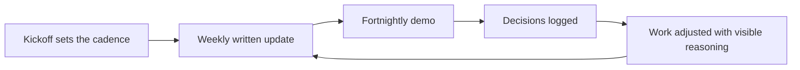

# Client Communication Rhythms

> **Core skill:** Designing a communication cadence — updates, demos, decisions — so clients always know the status and trust stands without being asked for.

## Why This Matters

Clients cannot see your work; they experience your work through communication. The code quality, the clever architecture, the quiet problem-solving — none of it reaches the client directly. What reaches them is a narrated experience: status that arrives on time, surprises that never do, decisions that are easy to make because the context was prepared. A brilliant delivery with silent weeks reads as risk. A steady delivery with transparent weeks reads as control. The rhythm is what clients actually buy.

Silence is the most expensive communication choice an independent can make. When clients go quiet with a vendor, they fill the gap with worst-case assumptions — and their first instinct, often unspoken, is to start managing the risk instead of the project. The discipline is asymmetric: regular updates cost a few minutes a week, while one period of radio silence can cost trust that took months to build. Communicate especially when there is nothing good to say, because that is precisely when the client is most watchful.

A designed rhythm also scales. When the cadence — weekly written update, fortnightly demo, monthly review — lives on the calendar before the engagement starts, communication stops depending on willpower or mood. Bad weeks get reported in the same shape as good ones, which strips bad news of its sting, and decisions accumulate in a log that both sides can cite later.

## The Default Rhythm

| Cadence | Artifact | Purpose | Length |
|---------|----------|---------|--------|
| Weekly | Written update | Status, next steps, blockers, decisions needed | Short and skimmable |
| Fortnightly | Demo or walkthrough | Show working output on real data | 30 to 45 minutes |
| Monthly | Review of budget, scope, and risks | Course correction while it is cheap | One page plus discussion |
| Continuous | Decision log | One-line records of agreed decisions | Appended as they happen |
| As needed | Escalation message | Same-day notice of material risk | Direct and early |
| Per milestone | Invoice with summary | Money and progress arrive together | Predictable |

## The Weekly Update Anatomy

| Section | Content | Rule |
|---------|---------|------|
| Done | What was completed since the last update | Lead with outcomes, not activity |
| Next | What is planned this week | One priority made explicit |
| Blocked | What is waiting on the client or a third party | Name the owner and the date needed |
| Decisions needed | Open questions requiring client input | Each with a recommendation attached |
| Budget and scope meter | Progress against money spent | No surprises at the invoice |
| Risks | Anything trending badly, with mitigation | Surface early even if mild |

## Communicating Bad News

| Principle | Wrong Way | Right Way |
|-----------|-----------|-----------|
| Surface early | Wait, hoping it resolves itself | Report the moment the trend is real |
| Lead with impact | Bury it in paragraph four | First line states the effect on date, cost, or scope |
| Bring options | Present a problem and stop | Present two or three paths with trade-offs |
| Own it plainly | Defensive or over-apologetic framing | State the cause, the fix, and what changes |
| One message | Fragmented hints across days | A single clear message, then follow-up cadence |

Demos deserve the same discipline. A demo is not a victory lap; it is a decision mechanism — show working software on the client's data, list known limitations honestly, and end with the specific decisions you need. Clients who feel the demos are honest stop auditing the work behind them.



## Practical Applications

```markdown
## Weekly Client Update Template
- **Done:** three to five outcomes, newest first
- **Next:** the single priority plus supporting work
- **Blocked:** item, owner, date needed
- **Decisions needed:** question, options, your recommendation
- **Budget and scope:** percent complete against percent of budget used
- **Risks:** trend, impact if unchanged, mitigation in motion

## Communication Setup at Kickoff
- [ ] Cadences agreed and calendared: weekly update, demo, review
- [ ] Channel chosen per cadence: email for updates, call for demos
- [ ] Decision log started and shared
- [ ] Escalation rules agreed: what warrants a same-day call
- [ ] Client-side decision owner named for each open question
```

## Common Pitfalls

| Pitfall | Why It Is a Problem | Better Approach |
|---------|---------------------|-----------------|
| **Silence when behind** | Clients assume the worst and start managing around you | Updates are most valuable precisely then |
| **Burying bad news** | Trust collapses harder when discovered than when reported | Impact first, then options, then fix |
| **Noise instead of signal** | Daily detail trains clients to ignore updates | Weekly short beats daily long |
| **Ad hoc communication only** | Rhythm depends on your memory in busy weeks | Cadences on the calendar before kickoff |
| **Assuming documents were read** | Decisions stall while specs sit unread | Summarize the ask in the update itself |
| **Status optimism in writing** | "Done" means done; untested claims find their witness | Report delivered and verified separately |

## Success Indicators

- Clients never need to ask where things stand; the update arrives first
- Bad news travels early and arrives with options attached
- Decisions are recorded in a log that both sides cite without dispute
- Demos become the primary requirements channel, naturally and ahead of scope drift
- Clients forward your updates internally without editing them

## Related Topics

- [[01_Statements_of_Work_and_Commitments]]: the SOW defines what the updates report against
- [[04_Managing_Multiple_Clients]]: the same rhythm design applied across a portfolio
- [[07_Handover_Engagement_Closure_and_Referrals]]: communication quality at closure becomes testimonial language
- [[06_Sales_and_Client_Communication/00_overview|Sales and Client Communication]]: the relationship and trust skills this rhythm operationalizes
- [[career-path/12_Technical_Program_Manager/00_overview|Technical Program Manager]]: status and stakeholder craft adapted for a solo practice

## Summary

Clients experience delivery through communication, so design the rhythm deliberately: weekly written updates with a fixed anatomy, fortnightly demos on real data, monthly reviews, a running decision log, and bad news delivered early, impact-first, with options. Silence is the one choice that always costs more than it saves. A cadence that lives on the calendar turns trust from a personality trait into a system.

