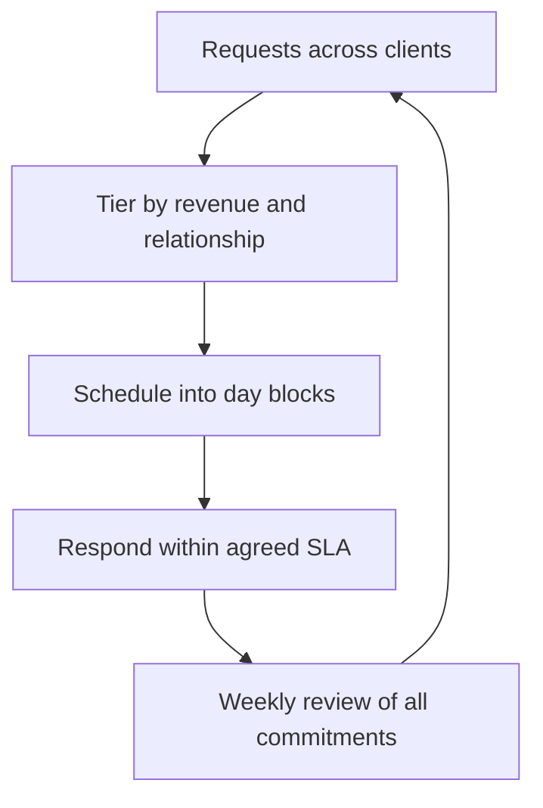

# Managing Multiple Clients

> **Core skill:** Running several client relationships in parallel without dropping commitments — capacity math, scheduling discipline, and honest prioritization.

## Why This Matters

Multiple clients are the independent's diversification: one client ending is an inconvenience, not a crisis, and two or three revenue streams make the whole practice calmer. But multiplicity has a cost that solo practitioners persistently underestimate — context switching. Moving between clients means reloading context, re-entering different codebases and vocabularies, and paying a mental setup tax every time. The invoice shows the hours worked; it never shows the hours spent becoming productive again.

The failure pattern of the over-committed independent is well-worn: capacity is sold at one hundred percent, the first overrun consumes the buffer, the buffer was the only slack available, and from then on every week is a debt repayment to the last one. Quality slips quietly, replies slow, and eventually a client who paid for attention receives leftovers. The fix is not heroism; it is arithmetic — knowing how many engagements of which type actually fit in one person's week, and enforcing that number regardless of how attractive the next yes looks.

Managing several clients well is mostly a design problem, and its centerpiece is scheduling. Fixed days per client beat fluid triage because they convert prioritization from a daily emotional exercise into a calendar fact. With days assigned, tiers defined, and response expectations agreed, the daily chaos narrows to genuine exceptions — and exceptions are exactly where judgment should be spent.

## Capacity Math

| Engagement Type | Realistic Concurrent Count | Weekly Shape | Notes |
|-----------------|----------------------------|--------------|-------|
| Deep build project | 1, at most 2 short ones | Three to four days on the main build | Context switching is brutally expensive here |
| Advisory retainer | 3 to 5 | Fixed hours per week each | Works because the mode and stack are shared |
| Support retainer | 3 to 5 | Morning triage blocks | Interrupt-driven; keep the load light |
| Product development on your own | 1 plus limited client work | Evenings or one dedicated day | Only sustainable with strict time boxing |
| Sales and admin | Always present | Half to one day per week | Never zero; plan for it every week |

The rule above the table: keep total commitments at seventy to eighty percent of capacity. The last fifth is not free time — it is the shock absorber that makes the other four-fifths reliable.

## The Weekly Architecture

| Day | Morning | Afternoon | Purpose |
|-----|---------|-----------|---------|
| Monday | Client A deep work | Client A deep work | Protect the week's largest deliverable |
| Tuesday | Client A deep work | Client B meetings and reviews | Alternate attention before midweek |
| Wednesday | Client B deep work | Client B deep work | Second deep block |
| Thursday | Client C or overflow | Demos and calls | Client-facing day |
| Friday | Admin, invoicing, sales | Buffer and plan next week | Absorb overruns before they compound |

Day blocking beats task juggling. Two clients in one afternoon costs more than the same work done in two calm mornings, and the schedule makes the cost visible before it is paid.

## Client Tiering and Response Expectations

| Tier | Definition | Attention Level | Response Expectation |
|------|------------|-----------------|----------------------|
| Anchor | A major share of revenue or strategic importance | Highest; protected calendar time | Same business day |
| Regular | Steady recurring or retainer work | Standard; scheduled blocks | Within one business day |
| Support | Ad hoc or small-scope relationships | Batched; weekly slots | Within two business days |
| Prospect | Potential future work | Scheduled selling time only | When substantive |

Tiers are agreements, not secrets. Clients told honestly that replies come within one business day get one-business-day replies and stay satisfied; clients promised same-hour responses eventually get neither responses nor honesty.

## Prioritization When Everything Is Urgent

| Situation | Decision Rule | Communication Move |
|-----------|---------------|--------------------|
| Two deadlines collide | Deadline fixed by external event wins | Inform both clients early, offer options |
| Anchor versus regular conflict | Anchor wins, but only after honest disclosure | "Tuesday for X or Wednesday for Y — your call" |
| Emergency in a support tier | Time-box triage now, full fix at its slot | Acknowledge within the SLA, cap the first response |
| Overrun consuming the buffer | Cut scope or move a date immediately | Same-week plan revision, not month-end apology |
| New client versus current commitments | Current commitments win until capacity is genuinely free | Decline or schedule start honestly |



## Practical Applications

```markdown
## Weekly Multi-Client Plan
- [ ] List every commitment due this week with client and tier
- [ ] Assign each to its day block; no client appears unnamed
- [ ] Reserve Friday for admin, buffer, and next-week planning
- [ ] Confirm any collisions are communicated before they hurt
- [ ] Total sold capacity under 80 percent, verified on paper

## Context Switch Discipline
- [ ] Each client has a running notes file: state, decisions, next actions
- [ ] Switch points are scheduled, not reactive
- [ ] Same-stack work batched where possible
- [ ] End each client block by writing the restart point
```

## Common Pitfalls

| Pitfall | Why It Is a Problem | Better Approach |
|---------|---------------------|-----------------|
| **First-come-first-served service** | The loudest client starves the most important one | Tier-based rules decided in advance |
| **No response expectations set** | Every client believes they are the priority | Publish SLAs per tier at kickoff |
| **Overbooking past capacity** | The buffer was the only shock absorber | Cap commitments at 70 to 80 percent |
| **Letting the loudest client dominate** | Revenue concentration drifts silently | Track attention and revenue per client monthly |
| **Unscheduled context switching** | Productivity bleeds invisibly | Day blocks with written restart points |
| **No admin and buffer day** | Sales and invoicing get squeezed into weekends | Protect Friday explicitly |

## Success Indicators

- Every client's weekly commitments are visible in one plan, none dropped
- Missed deadlines are rare, small, and communicated before they land
- Clients accept queueing because expectations were set openly
- Fridays absorb overruns instead of starting a new debt
- Revenue and attention per client stay within deliberate balance

## Related Topics

- [[02_Project_Planning_for_Solo_Practitioners]]: capacity arithmetic per project feeds the portfolio view
- [[03_Client_Communication_Rhythms]]: the tier SLAs extend the rhythm design across clients
- [[05_Scope_Change_and_Commercially_Aware_Delivery]]: changes at one client consume the shared buffer
- [[career-path/12_Technical_Program_Manager/00_overview|Technical Program Manager]]: multi-track coordination adapted to a single pair of hands
- [[career-path/13_Project_and_Program_Manager/00_overview|Project and Program Manager]]: resource and schedule discipline in solo form

## Summary

Multiple clients are diversification bought with context-switching costs. Pay the price deliberately: compute how many engagements of each type truly fit, schedule by day blocks rather than fluid triage, set and publish response expectations per tier, and keep commitments under eighty percent of capacity so the buffer stays real. Prioritization then becomes a rulebook applied to exceptions — which is where judgment belongs.

