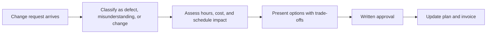

# Scope Change and Commercially Aware Delivery

> **Core skill:** Handling change requests with commercial clarity — protecting margin and relationship together while keeping delivery honest.

## Why This Matters

Change is not an anomaly in technical engagements; it is the normal weather. Clients learn what they want by seeing what they get, priorities move, environments shift, and the best requirements arrive mid-demo. An independent who treats every change as an imposition lives in constant conflict; one who absorbs every change to be agreeable watches margin dissolve silently. The professional posture is a third path: treat change as a process, run it warmly, and price it exactly.

The commercial heart of delivery is a simple awareness: every day of work has a cost, and unlogged favors are discounts. The first small favor feels generous; by the tenth, the relationship has a subtle imbalance — the client believes responsiveness is included, the independent resents the growing gap, and nobody said anything at the point where saying something was easy. Change discipline is how both sides stay honest, and the clients who appreciate it most are the ones who have been burned by vendors who hid the same arithmetic until the invoice.

Handled well, change requests are also an opportunity. They are where extra margin, deeper engagement, and the client's discovery of your value beyond the original scope all happen. The skill is making the process habitual from day one: classify, estimate, present options, get written approval, update the plan — a sequence short enough to run without drama and firm enough to protect the year.

## Classify Before You Respond

| Change Type | What It Is | Correct Response |
|-------------|------------|------------------|
| Defect | The delivered work does not meet agreed criteria | Fix within the support window at no charge |
| Misunderstanding | A requirement was ambiguous; both interpretations are reasonable | Clarify, decide together, negotiate if it changes cost |
| New requirement | Genuinely new scope, nothing broken | Change order with impact and price |
| Environment change | A third party changed platform, API, or dependency | Reference the SOW's assumptions and address commercially |
| Enhancement | Nice-to-have improvement, not required for acceptance | Backlog as future work with its own quote |

Most disputes are not about price; they are about misclassification. A defect treated as a change order insults the client; a new requirement absorbed as a defect quietly taxes you.

## Change Order Mechanics

| Step | Artifact | Outcome |
|------|----------|---------|
| 1. Log the request | One line in the register with date and requester | Nothing disappears into a call |
| 2. Assess impact | Hours, cost, schedule effect, risk | The real number, not the polite one |
| 3. Present options | Do now, do later, swap, decline | Client chooses among paths |
| 4. Get written approval | Email confirmation or signed note | A shared record of the decision |
| 5. Update plan and invoice | Revised schedule and billing | No retroactive surprises |

## The Swap Principle

Every addition displaces something: time, money, or scope. Present the three dials explicitly and let the client turn one.

| Client Says | Your Response Frame |
|-------------|---------------------|
| "Can we also add this small thing?" | "Yes — it is about two days. Add to the end, swap for part of milestone three, or hold for phase two?" |
| "The demo suggested more, make it like this" | "That is a valid direction. Here is the impact; want to trade it against the current priority?" |
| "Budget is fixed but priorities changed" | "Same budget, then: what comes out to let this in?" |
| "Just a quick change, surely" | "Everything is quick to ask and real to build. This one is roughly a day; where should it go?" |

## Margin Warning Signs

| Symptom | What It Signals | Correction |
|---------|-----------------|------------|
| Small favors not logged for weeks | Invisible discount compounding | Bank reconciliations of hours; weekly change register review |
| Repeated "quick calls" | Unbilled advisory crowding delivery | Office hours as a scoped, priced arrangement |
| Demo suggestions flowing straight into scope | Requirements arriving through the back door | Every demo output classified; changes get change orders |
| Discount creep on amendments | Price anchoring downward | Hold the rate card; negotiate scope instead |
| Every tiny impact assessment done free | Analysis given away | A threshold below which a small standard fee applies |



## Practical Applications

```markdown
## Change Order Template
- Request and requester:
- Date received and classification:
- Impact: hours, cost, schedule, risk:
- Options offered: add now, defer, swap, decline
- Client decision and date:
- Written approval reference:
- Plan and invoice updates:

## Delivery Without Margin Leakage
- [ ] Change register reviewed weekly against hours worked
- [ ] Every verbal request confirmed in writing the same day
- [ ] Demo outputs classified before the next planning step
- [ ] Free-fix window for defects defined and respected
- [ ] Fixed-price engagements carry explicit contingency, not hope
```

## Common Pitfalls

| Pitfall | Why It Is a Problem | Better Approach |
|---------|---------------------|-----------------|
| **Absorbing small changes to be nice** | A thousand small favors quietly exceed the margin | Run the process every time; warmth and rigor coexist |
| **Verbal approvals** | Change happens but the paper trail says it never did | Confirm every decision in writing the same day |
| **Impact analysis given away without limit** | Hours of free consulting before any decision | Small standard fee or a capped assessment |
| **Change framed as conflict** | Clients resist a process that feels adversarial | Normalize change orders from kickoff as routine |
| **Batching surprises to the invoice** | The client experiences retroactive charges as a betrayal | Show the register at every review |
| **Contingency consumed silently** | Fixed-price deals turn unprofitable with no discussion | Track contingency burn and raise a flag at half |

## Success Indicators

- No unlogged change exists on any active engagement
- Fixed-price margins hold within a few points of plan
- Clients describe the change process as fair and fast
- Change orders are approved before work starts, without friction
- Contingency burn on fixed-price work is visible and managed weekly

## Related Topics

- [[01_Statements_of_Work_and_Commitments]]: the change clause is the anchor this process cites
- [[02_Project_Planning_for_Solo_Practitioners]]: changes consume the buffer the plan reserved
- [[04_Managing_Multiple_Clients]]: changes at one client ripple across the shared calendar
- [[07_Handover_Engagement_Closure_and_Referrals]]: an honest change record makes closure clean
- [[career-path/13_Project_and_Program_Manager/00_overview|Project and Program Manager]]: formal change control translated for a solo practice

## Summary

Scope change is normal weather, and the response is a warm, habitual process: classify each request, assess the real impact, present options — add, defer, swap, decline — and get written approval before work continues. Every unlogged favor is an invisible discount; every logged change is a chance to demonstrate value. Keep the change register visible, watch contingency burn, and let margin survive with the relationship intact.

