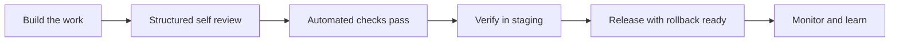

# Quality Without a Safety Net

> **Core skill:** Holding a professional quality bar when nobody reviews your work — building self-review, automation, and standards into solo delivery.

## Why This Matters

In a team, quality arrives through a net of mechanisms: code review, QA, release engineering, on-call peers, and the ambient accountability of people who will see your work tomorrow. Solo, every one of those mechanisms is gone, and the net that catches defects is the same person who wrote them. This is the structural risk of independent technical work: not a lack of skill, but the absence of friction — nobody to notice the shortcut, nobody to ask the question you did not think to ask, nobody whose presence changes your behavior before the release button.

The compensating discipline is to internalize the net as process. Self-review with structure instead of a glance. Automated checks that function as the tireless reviewer you cannot hire. Explicit quality gates before every demo, release, and handover. And a clear-eyed boundary for the work that genuinely requires a second pair of eyes — payments, security-sensitive systems, regulated data — where the professional answer is to buy the review, partner on it, or decline. Knowing the limit is itself a quality practice.

Quality is also the commercial engine of a solo practice. There is no brand department; your reputation is the entire marketing budget, and it is built from the defects clients never see. Every unreviewed shortcut that escapes into a client system is a future support burden, a damaged reference, and a referral that never happens. The quality bar is not craftsmanship for its own sake — it is the marketing strategy.

## What the Safety Net Used to Provide

| Mechanism | In a Team | Solo Substitute |
|-----------|-----------|-----------------|
| Code review | A colleague reads every change | Structured self-review plus paid review for critical paths |
| QA function | Dedicated testers between build and release | Automated test suites and acceptance checklists |
| Release engineering | Release managers and rollback procedures | CI pipelines, staged releases, rehearsal on staging |
| On-call peers | Someone to help at 2 a.m. | Monitoring, alerting, runbooks written before they are needed |
| Second opinions | Hallway architecture debates | A journal, a mentor, a paid specialist at decision points |

## The Self-Review Ritual

| Step | Rule | Why It Works |
|------|------|--------------|
| Read the diff | Every change, in full, before it leaves your hands | Fresh eyes are impossible on unread code |
| Run the checklist | A written list for the task type, checked off | Memory is the weakest gate; lists are the strongest |
| Test the change | Including the failure and edge paths | Tests are documentation of intent |
| Sleep on risky changes | High-consequence changes wait one day | Tomorrow-you catches what today-you cannot |
| Verify in staging | In an environment that resembles production | "Works on my machine" is not a status |
| Record known limits | Honest notes on what is untested or unfinished | Clients respect stated bounds; silence invites assumptions |

## Quality Gates

| Gate | Checklist Focus | Fail Action |
|------|-----------------|-------------|
| Before demo | Works on their data; known limits listed; script rehearsed | Demo as progress, not as finished claim |
| Before release | Tests green; rollback ready; backups current; monitoring live | Do not release; fix or delay with notice |
| Before handover | Docs complete; access inventory; acceptance criteria verified | Handover is a deliverable, not a formality |

## Automation as Your Reviewer

| Risk | Automated Control |
|------|-------------------|
| Regressions in core behavior | Test suites run in CI on every push |
| Style and obvious defects | Linters, formatters, type checks as blocking gates |
| Integration surprises | Contract tests against real client interfaces |
| Silent production failures | Monitoring, alerting, log review rituals |
| Data loss | Automated backups with periodic restore drills |
| Configuration drift | Infrastructure as code and documented environments |



## Practical Applications

```markdown
## Pre-Release Quality Gate
- [ ] Full diff read end to end
- [ ] Task-type checklist completed and dated
- [ ] Automated tests green, including edge cases
- [ ] Failure paths exercised manually where automation is thin
- [ ] Backup taken and restore path verified this quarter
- [ ] Rollback plan written in one paragraph
- [ ] Monitoring and alerts confirmed for the new behavior
- [ ] Known limitations documented for the client

## When a Second Set of Eyes Is Required
- [ ] Payments, authentication, or personal data involved
- [ ] Regulated or safety-adjacent systems
- [ ] One-way migrations or destructive operations
- [ ] Anything you would be nervous to see in a postmortem
- [ ] Decision: buy a review, partner, or decline the work
```

## Common Pitfalls

| Pitfall | Why It Is a Problem | Better Approach |
|---------|---------------------|-----------------|
| **Rubber-stamp self-review** | Reading for confirmation, not for defects | A checklist that forces reading every diff |
| **Skipping tests under deadline** | The shortcut is repaid with interest in production | The test suite is a gate, not a suggestion |
| **Client as QA** | Defects discovered by the customer burn trust twice | Verify before demo, without exception |
| **No rollback plan** | A bad release becomes an incident with no exit | Rollback rehearsed before shipping |
| **"Temporary" quality debt** | Temporary is the longest-lasting kind | Record and schedule the follow-up at creation |
| **Heroics in production** | Debugging live without observation tools | Monitor and reproduce; fix with the data |

## Success Indicators

- Defects reaching clients are rare, small, and handled without drama
- Every release has a rollback path and the knowledge that it works
- Known limitations are documented and disclosed rather than discovered
- Risky categories trigger a review partner, a paid review, or a polite decline
- Clients describe your systems as solid, calm, and well documented

## Related Topics

- [[02_Project_Planning_for_Solo_Practitioners]]: review time is planned capacity like any other work
- [[05_Scope_Change_and_Commercially_Aware_Delivery]]: quality defects and change orders must be classified honestly
- [[07_Handover_Engagement_Closure_and_Referrals]]: documentation quality dictates the handover experience
- [[career-path/02_Senior_Software_Engineer/08_Engineering_Economics_and_Trade_Offs/00_overview|Engineering Economics and Trade Offs (Senior)]]: quality investment trade-offs at the craft level
- [[07_Governance_Risk_and_Continuity/00_overview|Governance, Risk and Continuity]]: security and compliance obligations raise the quality bar further

## Summary

Without a team's safety net, quality must be manufactured deliberately: structured self-review, automated checks acting as a tireless reviewer, explicit gates before demo, release, and handover, and honest boundaries for work that needs a second professional pair of eyes. The bar you hold when nobody is watching is not just craft — it is the entire marketing engine of a solo practice, paid in referrals that defects would have prevented.

