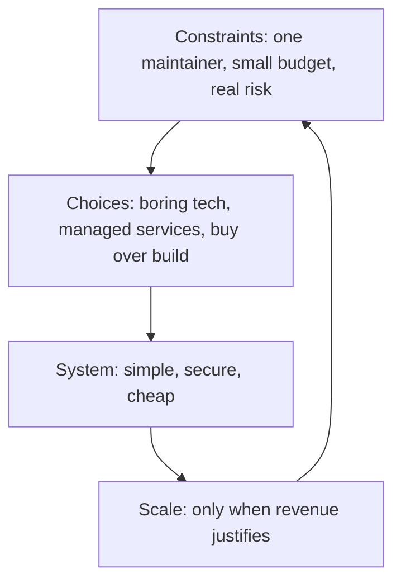

# Architecture for Independents

> **Core capability:** The independent builds systems appropriate for current and future constraints — sized for one maintainer, cheap to operate, secure by default, and honest about when not to build.

## Why This Matters

Independents do not have platforms teams, SRE rotations, or security departments. Every architecture decision lands on the same pair of shoulders that sells, delivers, and administrates. The constraint changes the calculus: the best technology for a solo business is often the most boring one — managed services over self-hosted, monoliths over microservices, and buying over building wherever differentiation is absent.

The architecture skill remains essential: choosing what to build, sizing it correctly, protecting client data, controlling costs, and knowing the scale at which today's simple system must evolve. Done well, an independent's architecture is invisible — the system just works, cheaply, while the business grows.

## Topics in This Capability Area

| Topic | Core Skill | When It Matters |
|-------|------------|-----------------|
| [[01_Right_Sized_Architecture]] | Designing systems for one maintainer | Every project; every product |
| [[02_Reusability_and_Multi_Client_Assets]] | Deciding when to build reusable assets across clients | After a few engagements |
| [[03_Technology_Selection_for_Solo_Builders]] | Boring technology, managed services, low ops burden | Every build decision |
| [[04_Security_and_Privacy_Basics]] | Doing client data protection properly at small scale | Every system with data |
| [[05_Cost_Aware_Infrastructure]] | Infrastructure cost control for small budgets | Continuous; every architecture choice |
| [[06_Scaling_Decisions_with_Limited_Resources]] | When to scale architecture, when to stay small | Growth moments |
| [[07_Maintaining_Systems_You_Sold]] | Maintenance as a business line: support tiers and health | Post-delivery; recurring revenue |

## The Solo Constraint Model

Every architecture decision is tested against the constraints before preference.

## Practical Applications

### Independent Architecture Checklist

- [ ] The system can be operated and maintained by one person on a bad week
- [ ] Technology choices are boring, documented, and replaceable
- [ ] Client data protection is proportionate and real (encryption, access control, backups)
- [ ] Monthly infrastructure costs are known and bounded
- [ ] Support and maintenance terms are defined for anything sold

## Common Pitfalls

| Pitfall | Why It Is a Problem | Better Approach |
|---------|---------------------|-----------------|
| **Resume-driven architecture** | Complex stacks nobody pays for; maintenance burden | Boring tech that you can operate alone |
| **Premature scaling** | Kubernetes for 40 users | Scale when revenue demands, not before |
| **Security as a checkbox** | A breach can end an independent business | Proportional, real protections from day one |
| **Free forever maintenance** | Sold systems become unpaid work | Support tiers and maintenance contracts |

## Success Indicators

- Systems run for months without attention
- Infrastructure costs stay within a planned budget
- No security incidents or data scares
- Maintenance is a priced line item, not a favor

## Related Capabilities

- [[03_Business_Case_and_Economics/00_overview|Business Case and Economics]]: architecture choices are economic choices
- [[04_Delivery_and_Client_Management/00_overview|Delivery and Client Management]]: maintenance as ongoing engagement
- [[career-path/06_Software_Architect/07_Operations_and_Infrastructure_Architecture/00_overview|Operations and Infrastructure Architecture (Architect)]]: the architecture discipline this scales down
- [[career-path/07_SRE_and_Platform_Engineer/00_overview|SRE and Platform Engineer]]: operations depth reference

## Summary

Architecture for independents is constraint-driven design: sized for one maintainer, boring by default, secure proportionately, cheap to run, and sold with maintenance terms. The best independent architecture is the one that never demands attention while the business sells.