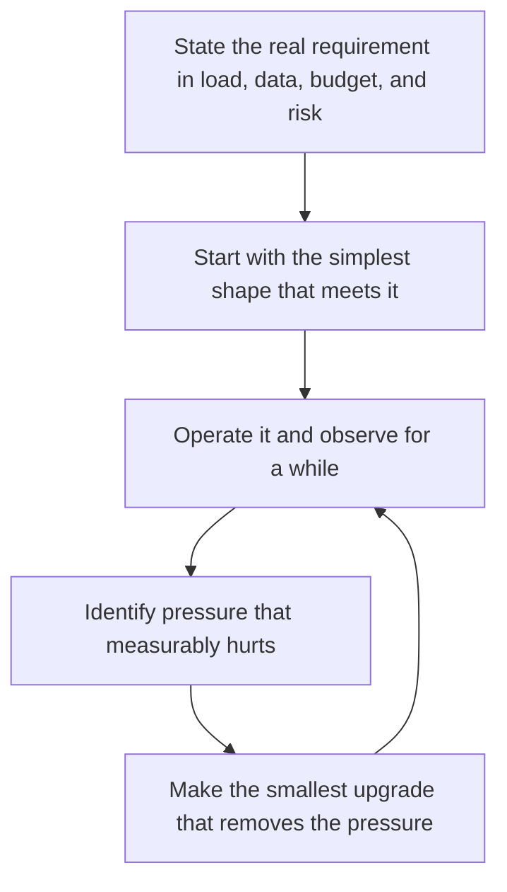

# Right Sized Architecture

> **Core skill:** The independent sizes every system for the life it will actually have — one maintainer, a small budget, and real users — adding complexity only when measured pressure demands it.

## Why This Matters

Employed engineers design inside an organization that absorbs the costs of excess: platforms teams run the infrastructure, budgets hide the overprovisioning, and colleagues share the burden of complexity. An independent inherits all three costs personally. Enterprise patterns applied naively — a Kubernetes cluster for one application, a microservice fleet with no one to page for it, a data platform for a few million rows — become a millstone that consumes the exact hours the business needs for selling and delivering.

Right sizing is not doing less craft; it is aiming the craft at reality. The system needs to handle the load it has, be understood by the person who maintains it, and cost meaningfully less than it earns. Every component beyond that line is a liability: another upgrade treadmill, another failure mode, another thing to explain at 2 AM. The right sized system is the cheapest one that meets the real requirement with margin — and it is usually far smaller than the engineer's instincts suggest.

The discipline follows a simple loop: start from the simplest shape that works, operate it, observe honestly, and let real pressure — never imagined scale — justify the next increment. Growth becomes a sequence of small, deliberate, reversible upgrades instead of one heroic architecture that guessed wrong about the future.

## The Right Sizing Framework

| Dimension | Commonly Overbuilt | Right Sized for One Maintainer | Signal to Grow |
|-----------|--------------------|--------------------------------|----------------|
| Compute | Container cluster with orchestration | Single deployable unit on a managed runtime | Sustained saturation or availability demands |
| Architecture | Microservices and a message fabric | Modular monolith with clean internal boundaries | Team growth or a genuinely independent workload |
| Data | Distributed store with replicas and sharding | One managed database with backups and a read path | Measured read or availability pressure |
| Environments | Full staging mirror of production | Shared staging or preview environments on demand | A contractual client requirement |
| Tooling | Full observability suite | Uptime checks, error tracking, structured logs | Repeated blind spots during incidents |

## System Shapes for the Solo Builder

| Shape | Typical Use | Wins When | Breaks When |
|-------|-------------|-----------|-------------|
| Static site with a managed backend | Marketing, content, simple apps | Traffic is modest and read heavy | Custom server state or per user processing appears |
| Monolith on a managed platform | Most client web applications | One person deploys and maintains everything | Deploy coordination becomes the bottleneck |
| Serverless functions with managed data | Spiky or intermittent workloads | Idle cost must approach zero | Long running processing or provider limits bind |
| Small set of services | Distinct workloads with different scaling or trust needs | Boundaries are proven and stable | The boundary count exceeds maintenance capacity |

## The Complexity Budget

| Asset | What It Buys | What It Costs | Rule of Thumb |
|-------|--------------|---------------|---------------|
| A new service | Independent scaling or isolation | Another deploy, log stream, and dependency | Add only for a proven boundary |
| A queue | Decoupling and burst absorption | Another failure mode and consumer to run | Add when synchronous calls measurably hurt |
| A cache | Latency and load relief | Invalidation correctness work | Add after measuring, not before |
| A second region | Availability beyond provider outages | Data consistency work and doubled cost | Add when revenue depends on it |
| An abstraction layer | Replaceability | Indirection that one person must learn | Add when a second concrete user exists |

## The Right Sizing Loop



Complexity is admitted in increments, each paid for by evidence, never by anticipation.

## Practical Applications

### Right Sizing Checklist

- [ ] The requirement is written down: users, expected load, data sensitivity, budget
- [ ] The chosen shape is the simplest one that meets the requirement with margin
- [ ] Every component has a named owner — which is always you
- [ ] The system can be fully deployed and recovered from documented steps in one sitting
- [ ] New complexity is admitted only with a recorded signal that justifies it

### Right Sizing Decision Note

```markdown
## Right Sizing Decision — <system or component>

| Field | Value |
|-------|-------|
| Requirement | Current load, expected growth, availability need |
| Chosen shape | Simplest option meeting the requirement |
| Rejected alternatives | What was considered and why it lost |
| Cost of choice | Monthly spend and operational burden |
| Growth trigger | The measured signal that would justify the next increment |
| Review date | When to revisit the decision |
```

## Common Pitfalls

| Pitfall | Why It Is a Problem | Better Approach |
|---------|---------------------|-----------------|
| **Copying enterprise architecture** | Assumes teams, budgets, and platforms the independent does not have | Design for one maintainer first; adopt institutional patterns only under real pressure |
| **Scaling for imagined load** | Complexity arrives years before the users do | Scale on measured signals, not on pitch decks |
| **Resume driven choices** | Novel technology is fun to build and hard to hand over | Boring technology with good documentation wins solo |
| **Premature decomposition** | Microservices multiply operational load for one person | Keep the monolith until a boundary is truly proven |
| **Unbounded environments** | Staging and experimental copies accumulate cost and drift | Ephemeral environments, created on demand and destroyed |
| **No growth trigger defined** | Upgrades happen from anxiety, or never | Record the specific signal that would justify each next step |

## Success Indicators

- The whole system fits in one maintainer's head on a bad week
- Infrastructure bills are a small, predictable share of revenue
- Deploys and recovery use documented, tested steps
- Architecture conversations center on requirements, not novelty
- Every added component can name the pressure it removed

## Related Topics

- [[02_Reusability_and_Multi_Client_Assets]]
- [[03_Technology_Selection_for_Solo_Builders]]
- [[06_Scaling_Decisions_with_Limited_Resources]]
- [[career-path/06_Software_Architect/07_Operations_and_Infrastructure_Architecture/00_overview|Operations and Infrastructure Architecture (Architect)]]

## Summary

Right sized architecture is the independent's version of the craft: the simplest system that meets the real requirement with margin, chosen for one maintainer and operated within a small budget. Complexity is added in measured increments, each justified by evidence and each reversible, because every unneeded component is a liability the business pays for every month — in money, in attention, and in the freedom to say yes to better work.
