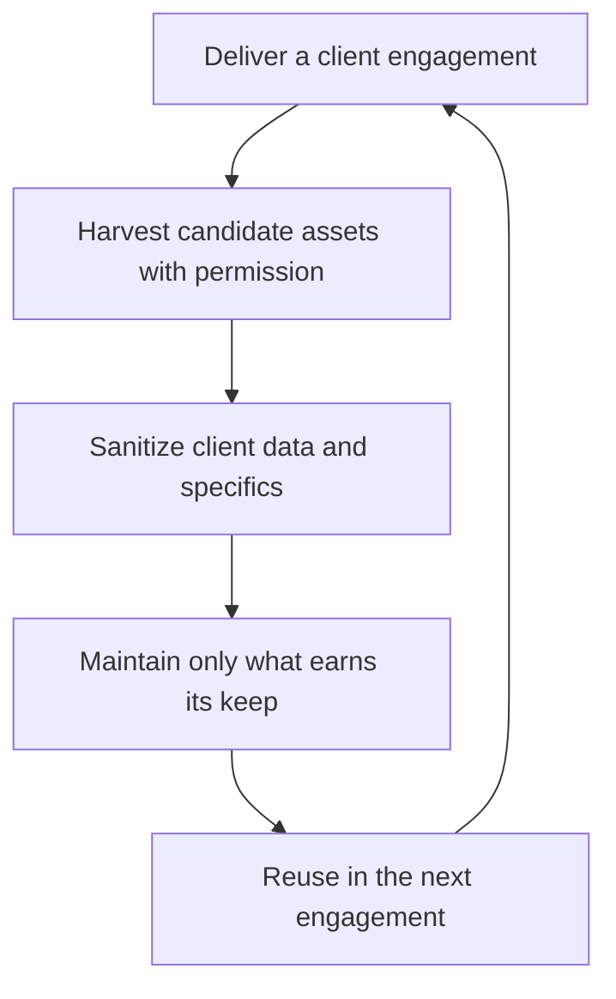

# Reusability and Multi Client Assets

> **Core skill:** The independent decides deliberately when shared assets — templates, libraries, accelerators, and platforms — serve multiple clients profitably, and when reuse would cost fit, ownership clarity, or fresh thinking.

## Why This Matters

Every engagement produces artifacts that could serve the next one: a deployment template, an authentication module, an intake questionnaire, a component library. Reuse is how an independent compounds leverage — the second similar engagement should start further ahead than the first, and the tenth should not rebuild what the third already proved. Without reuse, the business stays a series of disconnected sprints; with it, each project can leave behind an asset that quietly raises the floor for everything after.

Reuse also has a dark side. Assets built for one client's context bias every later solution toward that context; a toolkit applied without judgment turns engagements into assembly of yesterday's answers. And the ownership question is a trust landmine: unless the contract says otherwise, clients often assume that what they paid for is theirs, while the independent assumes the general patterns remain theirs. Ambiguity discovered late — when a client sees something resembling their system in someone else's hands — can cost the relationship entirely.

The practical stance is layered. Invest in reusable assets at the layers clients do not differentiate on — authentication, billing glue, deployment, monitoring, document templates — while keeping client-facing surfaces purpose-built. Harvest deliberately at the end of each engagement, sanitize completely, maintain only what earns its keep, and carry an explicit, plainly stated ownership position in every contract.

## The Reuse Decision Matrix

| Asset Type | Build Cost for Reuse | Payoff per Reuse | Key Risk | Verdict Guide |
|------------|----------------------|------------------|----------|---------------|
| Deployment and operations templates | Moderate | High, every engagement | Drift as platforms change | Build once a third project repeats the pattern |
| Auth and account plumbing | Moderate to high | High | Ongoing security maintenance obligation | Build at the second engagement or later |
| UI component libraries | High | Medium | Client brand and accessibility needs vary | Build only within a focused repeat niche |
| Domain logic modules | High | Low to medium | Overfitting to one client's model | Extract only from proven duplication |
| Document toolkit: proposals, SOWs, checklists | Low | Very high | Staleness and recycling errors | Maintain continuously; review every quarter |
| Full product platforms | Very high | High if productized | Support obligations across clients | Treat as a product with its own budget and roadmap |

## Ownership and Licensing Boundaries

| Asset Kind | Ownership Question | Professional Position | How to Record It |
|------------|--------------------|-----------------------|------------------|
| Client specific deliverables | Usually the client's | Assign on payment, per the contract | The IP clause names the deliverables |
| General purpose internal tools | Usually the independent's | Retain ownership of background and pre existing tooling | Contract carves out background IP explicitly |
| Templates derived from client work | Contested by default | Retain only generic patterns with no client data | Sanitization step before any reuse |
| Open source contributed modules | Public | Company-neutral; license chosen deliberately | Repository license file |
| Data, prompts, and content produced for a client | The client's | Never reuse without written permission | Explicit clause and recorded consent |

## The Productization Ladder

| Level | Description | Investment | When It Makes Sense |
|-------|-------------|------------|---------------------|
| One off project | Bespoke build for a single client | Baseline | The default state |
| Internal template | A sanitized starting point for future builds | Small | After the second similar engagement |
| Internal accelerator | A maintained toolkit with docs and tests | Moderate, recurring | When a repeat niche is proven |
| Paid product | A packaged offering sold independently of your hours | Large | When demand exists beyond your delivery capacity |

Each rung requires more maintenance than the one below it. Climb only when repeat demand is visible, not hoped for — an accelerator nobody reuses is a hobby, and a product nobody maintains is a future incident.

## The Reuse Gravity Loop



Reuse compounds only when the harvesting step is deliberate and the maintenance step is honest.

## Practical Applications

### Multi Client Asset Checklist

- [ ] Contracts define what is client owned and what remains the independent's background IP
- [ ] Every reuse candidate is sanitized of client data and client specific logic
- [ ] Each asset carries a maintenance budget; unused assets are retired
- [ ] The toolkit is documented enough to use after six months away from it
- [ ] Ownership claims are stated plainly to clients before reuse ever comes up

### Asset Harvest Note

```markdown
## Asset Harvest — <engagement name>

| Field | Value |
|-------|-------|
| Candidate | What could be reused |
| Ownership basis | Client owned, background IP, or needs contract review |
| Sanitization needed | Client data, branding, and domain logic to strip |
| Maintenance cost | Estimated recurring effort per year |
| Decision | Keep, generalize, or drop |
| Next review | When to check whether it was actually reused |
```

## Common Pitfalls

| Pitfall | Why It Is a Problem | Better Approach |
|---------|---------------------|-----------------|
| **Silent reuse** | Clients discover their work in another client's system and trust collapses | Disclose the reuse policy in the contract and in conversation |
| **Resume templating** | Every solution looks like the last client's problem | Keep client-facing surfaces purpose built; template only the plumbing |
| **Museum of assets** | Unmaintained templates rot and mislead the next engagement | Retire anything unused for two engagements |
| **Overgeneralizing early** | Abstraction designed for one use case guesses wrong | Extract only from proven duplication |
| **Ignoring third party licenses** | Mixed licenses in reused code create legal exposure | Track every dependency license in shared assets |
| **Free platform work** | A shared platform becomes unpaid infrastructure for every client | Price platform maintenance into retainers and contracts |

## Success Indicators

- Reuse decisions are recorded, and contracts state ownership clearly
- Second similar engagements start faster without feeling templated
- No client has ever been surprised by how their work is reused
- The toolkit stays small and current; dead assets get retired on schedule
- Shared assets are covered by maintenance terms, not absorbed silently

## Related Topics

- [[01_Right_Sized_Architecture]]
- [[07_Maintaining_Systems_You_Sold]]
- [[04_Delivery_and_Client_Management/00_overview|Delivery and Client Management]]
- [[career-path/03_Staff_Engineer/03_Technical_Strategy/00_overview|Technical Strategy (Staff)]]

## Summary

Reusability and multi client assets are how an independent converts experience into leverage: templates, accelerators, and libraries that make each engagement start further ahead. The discipline is choosing what to standardize — plumbing, not client-facing craft — sanitizing anything derived from client work, maintaining only what pays for itself, and stating ownership clearly so reuse never becomes a trust incident.
