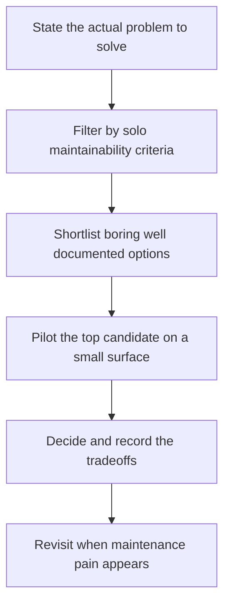

# Technology Selection for Solo Builders

> **Core skill:** The solo builder chooses boring, well-documented, replaceable technology — managed services over self-hosted, mainstream over novel — and treats every choice as a multi-year maintenance commitment made by one person.

## Why This Matters

Every technology choice is a commitment to maintain it, and with no team to absorb the cost, the solo builder pays each choice back in attention for years. Choices that look neutral inside a company become decisive alone: an exotic data store is a research project at 2 AM; a self-hosted service is an on-call rotation of one; a fashionable framework is a migration you will personally perform when it is abandoned. The question is never only what the tool can do — it is what it will cost in upkeep, and whether that cost lands on billable hours or on your evenings.

The selection criteria for one maintainer are easy to state and easy to violate: boring, mainstream, well documented, managed where possible, and easy to replace. The strongest test is handover — could another generalist contractor take over this system within a week, with the documentation you would leave behind? If not, the choice is a trap disguised as progress. This standard protects both the independent and the client, whose system should outlive any single engagement.

There is also a second-order effect: clients and buyers judge durability. Telling a client "this runs on a stack any contractor can pick up" is a sales feature, not a compromise. Maturity, community size, and clear upgrade paths read as professionalism. The independent who picks boring technology is not settling; they are buying down risk with every component.

## Solo Technology Selection Criteria

| Criterion | Question to Ask | Red Flag |
|-----------|-----------------|----------|
| Maintenance load | Can one generalist operate it on a bad week? | Requires specialists to run or debug |
| Documentation and community | Are answers one search away? | Thin docs and a small, inactive community |
| Handover | Could another contractor take over? | Skills tied to one person or one vendor |
| Maturity | Has it survived years of production use? | Frequent breaking changes and rewrites |
| Price shape | Is the cost model predictable? | Surprise billing dimensions and egress math |
| Exit cost | Can data and workloads leave? | Proprietary formats with no export path |
| Security posture | Does it meet the client's baseline? | Unknown maintainers and no advisories |

## Managed Versus Self Hosted

| Factor | Managed Service | Self Hosted | Guidance |
|--------|-----------------|-------------|----------|
| Operations burden | Provider maintains it | You maintain it, forever | Managed by default at solo scale |
| Cost at low scale | Higher unit price, near zero fixed effort | Lower unit price, real fixed effort | Small scale usually favors managed |
| Cost at high scale | Can become expensive at volume | Can become cheaper at volume | Revisit only under measured pressure |
| Control and customization | Constrained by the provider | Complete | Pay the control premium only when required |
| Compliance and data location | Provider dependent | Fully yours | Driven by client obligations and contract |
| Failure handling | Provider runs the incident | You are the incident desk | Weigh your own on-call reality honestly |

## The Boring Technology Policy

| Policy Element | Practice |
|----------------|----------|
| Default rule | Choose the mainstream option unless a specific need disqualifies it |
| Novelty budget | At most one exciting component per system, and only with a named benefit |
| Replaceability | Prefer components that have drop-in substitutes |
| Data durability | Open formats and documented schemas you control |
| Upgrade habit | Small regular upgrades instead of rare big migrations |
| Documentation duty | Every choice records why it won and how it is operated |

## The Selection Funnel



Preference enters the funnel last: the requirement, not the technology, leads.

## Practical Applications

### Technology Selection Checklist

- [ ] The requirement is stated independently of any particular technology
- [ ] At least one boring mainstream option was seriously considered
- [ ] The choice can be operated, upgraded, and debugged by one generalist
- [ ] Managed services were preferred wherever the cost shape allows
- [ ] An exit path exists for data and workloads if the choice is abandoned

### Technology Decision Record

```markdown
## Technology Decision — <component>

| Field | Value |
|-------|-------|
| Decision | What is being selected and where it applies |
| Need it serves | The requirement, stated without naming tools |
| Options considered | Including the boring default |
| Why chosen | Evidence, constraints, and expected maintenance load |
| Operations plan | Who runs it, how it is monitored, upgrade cadence |
| Exit plan | How data and workloads would leave if needed |
```

## Common Pitfalls

| Pitfall | Why It Is a Problem | Better Approach |
|---------|---------------------|-----------------|
| **Novelty as a selling point** | Clients rarely fund your learning curve, yet carry its risk | Sell outcomes on proven stacks; explore on personal time |
| **One exotic choice too many** | Each unusual component multiplies maintenance and hiring risk | Enforce a strict novelty budget per system |
| **Ignoring handover** | An unmaintainable choice traps you and devalues the client's system | Choose what a generalist could take over in a week |
| **Critical path on free tiers** | Terms and limits change; the surprise lands during delivery | Design so the paid upgrade is trivial when it comes |
| **Skipped upgrades forever** | Small version gaps compound into forced migration projects | Build a habit of small, regular updates |
| **Hype cycle adoption** | Early adoption costs are real and solo unpaid | Wait for stability before committing client systems |

## Success Indicators

- Every component in the stack can be defended in one sentence
- Another generalist contractor could take over within a week, with docs
- Upgrades are routine small steps, not annual crises
- No component exists purely to decorate a resume
- Client systems are built on stacks that outlive the engagement

## Related Topics

- [[01_Right_Sized_Architecture]]
- [[04_Security_and_Privacy_Basics]]
- [[05_Cost_Aware_Infrastructure]]
- [[career-path/06_Software_Architect/07_Operations_and_Infrastructure_Architecture/00_overview|Operations and Infrastructure Architecture (Architect)]]

## Summary

Technology selection for solo builders is risk management expressed as taste: boring, mainstream, well-documented components that one person can operate, afford, and hand over. The independent who keeps a strict novelty budget, prefers managed services by default, and records why each choice won builds systems that survive both the client relationship and their own absence — which is exactly what durability means at this scale.
