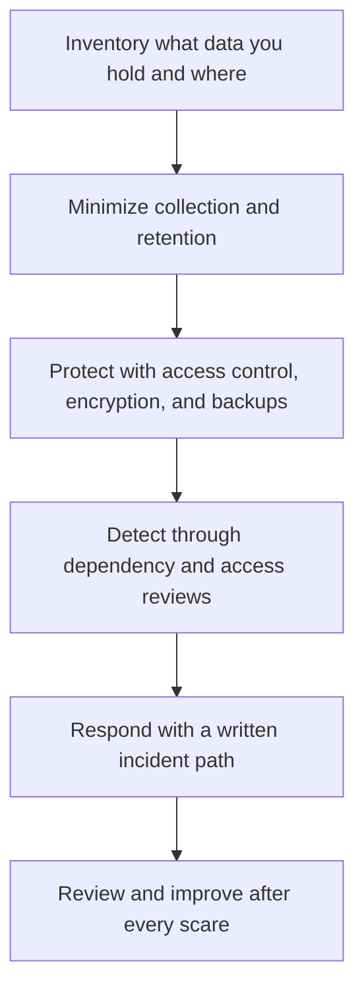

# Security and Privacy Basics

> **Core skill:** The independent applies proportionate, real security — access control, encryption, backups, dependency hygiene, and data minimization — because a single incident can end a one person business in a way it could never end a department.

## Why This Matters

Security for an independent is asymmetric: the effort of prevention is moderate and boring, while the cost of a single incident is existential. There is no security team to catch mistakes, no legal department to absorb a breach, and no employer brand to hide behind while a client's data is exposed. A leaked database or a compromised account does not just end one engagement; it ends the reputation that all future engagements depend on. The point of the security baseline is not to pass an audit — it is to make sure no single bad day becomes a business ending event.

Proportionality is the guiding principle. Most independent work does not need the controls of a bank; it needs the fundamentals done consistently: strong unique credentials with multi factor authentication, least privilege access, encryption in transit and at rest through managed defaults, backups that are actually tested, dependencies that get patched, and data that is collected only when there is a reason. These are conventions and habits more than technologies, and they are achievable by one person with a modest time budget.

Privacy adds a second obligation: not just protecting data, but handling it lawfully and only as agreed. Client data arrives with contractual promises and, depending on jurisdiction and industry, with legal duties attached. The independent needs to know what they hold, why, where it lives, how long it stays, and who can touch it — and must be able to answer those questions to a client's due diligence without improvisation. Where local law specifics matter, qualified local advice — a lawyer or privacy professional — is part of the baseline, not a luxury.

## The Solo Security Baseline

| Layer | Baseline Practice | Why It Carries the Most Weight |
|-------|-------------------|-------------------------------|
| Identity | Unique credentials, multi factor authentication, a password manager | Most breaches start with a credential, not an exploit |
| Access | Least privilege; separate accounts per client; no shared logins | Limits blast radius when something goes wrong |
| Data at rest | Encryption through managed platform defaults; disk encryption | Protects backups and stolen devices |
| Data in transit | TLS everywhere, including internal hops | Prevents interception and tampering |
| Backups | Automated, offsite, restores tested on a schedule | Turns ransomware and mistakes into inconveniences |
| Dependencies | Automated update alerts; patch on a rhythm | The most exploited code is old code |
| Devices | Full disk encryption, screen lock, timely updates | The laptop is often the weakest node |
| Secrets | No secrets in code or chat; a managed secret store | Leaked keys outlive almost every other mistake |

## Data Protection by Engagement Type

| Engagement Scope | Typical Data | Minimum Handling |
|------------------|--------------|------------------|
| Marketing site | Contact form submissions | Encrypt in transit, minimal retention, no third party resale |
| Web application | User accounts, usage data | Access control, hashed credentials, clear retention and deletion |
| Internal tooling | Business records, operational data | Same as application plus strict named access lists |
| Analytics or ML work | Datasets, possibly personal | Minimization, de identification where possible, documented lineage |
| Systems integration | Credentials, tokens, records in motion | Rotated secrets, least privilege service accounts, audit trails |

## Incident Readiness for a One Person Company

| Element | What It Means in Practice |
|---------|---------------------------|
| A written first hour plan | Who to call, what to disable, what to preserve, in what order |
| Contacts kept current | Client security contact, hosting provider, a lawyer or adviser |
| Logs and access records | Enough history to answer what happened without guessing |
| A disclosure posture | Tell clients early and factually; silence is the real reputational damage |
| A review habit | Every incident, however small, ends in one changed practice |

## The Security Baseline Stack

Each layer is cheap alone; together they remove the single points of failure that end solo businesses.

## Practical Applications

### Engagement Security Checklist

- [ ] Data held for this engagement is inventoried, with a stated retention period
- [ ] Access is least privilege, per person and per client, with no shared credentials
- [ ] Backups run automatically and a restore has been tested recently
- [ ] Dependency and platform updates are applied on a documented rhythm
- [ ] Client obligations — confidentiality, privacy terms, breach notification — are known and reflected in practice

## Common Pitfalls

| Pitfall | Why It Is a Problem | Better Approach |
|---------|---------------------|-----------------|
| **Security as a checkbox** | A breach ends the business regardless of intentions | Make the fundamentals habitual, not ceremonial |
| **Shared or weak credentials** | One compromise cascades across clients | Unique credentials per system with multi factor authentication |
| **Untested backups** | A restore that fails is discovered at the worst moment | Schedule restore tests like any other commitment |
| **Collecting data just in case** | Every extra record is future liability with no owner | Minimize at intake; keep only what the engagement needs |
| **Ignoring dependency decay** | Old libraries are the most exploited code in practice | Patch on a rhythm; budget it as real work |
| **Improvised incident response** | The first hours decide the outcome, panic decides badly | Keep a written first hour plan and current contacts |

## Success Indicators

- No security incidents, and no near misses that went unexamined
- Every engagement can answer what data is held, where, and for how long
- Restores from backup have been tested within the last quarter
- Clients pass due diligence questions without scrambling
- Security habits cost a small, steady slice of time — not emergency sprints

## Related Topics

- [[03_Technology_Selection_for_Solo_Builders]]
- [[05_Cost_Aware_Infrastructure]]
- [[07_Maintaining_Systems_You_Sold]]
- [[career-path/08_Security_Engineer/00_overview|Security Engineer]]
- [[07_Governance_Risk_and_Continuity/00_overview|Governance Risk and Continuity]]

## Summary

Security and privacy basics for independents are the fundamentals done consistently: identity and access discipline, encryption by default, tested backups, patched dependencies, data minimization, and a written response plan for the day something goes wrong. Proportionate and unglamorous, they exist for one reason — to ensure that no single incident can end a business that depends entirely on trust.
