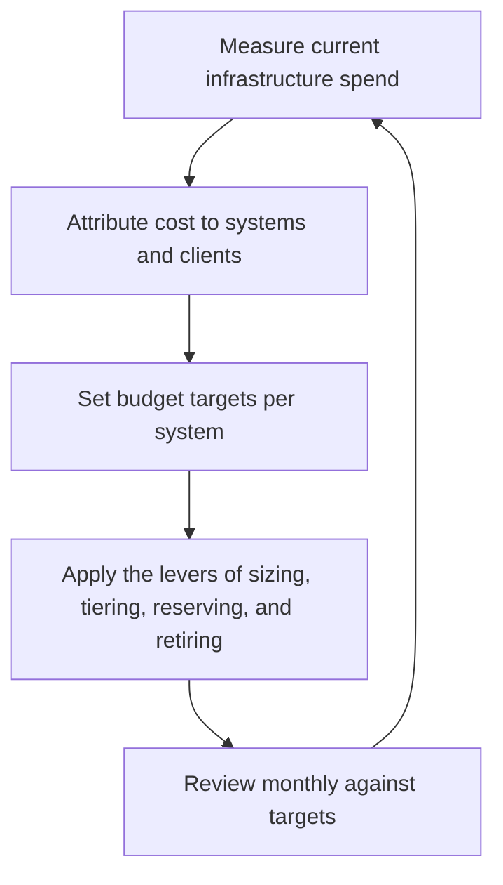

# Cost Aware Infrastructure

> **Core skill:** The independent treats every infrastructure choice as a recurring bill against revenue — knowing unit costs, sizing deliberately, and keeping spend bounded with budgets, alerts, and honest attribution to systems and clients.

## Why This Matters

For an independent, infrastructure cost is not an abstraction on a corporate budget; it comes out of the same account as groceries. The difference between a well-chosen and a carelessly chosen stack can be the difference between a comfortable margin and a business that works hard for nothing. Mismanaged spend also accumulates invisibly: idle environments, forgotten prototypes, premium tiers on systems nobody uses, storage that grows forever because nothing was ever deleted. None of these announce themselves — they wait in the invoice, month after month.

Cost awareness is a design discipline, not an accounting chore. Every architecture decision carries a cost shape: managed services trade higher unit prices for lower operational effort; self hosting trades money for attention; serverless trades premiums for near zero idle cost; reserved commitments trade flexibility for discounts. The independent who understands these shapes picks deliberately and projects spend at design time, instead of discovering it after launch when changing course is expensive.

The governance side is equally simple: targets per system, alerts on anomalies, attribution of each bill to the system and client that caused it, and a monthly review that is short because the numbers are known. When a cost spike appears, the independent should know within days — and should be able to say whether the spike is growth to welcome, waste to remove, or an error to fix.

## Cost Drivers for Small Systems

| Driver | Typical Source | Why It Escalates Quietly |
|--------|----------------|--------------------------|
| Compute time | Always-on servers for intermittent workloads | Idle capacity is billed whether used or not |
| Storage growth | Logs, uploads, backups, and histories with no lifecycle | Retention defaults are often unlimited |
| Data transfer | Egress between regions, providers, and clients | Charged per gigabyte and rarely modeled |
| Managed services | Databases, queues, search, monitoring tiers | Unit prices rise with usage, not with value |
| Environments | Staging, preview, and abandoned experiments | Nobody owns their shutdown |
| Third party APIs | Per call pricing in integrations | Test and retry traffic counts like production |
| Licensing | Per seat and per developer tools | Renewals continue without review |

## Cost Control Levers

| Lever | How It Works | Effort | Watch Out For |
|-------|--------------|--------|---------------|
| Right sizing | Match instance classes and tiers to measured load | Low, periodic | Shrinking too far and hurting reliability |
| Elastic over always-on | Pay for use on spiky workloads | Medium, design time | Unit premiums at steady high load |
| Reserved commitments | Discount in exchange for baseline commitment | Low once baseline is proven | Over-committing against uncertain growth |
| Lifecycle policies | Delete or archive data by age and access | Low, one time | Compliance and client retention needs |
| Consolidated services | One managed stack instead of many small ones | Medium | Consolidating onto a single point of failure |
| Environment hygiene | Ephemeral previews; scheduled shutdowns; deletion dates | Low, cultural | Convenience habits that quietly cost |
| Free tier discipline | Use allowances deliberately where terms permit | Low | Locking a client's critical path to a free plan |

## Budget Guardrails

| Guardrail | Practice |
|-----------|----------|
| Per system targets | Every system has a monthly cost expectation written down |
| Alerts | Notification thresholds set below the target, not at it |
| Hard limits | Platforms that support spending caps use them; where caps do not exist, a review calendar substitutes |
| Attribution | Bills map to systems and, where relevant, to clients for pass through or margin analysis |
| Spike protocol | Any unexpected increase gets a cause, a decision, and a note within the week |
| Kill switch | A known, tested way to shut down anything that runs away |

## The Cost Awareness Loop



Attribution is the hinge: a cost nobody owns is a cost nobody controls.

## Practical Applications

### Cost Awareness Checklist

- [ ] Every system has a monthly cost target and active alert thresholds
- [ ] Unit economics are known: what does a typical user, job, or transaction cost to serve?
- [ ] Data retention policies exist and are enforced by lifecycle rules
- [ ] Non production environments are ephemeral or scheduled off
- [ ] A monthly review compares actuals to targets and records decisions

### Infrastructure Cost Review

```markdown
## Infrastructure Cost Review — <month>

| Field | Value |
|-------|-------|
| Total spend | Current month versus previous month |
| Largest movers | The two or three systems driving change |
| Against targets | Over, under, or on plan per system |
| Waste found | Idle resources, oversized tiers, dead environments |
| Decisions | What will change before next month |
| Client pass through | What is billed onward versus absorbed |
```

## Common Pitfalls

| Pitfall | Why It Is a Problem | Better Approach |
|---------|---------------------|-----------------|
| **Spend discovered in the invoice** | By then the design decision is embedded and costly to reverse | Project cost at design time; review monthly |
| **No attribution** | Unclaimed costs survive every cleanup | Map every bill line to a system and client |
| **Always-on for intermittent workloads** | Idle capacity is pure waste at solo scale | Elastic or scheduled runtimes for spiky demand |
| **Set and forget environments** | Staging clones and experiments accumulate forever | Ephemeral environments with deletion dates |
| **Premium tiers by inertia** | Support plans and high tiers outlive their purpose | Review tiers at renewal, not after |
| **Chasing pennies, missing structure** | Instance tuning while topology burns the budget | Fix structural drivers — retention, egress, architecture — first |

## Success Indicators

- Infrastructure spend stays a small, predictable fraction of revenue
- Every unusual charge has a named cause and a decision behind it
- Retention policies measurably keep storage growth in check
- Client-passed costs are covered by contract, not absorbed silently
- The monthly cost review takes minutes because the numbers are current

## Related Topics

- [[01_Right_Sized_Architecture]]
- [[03_Technology_Selection_for_Solo_Builders]]
- [[06_Scaling_Decisions_with_Limited_Resources]]
- [[career-path/06_Software_Architect/07_Operations_and_Infrastructure_Architecture/07_Cost_and_Capacity_Architecture|Cost and Capacity Architecture (Architect)]]
- [[03_Business_Case_and_Economics/00_overview|Business Case and Economics]]

## Summary

Cost aware infrastructure treats every architecture choice as a recurring bill: cost shapes are understood at design time, spend is attributed to systems and clients, targets and alerts keep it bounded, and a short monthly review turns surprises into decisions. For a one person business the goal is simple — infrastructure that costs meaningfully less than it earns, with no line item that nobody owns.
