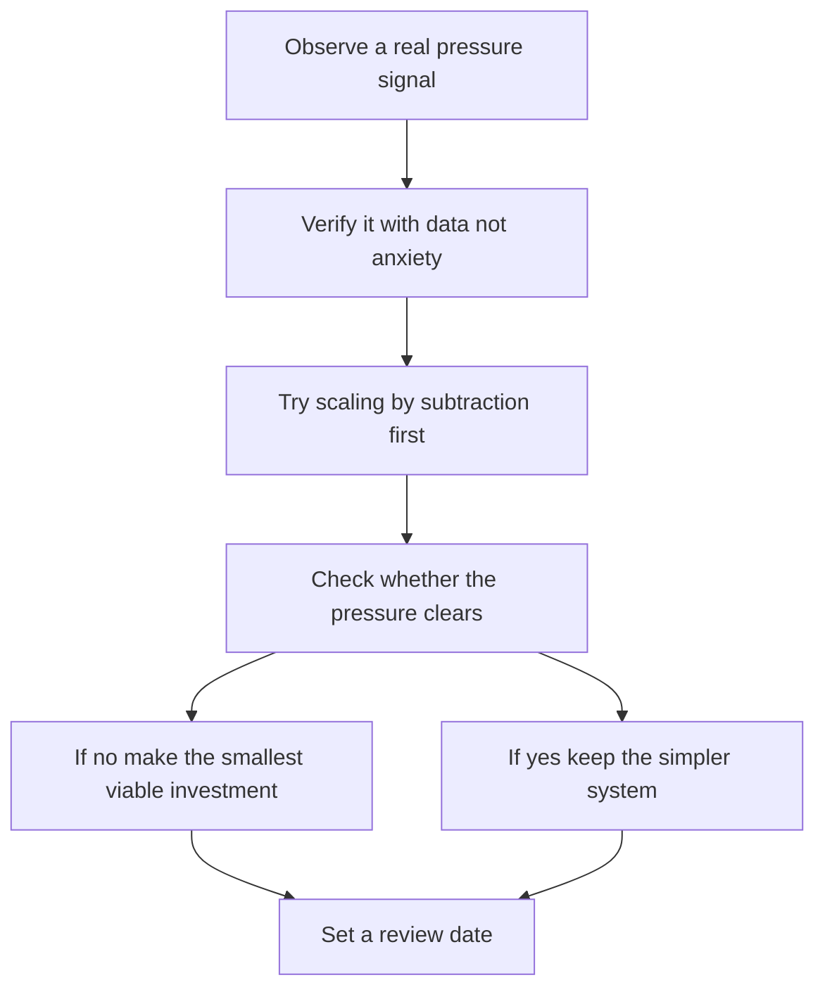

# Scaling Decisions with Limited Resources

> **Core skill:** The independent distinguishes real scaling pressure from premature optimization — scaling only where revenue, clients, or risk justify the investment, and preferring subtraction over addition until the evidence forces a decision.

## Why This Matters

Scaling is where technical ambition and business reality most often diverge for independents. The engineer in the room sees load graphs and wants headroom; the business in the room has revenue, margin, and attention as its scarce resources. Every scaling investment — more infrastructure, more services, more automation — buys capacity at the price of complexity, and complexity is exactly what a solo operator can least afford. The skill is not learning how to scale; it is learning to see the difference between a system that is genuinely constrained and one that merely looks busy.

Real scaling pressure has signatures: latency that breaches what clients notice, error rates that rise with load, queues that grow faster than they drain, costs that multiply faster than revenue, or operational work that crowds out delivery. Each of these can be measured. Imagined scaling pressure, by contrast, arrives as a feeling — "this will never hold up" — usually triggered by a growth story rather than a growth chart. The independent's discipline is to demand the measurement before spending the money.

When pressure is real, the response should follow a fixed order: first subtract waste (unbounded retention, chatty calls, oversized payloads), then tune what exists (indexes, caching, batching), and only then add capacity or components. Subtraction and tuning are cheap, reversible, and often sufficient; addition is expensive, sticky, and should be the last resort that evidence endorses. Scale by subtraction first — it is the only scaling lever that also makes the system simpler.

## Signals of Real Scaling Pressure

| Signal | What It Means | First Response |
|--------|---------------|----------------|
| Latency breaches user expectations | The bottleneck is on a measured path | Profile before provisioning |
| Errors correlate with load | Saturation or contention is real | Fix the constraint, not the symptom |
| Queues grow faster than they drain | Throughput is insufficient at peaks | Optimize the consumer or batch work |
| Cost grows faster than revenue | The cost shape is wrong, not the capacity | Re-examine architecture and retention |
| Operational toil crowds out delivery | The human is the bottleneck | Automate, defer, or decline work |
| Clients hit documented limits | Commitments are actually at risk | Address the specific limit contractually named |

## Scale by Subtraction Before Addition

| Lever | Example | Cost | Typical Effect |
|-------|---------|------|----------------|
| Deletion | Retention policy on logs, files, and history | Near zero | Immediate storage and backup relief |
| Batching | Group small synchronous calls into bulk work | Low, design time | Fewer round trips and cheaper units |
| Caching | Cache expensive reads that tolerate staleness | Low to medium | Large read relief, small correctness work |
| Asynchrony | Move slow work off the request path | Medium | Better perceived performance at same capacity |
| Indexing | Add the index the query actually needs | Low | Order of magnitude query gains |
| Load shedding | Shed gracefully instead of collapsing | Medium, design time | Protects the critical path under peaks |

## The Scaling Decision Gate

| Question | If Yes | If No |
|----------|--------|-------|
| Is the pressure measured, not imagined? | Continue through the gate | Do nothing; revisit at a defined trigger |
| Does the pressure affect revenue, clients, or a contract? | Prioritize it | Defer it behind delivery work |
| Is subtraction or tuning sufficient? | Do that first; stop | Consider adding capacity |
| Is the investment reversible if growth stalls? | Proceed with a review date | Prefer a reversible alternative |
| Can one maintainer operate the scaled design? | Enact it incrementally | Redesign toward a simpler shape |

## The Scaling Decision Gate Diagram



## Practical Applications

### Scaling Discipline Checklist

- [ ] Every scaling proposal names the measured signal that triggered it
- [ ] Subtraction and tuning options were tried and documented before additions
- [ ] The investment has a review date and a reversal path if growth stalls
- [ ] Revenue impact is explicit: what does this scaling unlock or protect?
- [ ] The scaled design remains operable by one person on a bad week

### Scaling Decision Memo

```markdown
## Scaling Decision — <system>

| Field | Value |
|-------|-------|
| Signal | The measured pressure and its trend |
| Business stakes | Revenue, client commitments, or risk affected |
| Options tried | Subtraction and tuning attempts with results |
| Chosen action | Smallest viable investment |
| Review date | When to confirm the pressure actually fell |
| Exit path | How the change would be reversed |
```

## Common Pitfalls

| Pitfall | Why It Is a Problem | Better Approach |
|---------|---------------------|-----------------|
| **Scaling for a story** | Pitch deck growth rarely arrives on schedule; complexity always does | Demand measured signals before spending |
| **Addition as the first reflex** | New components multiply maintenance permanently | Subtract and tune first; add last |
| **Ignoring the human bottleneck** | The maintainer saturates before the system does | Automate or decline work; scaling people is not an option |
| **No review date** | Capacity bought for growth no one revisits | Attach a review date and a reversal path to every scaling bet |
| **Optimizing the wrong layer** | Effort spent where profiling shows no pressure | Measure, then optimize the actual constraint |
| **Confusing reliability with capacity** | Availability problems get answered with scale | Fix the failure mode; capacity will not hide it |

## Success Indicators

- Scaling investments trace back to a measured signal and a business reason
- Subtraction and tuning are attempted before new infrastructure
- Systems stay operable by one person through every growth phase
- Capacity reviews happen on schedule and often conclude "no action"
- Growth in usage does not automatically mean growth in complexity

## Related Topics

- [[01_Right_Sized_Architecture]]
- [[05_Cost_Aware_Infrastructure]]
- [[07_Maintaining_Systems_You_Sold]]
- [[career-path/06_Software_Architect/07_Operations_and_Infrastructure_Architecture/07_Cost_and_Capacity_Architecture|Cost and Capacity Architecture (Architect)]]
- [[03_Business_Case_and_Economics/00_overview|Business Case and Economics]]

## Summary

Scaling decisions with limited resources are business decisions wearing architectural clothes: verify pressure with data, weigh it against revenue and client commitments, subtract and tune before adding, and keep every investment small, reversible, and operable by one person. The independent who scales only under evidence preserves the two things scarcity demands most — simplicity and attention.
