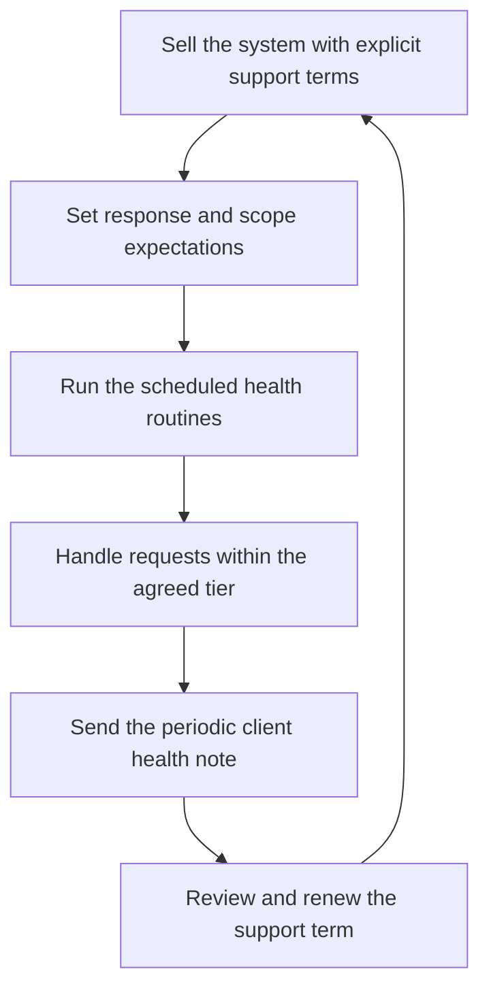

# Maintaining Systems You Sold

> **Core skill:** The independent sells maintenance deliberately — defining support tiers, response expectations, and health routines — so systems built for clients become a priced, bounded, recurring business line instead of unpaid obligation.

## Why This Matters

The system you sold last year keeps generating work: dependency updates, platform changes, small fixes, questions, and occasional emergencies. Handled informally, this work is invisible — it eats evenings, erodes margins, and breeds quiet resentment toward clients who believe they already paid for everything. Handled deliberately, maintenance becomes the most valuable revenue an independent can have: recurring, predictable, cheap to acquire, and delivered inside an established relationship. The same hours that feel like an unpaid tax as a favor feel like a professional service once they are named, priced, and bounded.

The difference is design, not effort. A support agreement names the tiers, the response expectations, what is included and excluded, and the price basis — so both sides know what a message at 9 PM will trigger. Health routines — scheduled reviews, dependency updates, backup checks, capacity reads — turn maintenance from reactive firefighting into a calm cadence that also produces natural upsell and renewal conversations. And the health report is a sales asset: a client who receives a short monthly note about their system's state has no reason to ever wonder whether the money is well spent.

Maintenance also carries an exit discipline, which is easy to forget. Some systems should be handed over to a client's growing team, some should be sunset in an orderly way, and some support clients should simply be declined because they consume more attention than they pay for. Saying all three out loud, in advance and in writing, is what keeps maintenance a business line rather than a trap.

## Support Tier Design

| Tier | Response Expectation | Typical Scope | Price Basis | Suits |
|------|----------------------|---------------|-------------|-------|
| Health only | Scheduled review, no on demand work | Updates, backups verification, small fixes | Small flat monthly retainer | Stable systems with light change |
| Standard support | Named response window during business days | Fixes, questions, minor enhancements, updates | Flat monthly retainer with a monthly hour allowance | Most client systems |
| Priority support | Shorter response window, escalation path | Everything in standard plus faster handling | Higher retainer, capped by contract | Revenue critical systems |
| Change partner | Planned work cadence | Roadmap work, features, integrations | Monthly capacity block | Clients with continuous evolution |

Response windows and allowances are contract terms, not promises made in chat — the written tier is what protects both sides when a busy week meets an urgent email.

## Maintenance Health Routines

| Routine | Cadence | Purpose |
|---------|---------|---------|
| Dependency and platform updates | Monthly, batched | Avoid forced migrations and known vulnerabilities |
| Backup restore test | Quarterly | Guarantee recovery actually works |
| Uptime and error review | Weekly, minutes | Catch drift before clients do |
| Cost and capacity read | Monthly | Confirm spend and load match expectations |
| Security and access review | Quarterly | Remove stale accounts, rotate secrets |
| Client health note | Monthly | Visible stewardship; renewal and upsell groundwork |

## When to Hand Over, Sunset, or Decline

| Situation | Professional Move | Why |
|-----------|-------------------|-----|
| Client builds an in house team | Structured handover with documentation and shadowing, priced | Goodwill compounds; the client remembers who left cleanly |
| System approaches end of life | Written sunset plan with dates, data export, and options | Avoids abandonment and reputational damage |
| Support client consumes more than they pay | Renegotiate scope or decline renewal, with notice | Subsidized attention is a slow business failure |
| You no longer want the work | Propose a successor or handover, politely and early | Referral chains survive even when engagements end |

## The Maintenance Business Loop



## Practical Applications

### Maintenance Business Checklist

- [ ] Every delivered system leaves with a written support option, even if declined
- [ ] Tiers name response expectations, scope, allowances, and exclusions
- [ ] Health routines exist on a calendar, not in good intentions
- [ ] A monthly health note goes to every supported client
- [ ] Handover, sunset, and decline paths are documented before they are needed

### Support Agreement Summary

```markdown
## Support Agreement — <client> — <system>

| Field | Value |
|-------|-------|
| Tier | Health only, standard, priority, or change partner |
| Response expectation | Business day window for named severities |
| Scope included | Fixes, updates, questions, enhancements as listed |
| Excluded | New features beyond allowance, third party outages, client changes |
| Allowance | Monthly hours or capacity block with overage terms |
| Price basis | Flat retainer, reviewed at renewal |
| Review cadence | Health note monthly; renewal term stated |
```

## Common Pitfalls

| Pitfall | Why It Is a Problem | Better Approach |
|---------|---------------------|-----------------|
| **Free forever maintenance** | Sold systems become an unbounded unpaid tax | Price maintenance explicitly, even at friends and family rates |
| **Undefined response promises** | Every message feels urgent; burnout and resentment follow | Put response expectations in the agreement |
| **Silent maintenance** | Clients cannot value work they never see | Send the short monthly health note |
| **Keeping every client forever** | Poor fit support clients drain the capacity that funds better work | Renegotiate, decline, or hand over on a schedule |
| **Reactive only** | Updates and backups checked only after failures | Run a scheduled cadence; fires get rarer and smaller |
| **No sunset plan** | Systems outlive their usefulness with no exit | Write sunset terms at delivery time |

## Success Indicators

- A meaningful share of revenue is recurring and predictable
- Clients renew without negotiation because value is visible monthly
- Emergency requests are rare; scheduled routines catch issues early
- Handovers and sunsets happen cleanly and still generate referrals
- Maintenance hours are bounded, priced, and never a surprise

## Related Topics

- [[02_Reusability_and_Multi_Client_Assets]]
- [[04_Security_and_Privacy_Basics]]
- [[06_Scaling_Decisions_with_Limited_Resources]]
- [[04_Delivery_and_Client_Management/00_overview|Delivery and Client Management]]
- [[career-path/07_SRE_and_Platform_Engineer/00_overview|SRE and Platform Engineer]]

## Summary

Maintaining systems you sold transforms the inevitable after work of delivery into a designed business line: tiers with named response expectations, scheduled health routines, visible monthly stewardship, and clean paths to hand over, sunset, or decline. The system keeps earning long after the build is done, and the relationship that produced it keeps producing — referrals, renewals, and the credibility of an independent who takes care of what they sold.
