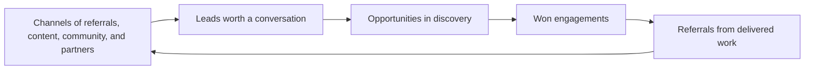

# Pipeline and Lead Generation

> **Core skill:** The independent maintains a living pipeline — several channels feeding qualified conversations — so selling runs as a continuous light system instead of a panic that begins the week work ends.

## Why This Matters

Feast and famine is the classic independent failure pattern: full attention goes to delivery, the pipeline gets nothing, the engagement ends, and revenue falls off a cliff while selling restarts from cold. The failure is structural, not personal — delivery is urgent and visible, while pipeline work is neither, so it loses every scheduling contest until it becomes the most urgent thing in the business. The fix is to treat pipeline as a standing commitment with a small, protected time budget that continues in busy weeks precisely because busy weeks are when it matters most.

Pipeline for an independent is not a sales team's dashboard. It is a handful of real relationships and a visible body of work. The goal is not hundreds of leads; it is at least three live opportunities in various stages, a rhythm of conversations, and channels that keep producing introductions without panic. Depth beats breadth: a few warm, qualified conversations convert at rates that make volume outreach unnecessary as a primary strategy.

Channels differ in speed, quality, and effort. Referrals convert fastest and feel best, but they require a delivery history and an explicit ask. Content and community build slowly and compound — an article or a talk keeps working months later. Partner relationships route work that does not fit your focus. Cold outreach works as filler but costs the most attention per conversation. The independent's mix leans on compounding channels, uses outreach deliberately, and never lets the ask for referrals become a forgotten step after every good delivery.

## Channel Comparison

| Channel | Speed to First Conversation | Conversion Quality | Effort Pattern |
|---------|-----------------------------|--------------------|----------------|
| Referrals from past clients | Days | Highest; trust transfers | Low per lead, needs the ask and a delivery history |
| Partner and peer network | Weeks | High; pre filtered fit | Relationship upkeep, occasional reciprocation |
| Content and writing | Months | High; demonstrates competence | Compounding; front loaded effort |
| Talks and community presence | Months | Medium to high | Batch effort per event, long tail |
| Direct outreach | Days to weeks | Lower; needs strong targeting | Highest attention per conversation |
| Marketplace and platform listings | Weeks | Variable, often price driven | Channel maintenance plus screening overhead |

## Pipeline Stages and Health

| Stage | Definition | Healthy Signal |
|-------|------------|----------------|
| Conversation | A real discussion about a problem | Several live at once; not all will progress |
| Qualified opportunity | Fit, budget, and timing look plausible | At least three at any time |
| Proposal out | A written offer awaiting decision | Decisions expected within a stated window |
| Won | Signed and scheduled | Starting before the bench runs dry |
| Parked or lost | Declined, deferred, or lost | Reasons recorded; some become future leads |

## The Constant Light Rhythm

| Habit | Cadence | Time Budget |
|-------|---------|-------------|
| Pipeline review and follow ups | Weekly | Thirty minutes |
| Publishing something visible | Monthly | A few hours, batched |
| Community or network touch | Weekly | One genuine interaction |
| Referral ask after good delivery | Every engagement close | Minutes, scripted |
| Channel audit | Quarterly | Which sources actually produced conversations |

## The Pipeline Funnel



The loop is the point: delivered work is the most productive channel, but only if the referral ask is made.

## Practical Applications

### Pipeline Checklist

- [ ] At least three live opportunities exist in varying stages at all times
- [ ] Pipeline review happens weekly, even in the busiest delivery weeks
- [ ] At least one compounding channel is active and consistent
- [ ] Every delivered engagement ends with a referral and testimonial request
- [ ] Lost and parked leads are recorded with reasons and revisit dates

### Pipeline Board

```markdown
## Pipeline Board — <date>

| Opportunity | Stage | Source | Next Step | Next Date |
|-------------|-------|--------|-----------|-----------|
| Client A expansion | Qualified | Referral | Send options memo | This week |
| Prospect B | Conversation | Conference talk | Discovery call | Next week |
| Prospect C | Proposal out | Partner intro | Follow up on decision | In ten days |
```

## Common Pitfalls

| Pitfall | Why It Is a Problem | Better Approach |
|---------|---------------------|-----------------|
| **Pipeline neglected in busy weeks** | The famine is created during the feast | Protect a weekly slot; it is smallest when busiest |
| **All eggs in one channel** | One quiet quarter cuts revenue to zero | Two or three active channels, reviewed quarterly |
| **Skipping the referral ask** | Satisfied clients often do not refer unprompted | Make the ask a closing step of every engagement |
| **Collecting leads, not qualifying** | Large lists of poor fits waste the scarcest attention | Qualify early; release politely and quickly |
| **Content without a niche** | General writing attracts general readers, not buyers | Write for the specific problems you sell |
| **Outreach as a last resort** | Desperate outreach is visible and converts worst | Run outreach as steady filler, not emergency fuel |

## Success Indicators

- Opportunities arrive from referrals and inbound more often than from cold effort
- Revenue gaps between engagements are short and planned
- The weekly pipeline review survives the busiest delivery weeks
- Every closed engagement produced either a referral, a testimonial, or both
- Channel audit shows which sources earn their effort, and weak ones get dropped

## Related Topics

- [[01_Selling_Technical_Work_Ethically]]
- [[07_Personal_Brand_and_Visibility]]
- [[04_Delivery_and_Client_Management/00_overview|Delivery and Client Management]]
- [[career-path/16_Developer_Advocate_and_Technical_Consultant/06_Community_and_Ecosystem/00_overview|Community and Ecosystem (Dev Advocate)]]

## Summary

Pipeline and lead generation keep the independent business breathing: a small set of channels — referrals, content, community, partners, and deliberate outreach — feeding at least three live opportunities at all times, reviewed weekly and never paused during delivery. The pipeline is built from delivered work and honest relationships, which is why it rewards consistency far more than intensity.
