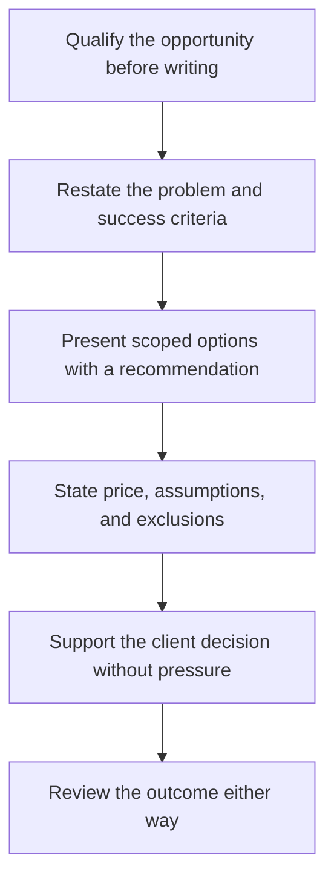

# Proposals and Bids

> **Core skill:** The independent writes proposals that win on understanding and outcomes — problem restatement, scoped options, clear pricing, explicit assumptions — while protecting against scope ambiguity that becomes unpaid work.

## Why This Matters

A proposal is the moment a sales conversation becomes a document both sides will remember differently. Buyers use proposals to answer three questions: does this person understand our problem, can they do the work, and does the price make sense? Independents lose bids on price far less often than they believe — they lose on genericness. A proposal that could have been sent to any company signals that no one read the brief, and no discount repairs that impression.

Structure beats eloquence. The strongest proposals restate the problem in the client's own words, define what success will look like, present two or three scoped options with a recommendation, state the price and its logic, and — critically — make assumptions and exclusions explicit. Assumptions are where proposals quietly fail: everything left unstated becomes contested later, and every ambiguity that favors the independent will be read by the client as either an oversight or a trick. Writing it down at proposal time costs minutes; discovering it at delivery time costs trust.

Not every bid deserves a proposal. Writing costs the same hours that delivery and pipeline both need, and a proposal written around an incumbent is usually a favor the buyer requested from procurement policy rather than a real opportunity. The skill includes disqualifying honestly: choosing depth over volume, declining thin-fit requests, and putting the saved effort into the opportunities with genuine access and genuine stakes.

## Proposal Structure That Wins

| Section | Job It Does | Common Mistake |
|---------|-------------|----------------|
| Understanding | Restates the problem and stakes in the client's terms | Generic boilerplate that proves nothing was read |
| Success criteria | Defines the measurable end state | Vague aspirations nobody can accept against |
| Options | Two or three scoped paths with a recommendation | A single take it or leave it number |
| Approach | Phases, milestones, and client responsibilities | Skipping what the client must supply |
| Assumptions and exclusions | States what is not included and what must hold | Silence that becomes a scope dispute |
| Commercial terms | Price, payment schedule, validity, change process | Price buried on the last page |
| Evidence | Relevant past work and references, briefly | Reciting a full history irrelevant to the brief |

## Pricing Models in Proposals

| Model | How It Appears | Use When | Main Risk |
|-------|----------------|----------|-----------|
| Fixed price | One number per scope option | Scope can be specified precisely | Scope drift eats margin |
| Time and materials | Rate against estimated effort | Discovery heavy or changing work | Effort scrutiny; client anxiety |
| Monthly retainer | Fixed fee per period | Ongoing service relationships | Underuse feels like waste to clients |
| Milestone based | Payment tied to deliverables | Larger engagements with phases | Milestone definition disputes |
| Value anchored | Price tied to business outcome | Outcomes are measurable and attributable | Attribution arguments |

Whichever model is chosen, the proposal states the basis of the price — so the number reads as reasoned, not invented.

## Bid or No Bid

| Criterion | Bid Signal | No Bid Signal |
|-----------|------------|---------------|
| Access | Direct conversations with decision makers | Only a procurement channel, no access |
| Problem fit | Center of the problem matches your proven work | You would be learning the domain from scratch |
| Requirements | Written for outcomes | Written around one incumbent's exact features |
| Timing and effort | Fit within your capacity window | Deadline demands a rushed, generic document |
| Commercials | Budget plausibly exists | No budget, or expectations far below floor |

## The Proposal Flow



## Practical Applications

### Proposal Discipline Checklist

- [ ] The problem is restated in the client's own language, showing it was read
- [ ] Every price has a stated basis and a scoped boundary
- [ ] Assumptions and exclusions are written, not remembered
- [ ] The proposal fits on the pages it deserves — complete but ruthlessly edited
- [ ] Losing patterns are reviewed: which factors correlated with wins and losses

### Proposal Skeleton

```markdown
## Proposal — <client> — <engagement>

1. Understanding — the problem and stakes in the client's words
2. What success looks like — outcomes and acceptance criteria
3. Options —
   - Option A: <scope> — fixed price <figure>
   - Option B: <scope> — monthly retainer <basis>
   - Recommended: <which and why>
4. Approach and milestones — phases, dates, and client responsibilities
5. Assumptions and exclusions — everything not included, stated plainly
6. Commercial terms — price, payment schedule, validity window, change process
7. Evidence — relevant results, references, and fit, kept brief
```

## Common Pitfalls

| Pitfall | Why It Is a Problem | Better Approach |
|---------|---------------------|-----------------|
| **Template with the client's name swapped** | Reads as indifference and loses to tailored competitors | Restate the actual problem; tailor the middle |
| **One giant number** | Forces accept or reject with no middle path | Offer two or three scoped options |
| **Unstated assumptions** | Every silence becomes a delivery dispute | Write exclusions and conditions into the proposal |
| **Underpricing to be safe** | Trains clients to expect discounts and harms delivery | Price the scoped work; reduce scope to reduce price |
| **Bidding indiscriminately** | Volume bidding burns the hours delivery needs | Qualify first; decline thin fits openly |
| **Proposal then silence** | Decisions stall without a follow up rhythm | Agree on a decision date at submission |

## Success Indicators

- Win rate is healthy relative to the number of proposals submitted
- Wins close on understanding and fit, not on the lowest number
- Delivered scope matches proposed scope, with changes priced as changes
- Losing proposals produce useful feedback and better next drafts
- Proposal writing time is bounded because qualification filters upstream

## Related Topics

- [[01_Selling_Technical_Work_Ethically]]
- [[05_Negotiation_for_Independents]]
- [[06_Communicating_Value_Not_Hours]]
- [[03_Business_Case_and_Economics/00_overview|Business Case and Economics]]
- [[04_Delivery_and_Client_Management/00_overview|Delivery and Client Management]]

## Summary

Proposals and bids are where conversations become commitments: the problem restated in the client's own words, success defined measurably, options scoped with a recommendation, prices given a basis, and assumptions written where disputes would otherwise grow. The discipline extends to knowing when not to bid — because the proposals worth winning are the ones worth writing well.
