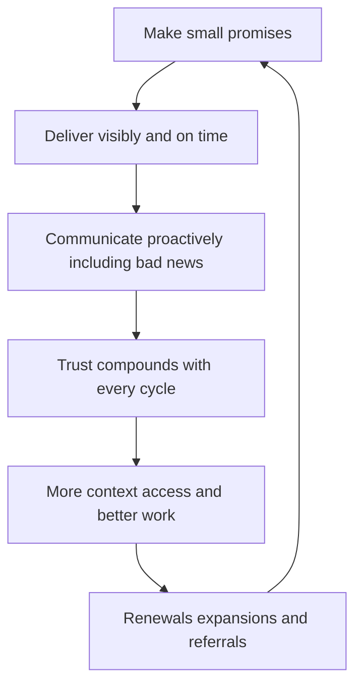

# Client Relationships and Trust

> **Core skill:** The independent treats trust as the core business asset — proactive communication, honest expectations, visible incentives — because renewals, expansions, and referrals grow from the relationship long after the contract is signed.

## Why This Matters

Trust is the invisible line item on every independent engagement. Clients cannot audit your evenings, your judgment calls, or your motivations; they substitute the relationship for the oversight they do not have. That trust is built in small, boring moments: the status update sent before it was requested, the estimate revised the day it changed, the bad news delivered early and with options attached. It is destroyed in the same small moments: silence during a problem, a surprise invoice, an excuse discovered later. Clients rarely grade vendors on the quality of good months — they grade them on how bad months were handled.

Trust also compounds into outright commercial advantage. Clients who trust you share context earlier, accept your advice on scope, renew without re-tendering, and recommend you inside their networks — which is the cheapest and highest quality pipeline an independent can have. Trust raises price tolerance directly, because the risk premium in a buying decision falls when the buyer believes you will say the difficult thing rather than the profitable thing.

Maintaining the relationship has a rhythm and a few harder skills: a communication cadence that fits the client, honesty about capacity and limits, incentives kept visibly aligned — which sometimes means saying that a feature is not worth building — and professional disengagement when a relationship stops working for either side. Done well, the relationship outlives individual projects and belongs to the business, not to fate.

## Trust Builders and Trust Breakers

| Moment | Trust Building Behavior | Trust Breaking Behavior |
|--------|-------------------------|-------------------------|
| Status and progress | Proactive updates on a fixed cadence | Silence until asked |
| Bad news | Delivered early, with options and a plan | Discovered late by the client |
| Estimates | Revised the moment reality changes | Discovered as overruns at invoicing |
| Disagreement | Stated respectfully with evidence | Quiet compliance then resentment |
| Mistakes | Owned plainly with a fix | Blame deflected to tools, scope, or others |
| Billing | Predictable and matching the agreement | Surprises and ambiguity |
| Advice | Includes "do not build this" | Every question answered with a yes |

## Communication Rhythm

| Touchpoint | Cadence | Purpose |
|------------|---------|---------|
| Working status note | Weekly during active work | Visibility without meetings |
| Decision log | Continuous, shared | A record both sides can cite |
| Health or progress review | Monthly or per milestone | Step back from tasks to outcomes |
| Expectation reset | At every change | Scope, timeline, and cost restated together |
| Relationship check in | Quarterly for long relationships | Direction, satisfaction, and what is next |
| Closure conversation | Every engagement end | Results, lessons, and the referral or renewal path |

## Managing Difficult Moments

| Situation | Amateurish Response | Professional Response |
|-----------|---------------------|-----------------------|
| A mistake you made | Minimize or bury it | Disclose early, explain impact, propose the fix |
| Unrealistic client demand | Silently absorb and resent | Name the tradeoff; offer scoped alternatives |
| A missed deadline risk | Wait and hope | Flag as soon as it is probable, with recovery options |
| Invoice dispute | Defensive argument from memory | Walk the agreement and record together, calmly |
| Scope creep by inches | Absorb, absorb, explode | Log small changes; price or trade them at a threshold |
| A client behaving badly | Endure, then disappear silently | Address it directly; disengage cleanly if needed |

## The Trust Compounding Loop

## Practical Applications

### Client Relationship Checklist

- [ ] A communication cadence is agreed at kickoff and kept without reminders
- [ ] Bad news travels to the client before they would have to ask for it
- [ ] Every scope or timeline change comes with restated expectations in writing
- [ ] Advice includes what not to buy, to keep incentives visibly aligned
- [ ] Every engagement closes with a conversation about results and what comes next

## Common Pitfalls

| Pitfall | Why It Is a Problem | Better Approach |
|---------|---------------------|-----------------|
| **Silence as a strategy** | Uncertainty is filled with worst assumptions | Send the update even when there is nothing new |
| **Yes as a reflex** | Small unrewarded yeses accumulate into resentment | Answer with tradeoffs, not automatic agreement |
| **Only talking to the sponsor** | Daily stakeholders can quietly veto you | Build relationships across the working team |
| **Hiding market pain** | Clients discover it anyway and trust all past updates less | Share context within professional bounds |
| **Transactional endings** | Relationships die at the last invoice | Close with results, gratitude, and a real ask |
| **Keeping toxic clients for revenue** | One bad relationship poisons attention and morale | Disengage cleanly; the capacity funds better clients |

## Success Indicators

- Clients extend, expand, or renew without competitive shopping
- Bad news is easy to deliver because the rhythm makes it normal
- Referrals arrive without being solicited at the end of engagements
- Disagreements surface early and resolve without escalation drama
- Long relationships feel like partnerships, with candid two way feedback

## Related Topics

- [[02_Pipeline_and_Lead_Generation]]
- [[05_Negotiation_for_Independents]]
- [[04_Delivery_and_Client_Management/00_overview|Delivery and Client Management]]
- [[career-path/16_Developer_Advocate_and_Technical_Consultant/01_Technical_Communication/00_overview|Technical Communication (Dev Advocate)]]

## Summary

Client relationships and trust are the compound asset of independent work: proactive communication, honest expectations, visible alignment of interests, and clean handling of the moments that decide how clients remember the engagement. Trust converts into renewals, expansions, referrals, and price tolerance — which is why the relationship deserves the same deliberate attention as any technical deliverable, because it is one.
