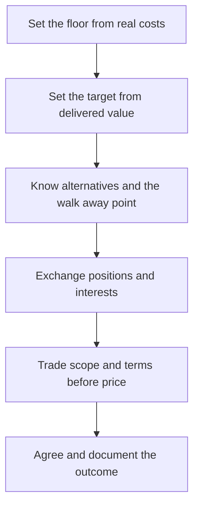

# Negotiation for Independents

> **Core skill:** The independent negotiates from a prepared position — floor, target, walk away point, and alternatives — trading scope and terms rather than discounting rate, and staying calm when the other side anchors hard.

## Why This Matters

Negotiation feels adversarial to engineers because it is usually taught as combat: tactics, leverage, and the art of winning. For an independent, negotiation is mostly preparation. Knowing the floor below which the work is not financially viable, the target that reflects the value delivered, and the walk away point where math and dignity agree turns negotiation from improvisation into arithmetic. A prepared negotiator is calm, and calm is the strongest position in the room — clients can sense who needs the deal and who is comfortable with either outcome.

The second discipline is trading rather than conceding. A discount given for free buys nothing and teaches the client that prices are fiction; a discount exchanged for something real — a longer term, faster payment, a reduced scope, a case study, a referral — costs far less and often improves the engagement. Rate is only one variable on the table. Scope, schedule, payment terms, exclusivity, intellectual property, and duration are all negotiable currencies, and an independent who knows their full inventory trades from strength.

The hardest skill is the credible walk away. Tactics like low anchoring, long silences, and "we have a cheaper quote" only work against someone who needs this deal. The independent whose floor is real, whose pipeline contains alternatives, and who can say "then it is probably not a fit" without anger wins most negotiations before they require a single counteroffer.

## Preparation: Floor, Target, Walk Away

| Element | Definition | How to Set It |
|---------|------------|---------------|
| Floor | The minimum that keeps the engagement viable | Costs, taxes, and the opportunity cost of the time required |
| Target | The price that reflects value and margin fully | Comparable outcomes and the client's gain from the work |
| Walk away point | Where math and respect agree the deal should not close | At or just above the floor, defended without apology |
| Alternatives | What you will do if this deal does not happen | Live pipeline, product work, rest — made real, not threatened |
| Concession plan | What can be given, in what order, for what in return | Trade list written before the conversation starts |

## Trading Variables Beyond Price

| Variable | What the Client Gains | What You Gain | Caution |
|----------|-----------------------|---------------|---------|
| Scope | Lower total cost, faster start | A boundary that protects margin | Never cut quality silently; cut deliverables openly |
| Timeline | Earlier delivery | Less concurrency pressure | Do not promise speed without a scope story |
| Payment terms | Cash flow flexibility for them | Faster cash for you | Upfront or milestone terms counteract discounts |
| Duration | Committed continuity | Predictable revenue and planning | Fixed rates over long terms need review points |
| Exclusivity | Reduced competitive risk | A premium for the constraint | Price exclusivity explicitly or refuse it |
| IP and licensing | Ownership or license breadth | Retention of background tools | Never trade more rights than the scope requires |
| Case study rights | Confidentiality or privacy | A reference and public proof | Agree exact wording and approval process |

## Handling Common Tactics

| Tactic | What Is Actually Happening | Steady Response |
|--------|----------------------------|-----------------|
| Lowball anchor | Testing whether your number moves under pressure | Do not counter on their number; restate scope and price basis |
| Long silence | Waiting for discomfort to produce a concession | Let the silence sit; the first to panic concedes |
| "We have a cheaper quote" | Possibly true, possibly leverage | Ask what is included; compare scopes, not figures |
| Budget disclosure after the pitch | A late constraint used as a lever | Reframe to what fits the budget; never to what fits the old price |
| Deadlines and urgency | Real or manufactured pressure | Verify the driver; plan properly or decline gracefully |
| Last minute extras | Testing inclusion creep | Welcome them as a priced change with a new date |

## The Negotiation Preparation Loop



## Practical Applications

### Negotiation Checklist

- [ ] Floor, target, and walk away point are set in writing before any call
- [ ] Alternatives are real — the pipeline makes walking genuinely possible
- [ ] A concession ladder exists: what is given, in what order, for what return
- [ ] Every rate concession is exchanged for scope, terms, or duration
- [ ] Outcomes are documented in the agreement the same week they are agreed

### Negotiation Prep Sheet

```markdown
## Negotiation Prep — <client and engagement>

| Field | Value |
|-------|-------|
| Their interests | What the client actually needs from this deal |
| My floor | Minimum viable price and terms |
| My target | Value based price and terms |
| Walk away point | The line I will not cross, stated calmly |
| Alternatives | What I do if this does not close |
| Concession ladder | Give in order, each traded for something |
| Opening move | Scope first framing; price stated with basis |
```

## Common Pitfalls

| Pitfall | Why It Is a Problem | Better Approach |
|---------|---------------------|-----------------|
| **No floor, no walk away** | Negotiation becomes whatever survives the conversation | Prepare numbers before the first call |
| **Discounting to be liked** | Rewards pressure and resets all future prices | Trade, never concede; reduce scope to reduce price |
| **Negotiating against yourself** | Preemptive concessions collapse the deal's economics | State the number once; let them respond |
| **Emotional reactions to tactics** | Anger and anxiety both leak leverage | Name the tactic internally; respond to the interest behind it |
| **Unprepared alternatives** | A bluff you cannot execute has no force | Keep the pipeline alive so walking is real |
| **Verbal deals left undocumented** | Memories diverge; disputes follow | Write outcomes down the same week |

## Success Indicators

- Negotiations end within a small distance of the quoted price and terms
- Concessions, when made, are always exchanged for value
- Walking away happens when it should — and often leads to a better callback later
- Clients describe the process as clear and fair, not adversarial
- Rate pressure eases as reputation and pipeline strength grow

## Related Topics

- [[03_Proposals_and_Bids]]
- [[06_Communicating_Value_Not_Hours]]
- [[03_Business_Case_and_Economics/00_overview|Business Case and Economics]]

## Summary

Negotiation for independents is preparation made visible: floor, target, walk away point, and real alternatives set before the conversation; scope and terms traded instead of rate discounted; calm maintained against anchors and silences because the deal is genuinely optional. The independent who negotiates this way does not win every deal — they win the right ones, at prices that let the work be done well.
