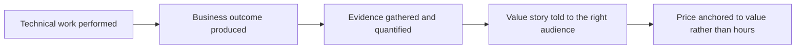

# Communicating Value Not Hours

> **Core skill:** The independent frames work by outcomes and business results — results delivered, risk removed, money made or saved — instead of selling time, which caps income and invites hourly scrutiny.

## Why This Matters

Hourly framing feels honest to engineers: time is what you sell, hours are measurable, and the rate is the price per unit. But hourly framing quietly caps the business in three directions at once. Income is bounded by available hours; efficiency is punished, because getting better at the work reduces the billable time a result takes; and every commercial conversation becomes scrutiny of inputs rather than comparison of outcomes. Clients who buy hours are buying a resource and will manage it like one, watching the clock and questioning the timesheet. Clients who buy outcomes are buying a result and comparing its price to the value of the result.

Value framing is not spin; it is translation. "A hundred and twenty hours of development" means nothing to an economic buyer. "Payments live before the launch date, with reconciliation handled and the finance team trained" lets the same buyer compare the price against a delayed launch, a failed audit, or an expensive manual workaround. The competence is knowing what each stakeholder actually buys — revenue, risk reduction, time saved, compliance, reputation — and describing the delivered work in those terms, with evidence and honest numbers.

Making value framing real takes structure: proposals that lead with outcomes, progress reports that track results rather than activity, and pricing models aligned to value where the value is attributable. The guardrail is integrity — value claims must be true, estimates must remain honest, and "this may not be worth the investment" stays available as an answer. Inflation destroys the credibility that value framing depends on.

## Hours Framing Versus Value Framing

| Statement | Hours Framing | Value Framing |
|-----------|---------------|---------------|
| Scope | "Three weeks of development" | "Checkout works reliably by the holiday peak" |
| Progress | "Forty hours logged this month" | "Payments milestone reached; two of four success criteria met" |
| Change | "That will add twenty hours" | "That change moves the launch date, or costs the reporting feature to keep it" |
| Price | "Rate per hour times estimated hours" | "Fixed price for the outcome, with the logic stated" |
| Risk | Time overruns are the client's problem too | "Fixed price means schedule risk sits with me" |

## What Different Stakeholders Buy

| Stakeholder | What They Care About | Evidence That Lands |
|-------------|----------------------|---------------------|
| Technical lead | Quality, maintainability, low drama | Design notes, test coverage, handover docs |
| Economic buyer | Money, risk, timeline | Cost avoided, revenue enabled, milestones held |
| Operations and support | Stability, runbooks, fewer surprises | Monitoring, backups tested, documentation |
| Compliance or legal | Obligations met | Data handling, access controls, audit trails |
| End users | Simply that it works | Uptime, speed, fewer steps |

## Price Anchors and Their Sources

| Anchor Source | Example Framing | Validity Condition |
|---------------|-----------------|--------------------|
| Cost avoided | Manual process removed, error rate cut | The saving is measurable and attributable |
| Revenue enabled | A channel, feature, or flow that earns | The causal link is defensible |
| Risk reduced | Compliance exposure, outage cost | The risk is real and understood by the buyer |
| Replacement cost | Hiring and training an internal team | A genuine alternative the client considered |
| Comparable work | Market prices for similar outcomes | Comparable scope, not comparable titles |

## The Value Translation Path



## Practical Applications

### Value Communication Checklist

- [ ] Proposals lead with the business outcome, not the effort estimate
- [ ] Progress updates report against success criteria, not hours logged
- [ ] Each stakeholder receives the framing that matches what they buy
- [ ] Value claims are true and, where possible, quantified with the client's own numbers
- [ ] At least one pricing conversation per engagement is conducted in outcome terms

### Value Narrative

```markdown
## Value Narrative — <engagement>

| Field | Value |
|-------|-------|
| Business outcome | What changes for the client when this works |
| Stakes | What it costs them to leave the problem unsolved |
| Evidence | Numbers, references, or measurements behind the claim |
| Risk removed | What uncertainty the work eliminates |
| Price basis | How the fee connects to the outcome |
| Guardrail | What is honestly not claimed |
```

## Common Pitfalls

| Pitfall | Why It Is a Problem | Better Approach |
|---------|---------------------|-----------------|
| **Selling hours by default** | Caps income and turns buyers into timekeepers | Sell outcomes; keep hours internal |
| **Vanity metrics as value** | Story points and commits do not interest buyers | Translate technical progress into business terms |
| **Inflated value claims** | One exposed exaggeration discredits every future number | Quantify honestly or qualify plainly |
| **Same pitch for every audience** | Each stakeholder buys something different | Match the framing to the role |
| **Efficiency as a threat** | Automating yourself away feels risky under hourly billing | Price results, so improving efficiency pays you |
| **Value language without evidence** | Adjectives without numbers read as marketing | Attach the client's own data where possible |

## Success Indicators

- Clients discuss price in relation to outcomes, not hours
- Renewals and expansions reference results achieved, not effort spent
- Time tracking, where it exists, is internal and for your own estimating
- Proposals win without the lowest number on the table
- Efficiency gains show up as better margins, not lower invoices

## Related Topics

- [[03_Proposals_and_Bids]]
- [[05_Negotiation_for_Independents]]
- [[03_Business_Case_and_Economics/00_overview|Business Case and Economics]]
- [[career-path/16_Developer_Advocate_and_Technical_Consultant/01_Technical_Communication/00_overview|Technical Communication (Dev Advocate)]]

## Summary

Communicating value instead of hours is translation done with integrity: describe what the work changes in the client's business, quantify it honestly, give price a stated basis, and match the framing to what each stakeholder actually buys. The independent who sells outcomes escapes the hour trap — income decoupled from effort, efficiency rewarded, and commercial conversations about results rather than timesheets.
