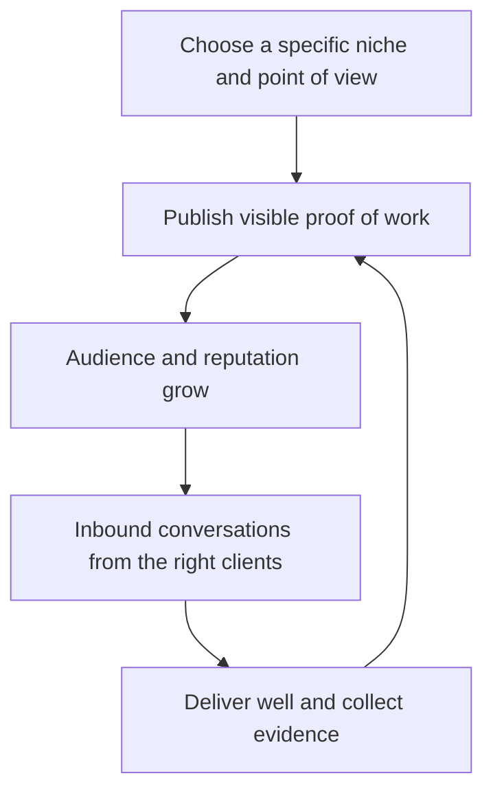

# Personal Brand and Visibility

> **Core skill:** The independent builds a visible, specific professional identity — a niche, a point of view, and a body of public work — so the right clients find them instead of the other way around.

## Why This Matters

Personal brand is a polarizing term, but for an independent it means something concrete: what you are known for, by whom, and what a stranger finds when they check you out. Most buying journeys for technical services now begin with a search, a reference check, or a quiet look at someone's public work. When the search finds nothing, the independent is invisible and competes only where someone hands them a lead. When it finds a muddle, they are discounted. When it finds evidence of exactly the problem the client has, the conversation starts with trust already partially funded.

Specificity beats reach. "Full stack developer" is invisible because it asserts nothing; "I help logistics teams make warehouse data trustworthy" is findable, memorable, and referable. A niche is not a life sentence — it is a current center of gravity that can shift as skills and markets evolve. But the narrow version gets remembered, referred, and priced better, because it answers the client's real question, which is not "are you good" but "do you understand my situation."

Consistency over intensity is the operating rhythm. A modest, sustainable cadence of visible work — articles, talks, open source contributions, thoughtful community answers — compounds the way interest compounds, while sporadic bursts and long silences reset to zero. The brand is also a filter: publishing how you work attracts the clients who like how you work and gently repels the ones who would have been exhausting, which is worth entire avoided engagements.

## The Brand Stack

| Layer | Question It Answers | Evidence |
|-------|--------------------|----------|
| Positioning | What are you known for, for whom? | A one line statement specific enough to be arguable |
| Point of view | What do you believe about the work that others should hear? | Opinions with reasons, published openly |
| Proof | What have you actually done? | Case notes, references, open source, talks |
| Presence | Where do the right people encounter you? | A small set of channels maintained consistently |
| Personality | What is it like to work with you? | How you write, respond, and treat people publicly |

## Visibility Channels and Their Compounding

| Channel | Effort Shape | Who It Reaches | Compounding Character |
|---------|--------------|----------------|-----------------------|
| Writing and articles | Front loaded per piece | Peers, buyers researching problems | Strong; pieces earn long after publishing |
| Talks and podcasts | Batch effort per event | Communities and conference audiences | Medium; recording extends the life |
| Open source | Sustained, episodic | Developers and technical evaluators | Strong when maintained; a liability when abandoned |
| Community participation | Small, frequent | Peers who refer and recommend | Strong; reputation accrues quietly |
| Social posting | Continuous, low per item | Mixed audiences | Weak alone; amplifies other channels |
| Client-visible work | Every engagement | Clients, their networks | Strongest; delivered work is the best proof |

## A Sustainable Visibility Rhythm

| Activity | Cadence | Note |
|----------|---------|------|
| Publish one substantial piece | Monthly or quarterly | Depth beats frequency; solved problems make the best subjects |
| Speak or present | A few times a year | Conferences, meetups, internal client events |
| Maintain the proof page | Quarterly review | Recent, relevant, and easy to find |
| Contribute in communities | Weekly, fifteen minutes | Answer questions in your niche genuinely |
| Revisit positioning | Twice a year | Does the niche still match the work you want next? |

## The Brand Flywheel

## Practical Applications

### Visibility Checklist

- [ ] Positioning is one specific sentence, testable against real opportunities
- [ ] A stranger checking you out finds current, relevant proof within minutes
- [ ] One compounding channel (writing, open source, or speaking) runs on a fixed rhythm
- [ ] Public work never leaks client confidential information
- [ ] Positioning is reviewed on a calendar, not left to drift

## Common Pitfalls

| Pitfall | Why It Is a Problem | Better Approach |
|---------|---------------------|-----------------|
| **Invisibility by generality** | "We do everything" competes on price everywhere | Pick a specific niche and be findable in it |
| **Burst then silence** | Momentum resets; audiences forget between spurts | A small sustainable rhythm beats heroics |
| **Performance over substance** | Audiences sense manufactured thought leadership | Publish real lessons from real work |
| **Leaking client details** | One careless screenshot costs a relationship | Anonymize and get permission; when unsure, omit |
| **Chasing reach over fit** | Large, wrong audiences do not buy | Optimize for the right few hundred readers |
| **Abandoned open source** | A dead repository signals neglect | Maintain what you show or archive it honestly |

## Success Indicators

- Inbound conversations reference specific public work
- Prospects arrive pre convinced, shortening sales cycles
- Referrals repeat the positioning almost in your own words
- The sustainable rhythm has survived at least a year without burnout
- Bad fit inquiries decline because the positioning filters them out

## Related Topics

- [[02_Pipeline_and_Lead_Generation]]
- [[04_Client_Relationships_and_Trust]]
- [[career-path/16_Developer_Advocate_and_Technical_Consultant/01_Technical_Communication/00_overview|Technical Communication (Dev Advocate)]]
- [[career-path/16_Developer_Advocate_and_Technical_Consultant/06_Community_and_Ecosystem/00_overview|Community and Ecosystem (Dev Advocate)]]

## Summary

Personal brand and visibility for an independent are a working system, not vanity: a specific niche, a point of view worth hearing, visible proof of real work, and a small sustainable rhythm across compounding channels. The payoff is structural — the right clients find you, arrive already trusting, and refer you in your own words — which turns marketing from a constant chase into an asset that keeps earning.
