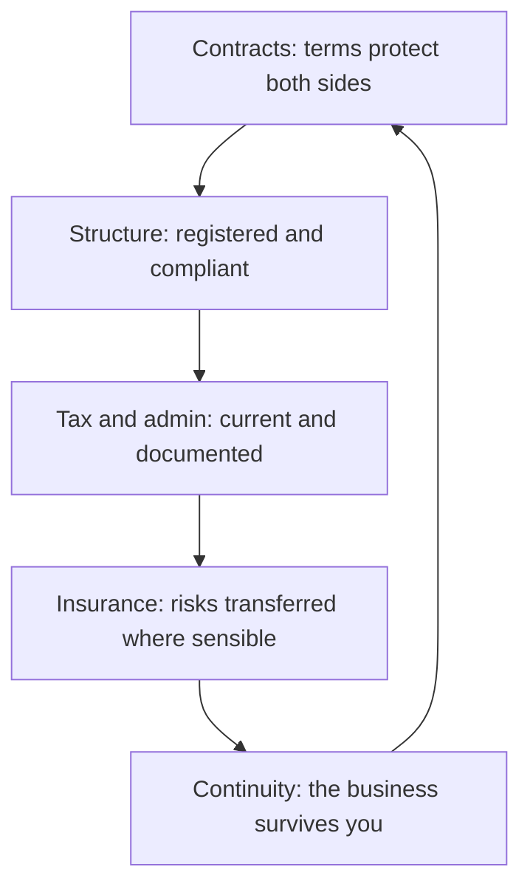

# Governance, Risk and Continuity

> **Core capability:** The independent handles contracts, security, privacy, and continuity responsibly — managing the legal, financial, and operational risks of the business like the professional it is.

## Why This Matters

Independent work concentrates risk: no legal department, no employer insurance, no colleague to cover for you. The contract you signed, the client data you hold, the tax you owe, the week you get sick — each a real exposure that employed engineers never face personally. Governance for independents is the discipline of handling these exposures before they handle you.

None of this requires lawyer-level expertise — it requires knowing what must be handled, doing it simply and correctly, and knowing when to pay a professional. The difference between a durable practice and one incident away from collapse is whether these basics were managed from the start.

## Topics in This Capability Area

| Topic | Core Skill | When It Matters |
|-------|------------|-----------------|
| [[01_Contracts_and_Professional_Agreements]] | Contracts: scope, IP, liability, termination basics | Every engagement |
| [[02_Business_Structure_and_Registration]] | Business structures, registration, and local obligations | Business formation |
| [[03_Tax_Administration_and_Compliance]] | Tax, invoicing, and administrative obligations | Continuous; recurring deadlines |
| [[04_Insurance_Liability_and_Protections]] | Professional liability and risk transfer | Before risk materializes |
| [[05_Data_Protection_and_Client_Obligations]] | Privacy obligations and client data responsibility | Every system with data |
| [[06_Business_Continuity_for_Solo_Operators]] | What happens when you cannot work | Always; worst weeks |
| [[07_Risk_Management_and_Professional_Ethics]] | A risk practice and an ethics compass | Every decision |

## The Governance Baseline

Handled in order, each layer makes the next cheaper and calmer.

## Practical Applications

### Governance Checklist

- [ ] Every engagement has a written contract covering scope, IP, payment, and termination
- [ ] Business structure and registration are in place and compliant locally
- [ ] Tax and invoicing obligations are current, with records kept
- [ ] Risks that could end the business are identified and transferred where possible
- [ ] Client data obligations (privacy laws, confidentiality) are understood per engagement

## Common Pitfalls

| Pitfall | Why It Is a Problem | Better Approach |
|---------|---------------------|-----------------|
| **Handshake agreements** | Disputes become he-said-she-said | Written contracts, every time |
| **Ignoring local tax until later** | Penalties and stress compound | Register, invoice, and file on schedule |
| **Uninsured professional risk** | One dispute can wipe out savings | Professional liability where exposure exists |
| **No continuity plan** | Illness or burnout stops everything | Documented handover, reduced-scope options |

## Success Indicators

- Contracts are standard and rarely negotiated from scratch
- Tax and admin run on schedule without panic
- No client data incidents or legal disputes
- The business has a written "if I cannot work" plan

## Related Capabilities

- [[03_Business_Case_and_Economics/00_overview|Business Case and Economics]]: structure and tax are economic decisions
- [[04_Delivery_and_Client_Management/00_overview|Delivery and Client Management]]: contracts operationalize commitments
- [[career-path/08_Security_Engineer/00_overview|Security Engineer]]: security depth the independent draws on
- [[career-path/11_Engineering_Manager/01_People_Development/00_overview|People Development (EM)]]: fairness and responsibility in working with people

## Summary

Governance, risk, and continuity are the professional basics that keep an independent business viable: contracts that protect both sides, compliant structure and tax, transferred risks, protected client data, and a continuity plan for the bad weeks. Boring, unglamorous, and precisely what separates a durable practice from a disaster waiting to happen.