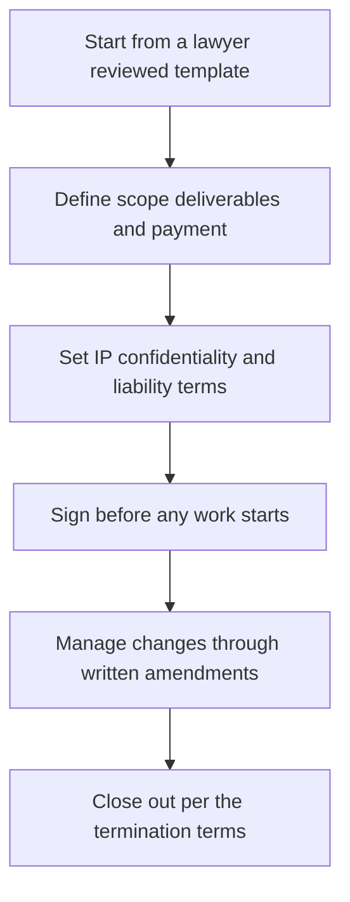

# Contracts and Professional Agreements

> **Core skill:** The independent works from a written agreement every time — scope, deliverables, payment, IP, confidentiality, liability, and termination — because contracts protect both sides and resolve disputes before they exist.

## Why This Matters

Contracts have a reputation problem among engineers: paperwork that matters only when something goes wrong. In practice, a good agreement is a decision document. It forces both sides to state expectations while everyone is still friendly — what is being built, what it costs, when it is paid, who owns it, and what happens if the engagement ends early. The engagements where nothing was written down are the same engagements where memories later diverge, and the party with the more convenient memory wins. Writing it down is not distrust; it is the mechanism by which trust survives its first test.

The independent does not need to practice law, but does need to understand each clause's purpose and refuse to sign what cannot be explained. A workable set covers the essentials: deliverables and scope, payment schedule tied to something, a change process for the inevitable creep, ownership of what is created versus what the independent brings, confidentiality in both directions, a defined liability position, and termination terms with notice. Templates from a qualified lawyer, adapted per engagement, are the sane middle path between reinventing contracts and signing whatever arrives.

Local specifics matter and must never be improvised. Contract law, the enforceability of particular clauses, and required formalities vary by jurisdiction — and where an engagement touches Thailand or any other local market, the correct move is to confirm obligations with a local lawyer rather than copy a clause from the internet or a peer. Clients often present their own paper; the party who writes the contract sets the defaults, so reading and negotiating the important clauses is part of the professional service, not an administrative afterthought.

## Core Contract Terms

| Term | What It Protects | Principle to Apply |
|------|------------------|--------------------|
| Scope and deliverables | Both sides, from disagreement about what was bought | Describe outcomes and boundaries; reference the proposal |
| Payment schedule | Cash flow and dispute avoidance | Tie payments to milestones or dates, never to vague approval |
| Change process | Margin and goodwill | Changes are written, priced, and approved before work proceeds |
| Intellectual property | Ownership clarity for both | Assign client deliverables; retain background tools and general know how |
| Confidentiality | Client data and your methods | Mutual where fair; define what may be disclosed and for how long |
| Liability position | Proportional risk | A defined cap or position confirmed with a lawyer; never unlimited exposure |
| Termination | Exits without drama | Notice period, handover duties, and payment for work done |
| Dispute handling | Cheaper resolution | A staged path — conversation, then mediation — before litigation |

## Common Agreement Types

| Agreement | Purpose | When It Is Used |
|-----------|---------|-----------------|
| Master services agreement | Umbrella terms for a long relationship | Repeat clients; multiple projects |
| Statement of work | Specific scope, price, and schedule per project | Attached to the umbrella agreement |
| Single project contract | All terms in one document | One off engagements |
| Retainer agreement | Ongoing support or capacity terms | Maintenance and advisory relationships |
| Non disclosure agreement | Confidentiality before detailed discussions | Early sales and discovery phases |
| License terms | Rights over reusable or productized assets | When clients license rather than own |

## When to Involve a Lawyer

| Situation | Why Professional Advice Pays | Note |
|-----------|------------------------------|------|
| First template ever | Saves years of accumulated clause debt | Have a local lawyer draft or review once |
| Unusual IP or licensing demands | Rights are easy to give away permanently | Review before signing, not after |
| Large or long engagements | Exposure grows with deal size | Proportional review effort |
| Client paper with heavy terms | Defaults favor the party who wrote it | Negotiate or clarify the risky clauses |
| Cross border engagements | Law, tax, and enforceability vary | Confirm with professionals in each relevant jurisdiction |
| Anything in a new local market, such as Thailand | Local formalities and rules are easy to miss | Confirm with a local lawyer or accountant; never assume |

## The Contract Lifecycle



No work starts before signature; no change proceeds without a written trace.

## Practical Applications

### Contract Discipline Checklist

- [ ] Every engagement has a signed agreement before work begins
- [ ] Scope, payment, change, IP, confidentiality, liability, and termination are all covered
- [ ] The template was reviewed by a local lawyer at least once
- [ ] Client paper is read carefully, with risky clauses negotiated or clarified
- [ ] Local obligations in any new jurisdiction are confirmed with local professionals

### Engagement Terms Summary

```markdown
## Engagement Terms — <client>

| Field | Value |
|-------|-------|
| Scope reference | The proposal or SOW version this agreement points to |
| Payment | Schedule and triggers, stated plainly |
| Change rule | How changes are priced, approved, and recorded |
| IP position | What transfers to the client; what stays with the practice |
| Confidentiality | Mutual obligations and duration |
| Liability | Position as confirmed with a lawyer |
| Termination | Notice, handover duties, and payment for work done |
```

## Common Pitfalls

| Pitfall | Why It Is a Problem | Better Approach |
|---------|---------------------|-----------------|
| **Handshake agreements** | Disputes become memory contests you may lose | A written agreement every time, however simple |
| **Signing client paper unread** | Defaults written by the other side rarely suit you | Read, clarify, and negotiate key clauses |
| **Vague scope language** | Every ambiguity becomes unpaid work or conflict | Outcomes and exclusions stated explicitly |
| **IP silence** | Ownership disputes surface at the worst moment | Address deliverables, background tools, and reuse openly |
| **Unlimited liability exposure** | One claim can exceed the entire engagement's value | A defined position reviewed by a lawyer |
| **Copying clauses from strangers** | Rules and enforceability vary by jurisdiction | Local professional review; confirm before relying |

## Success Indicators

- Engagements start with signature in place, without friction or delay
- The standard template needs little negotiation beyond scope and price
- Changes are handled in writing, calmly, with no margin erosion
- IP and reuse questions never cause a client surprise
- Local obligations in new markets are confirmed before commitments are made

## Related Topics

- [[02_Business_Structure_and_Registration]]
- [[03_Tax_Administration_and_Compliance]]
- [[04_Insurance_Liability_and_Protections]]
- [[04_Delivery_and_Client_Management/00_overview|Delivery and Client Management]]

## Summary

Contracts and professional agreements give an independent engagement its rules before it needs them: scope and payment written plainly, change handled in writing, ownership and confidentiality stated, liability kept proportional with lawyer reviewed terms, and termination that lets both sides exit cleanly. The contract is not the opposite of trust — it is what allows trust to survive contact with reality.
