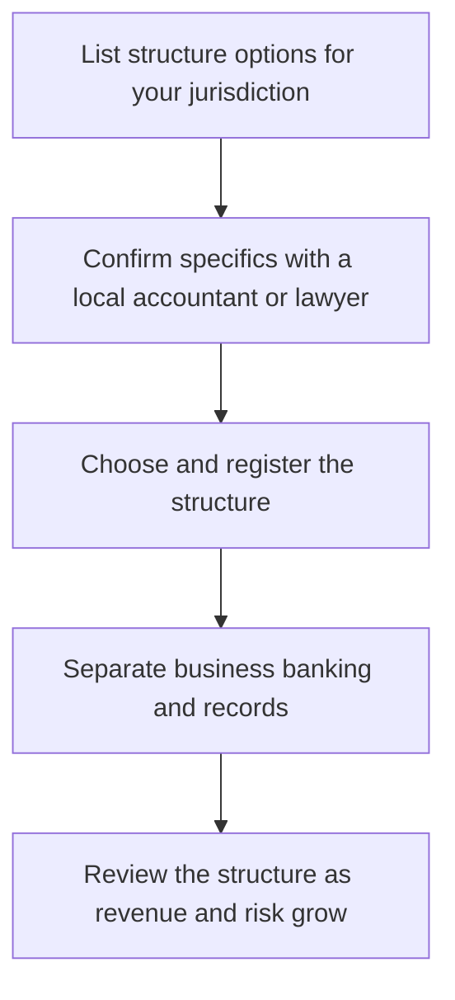

# Business Structure and Registration

> **Core skill:** The independent chooses a business structure and completes registration appropriate to their jurisdiction and risk profile — simple to run, honest about liability — and confirmed with local professionals rather than copied from peers.

## Why This Matters

Structure is a quiet decision with loud consequences. It shapes how taxes are paid, whether personal assets stand behind the work, how clients perceive professionalism, and how much administration the business carries. Skip the decision entirely and every engagement is taken personally in the legal sense — with personal liability attached. Overcomplicate it and administrative overhead consumes the hours that should be selling and delivering. The right structure is the simplest one that matches the real risk and revenue of the practice today, with a plan to revisit it as both grow.

The main axes are few. Operating personally is cheap and immediate but leaves assets exposed and can look provisional to larger clients. A separate legal entity — where the jurisdiction offers one that suits a single owner — separates liability, fits procurement processes, and signals permanence, at the cost of registration, filings, and a small ongoing administrative burden. Partnerships and multi-owner arrangements trade control for shared risk and require careful agreements between the parties. There is no universally correct answer: the choice depends on jurisdiction, client type, revenue level, and the risks actually being taken on.

What works in one country cannot be assumed to work in another. Registration steps, naming rules, capital requirements, foreign ownership limits, and reporting duties all vary — and in Thailand, for example, the structure options available to a resident versus a foreigner, and the formalities attached to each, must be confirmed with a Thai accountant or lawyer rather than inferred from another market. The independent's discipline is to compare two or three real options with local professional advice, register properly, separate business banking and records from day one, and review the structure annually against where the business is actually heading.

## Structure Decision Factors

| Factor | Questions to Ask | What to Weigh |
|--------|------------------|---------------|
| Liability | What risk does the work create, and what stands behind it? | Personal exposure versus limited liability |
| Clients | What will enterprise procurement accept? | Some clients require a registered entity |
| Tax treatment | How does each option change what is owed and when? | Confirm with a local accountant, not by comparison |
| Administration | How much filing and bookkeeping does each require? | Time cost versus protection gained |
| Cost | What are the setup and ongoing obligations? | Favor simplicity until revenue justifies more |
| Growth plan | Will partners, employees, or investors join? | Structure ahead only when plans are real |
| Location | Where will clients and contracts live? | Local rules follow where the work is done |

## Structure Types at a Glance

| Type | Liability Position | Administration | Typically Suits |
|------|--------------------|----------------|-----------------|
| Operating as a sole individual | Personal assets exposed | Minimal | Early stage, low risk, small clients |
| Limited liability company | Exposure generally limited to the entity | Registration, filings, records | Most established independent practices |
| Partnership | Shared and often joint exposure | Agreement plus filings | Two or more independents working together |
| Foreign owned entity in some jurisdictions | Additional conditions apply | Higher compliance bar | Non residents operating locally, such as in Thailand |

Names, availability, and exact rules differ by jurisdiction; this table is orientation, not advice — confirm specifics locally.

## Registration and Onboarding Steps

| Step | Purpose | Note |
|------|---------|------|
| Compare options with a local professional | Avoid guessing at rules | A single consultation prevents years of friction |
| Register the chosen structure | Legal existence and invoicing capability | Follow local formalities exactly |
| Open business banking | Separation of money and records | Never mix personal and business funds |
| Put bookkeeping in place | Records from the first transaction | Choose a system you will actually maintain |
| Register for applicable taxes | Correct invoicing and filing | Confirmed with an accountant for the jurisdiction |
| Document the baseline | A one page record of structure and obligations | Useful for renewal, banking, and review |

## The Structure Decision Path

## Practical Applications

### Structure and Registration Checklist

- [ ] At least two structure options were compared with local professional input
- [ ] The chosen structure is registered and compliant in its jurisdiction
- [ ] Business banking and bookkeeping are fully separated from personal finances
- [ ] Tax registrations required for the jurisdiction are in place and confirmed
- [ ] The structure is reviewed annually against revenue, risk, and plans

## Common Pitfalls

| Pitfall | Why It Is a Problem | Better Approach |
|---------|---------------------|-----------------|
| **Copying what peers did** | Their jurisdiction, clients, and risk differ from yours | Compare options with a local professional |
| **Staying informal too long** | Personal exposure grows silently with revenue and client size | Review structure as soon as stakes rise |
| **Over engineering early** | Complex structures cost money and attention before they help | Simplest valid structure first; evolve later |
| **Mixing personal and business money** | Records blur; liability separation weakens; disputes get messy | Separate accounts from the first invoice |
| **Ignoring foreign ownership rules** | Assumptions from one market fail in another | Confirm local conditions, such as in Thailand, before committing |
| **Set and forget** | Structures outlive their fit as the business changes | Revisit annually or at major threshold events |

## Success Indicators

- The structure matches the jurisdiction and the risk actually being taken
- Larger clients onboard without procurement friction
- Administration runs on a light, predictable schedule
- Business and personal finances are cleanly separated
- The structure has been reviewed in the last year against the business's direction

## Related Topics

- [[01_Contracts_and_Professional_Agreements]]
- [[03_Tax_Administration_and_Compliance]]
- [[03_Business_Case_and_Economics/00_overview|Business Case and Economics]]

## Summary

Business structure and registration give the independent practice its legal shape: the simplest arrangement that matches the jurisdiction, the risk, and the clients — registered properly, banked separately, and revisited as revenue and exposure grow. Local professionals confirm the specifics, because rules and formalities differ by country, and no general principle or peer anecdote substitutes for a qualified local answer.
