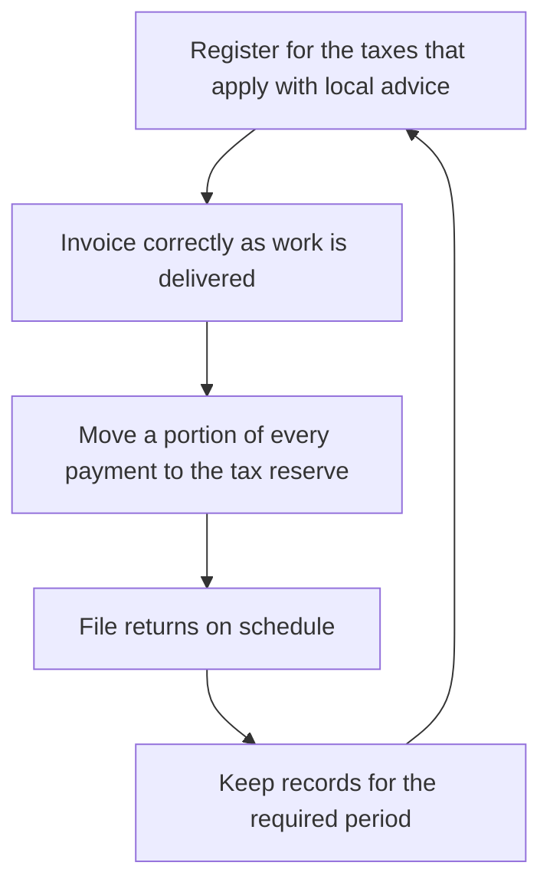

# Tax Administration and Compliance

> **Core skill:** The independent runs tax as an operating routine — registered correctly, invoicing properly, reserving for obligations as income arrives, filing on schedule — with a local accountant confirming every jurisdiction specific rule.

## Why This Matters

Tax is the one obligation that does not forgive inexperience. Deadlines are fixed, penalties accrue automatically, and the rules differ by jurisdiction in ways no general guide can settle. For independents, the real danger is rarely complexity — it is avoidance. The paperwork gets deferred until it becomes a pile, the pile becomes a penalty, and the penalty becomes a very bad month that could have been avoided with a weekly habit. Tax is not a project to finish; it is a rhythm to keep.

The defense is that rhythm, not heroics. Register for what applies, invoice in the required form, move a portion of every payment into a tax reserve the day it arrives, file on the calendar, and keep records that would satisfy a review. Each element is small. Together they mean the independent never experiences a tax crisis, never scrambles for receipts at deadline, and always knows approximately what is owed. The specifics of what applies — income tax, consumption or value added style taxes, withholding, social contributions — depend entirely on the jurisdiction and the structure, so the applicable set must be confirmed with a local accountant, especially when a new market such as Thailand is involved.

A good local accountant is one of the highest leverage relationships a practice can have. They turn rules written for organizations into a checklist for one person, catch obligations that are easy to miss, and often cost less than a single avoidable mistake. But the responsibility stays with the independent even when the accountant prepares the numbers: signatures carry the duty, so the habit is to stay literate about what is filed and why, ask questions early, and review the year's position before deadlines rather than after.

## The Tax Operating Rhythm

| Activity | Cadence | Purpose |
|----------|---------|---------|
| Set aside for tax | Every payment received, immediately | Obligations never outgrow the reserve |
| Record expenses and income | Weekly, brief | Filing and reviews take minutes, not days |
| Invoice correctly | Every billing event | Compliant documents, faster payment |
| Review with the accountant | Monthly or quarterly, short | Catch issues while they are small |
| File returns | On the jurisdiction's schedule | Penalties avoided; history built |
| Yearly review | Annually, ahead of deadlines | Estimate position; plan the next year |

## Invoicing Essentials

| Element | Why It Matters | Principle |
|---------|----------------|-----------|
| Correct legal identity | Determines who can deduct and how | Use the registered name and identifiers |
| Required content | Compliance in the client's jurisdiction | Confirm the required fields locally |
| Clear description | Reduces payment friction and disputes | Outcomes and periods, not vague labels |
| Numbering and dates | Auditability across years | Sequential, never reused |
| Payment terms | Cash flow | State due dates and consequences plainly |
| Tax treatment | Withholding and consumption taxes | Applied as the local rules require, confirmed with the accountant |

## Working With a Local Accountant

| Task | You | Your Accountant |
|------|-----|-----------------|
| Records | Keep clean, current books | Review and reconcile |
| Classification | Ask when unsure | Confirm treatment of transactions |
| Filings | Sign and stay literate | Prepare and advise |
| Deadlines | Keep the calendar | Remind ahead of the schedule |
| New jurisdictions | Flag any new market early | Advise or refer locally, as with Thailand |

## The Tax Operating Cycle



## Practical Applications

### Tax Administration Checklist

- [ ] Applicable taxes and registrations are confirmed with a local accountant
- [ ] A tax reserve receives a portion of every incoming payment automatically
- [ ] Invoicing uses the registered identity with the locally required content
- [ ] Filing deadlines live on a calendar with reminders ahead of time
- [ ] Records are organized so a review would take hours, not weeks

### Tax Reserve Note

```markdown
## Tax Reserve — <period>

| Field | Value |
|-------|-------|
| Income received | Total for the period |
| Reserve moved | Portion set aside for obligations |
| Reserve balance | Available for upcoming filings |
| Upcoming deadlines | What is due, when, and to whom |
| Open questions | Items to confirm with the accountant |
```

## Common Pitfalls

| Pitfall | Why It Is a Problem | Better Approach |
|---------|---------------------|-----------------|
| **Filing from memory and hope** | Rules are jurisdiction specific and change | Confirm the applicable set with a local accountant |
| **Spending the tax before it is due** | The bill arrives against an empty account | Reserve on receipt, automatically |
| **Deadline drift** | Penalties accrue silently and compound | Calendar everything with early reminders |
| **Messy records all year** | Reviews and filings become crisis projects | Weekly bookkeeping, minutes at a time |
| **Assuming one country's rules travel** | A new market such as Thailand has its own obligations | Get local advice before earning locally |
| **Outsourcing completely and blindly** | Responsibility still rests on your signature | Stay literate; ask why, not just what |

## Success Indicators

- Filing deadlines pass calmly because work finished earlier
- The tax reserve always covers what is owed
- Invoices are issued correctly and paid without compliance questions
- The accountant receives clean records and asks few clarifying questions
- New markets or structures are assessed before any local work begins

## Related Topics

- [[01_Contracts_and_Professional_Agreements]]
- [[02_Business_Structure_and_Registration]]
- [[03_Business_Case_and_Economics/00_overview|Business Case and Economics]]

## Summary

Tax administration and compliance for independents is a rhythm of small habits: register what applies with local advice, invoice properly, reserve on receipt, file on schedule, and keep records that make review easy. No general principle settles what a specific jurisdiction requires — the local accountant confirms the rules, the independent keeps the calendar, and the routine keeps tax from ever becoming the crisis it becomes for those who avoid it.
