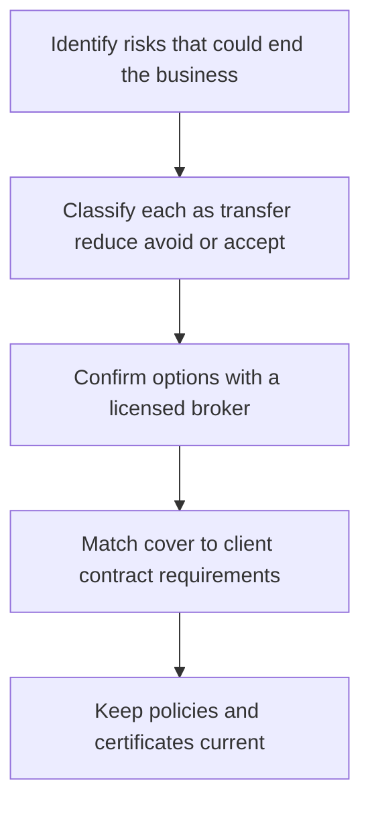

# Insurance Liability and Protections

> **Core skill:** The independent identifies the risks that could end the business and transfers the insurable ones — professional indemnity, public liability, cyber — with cover matched to real client contracts and confirmed with a licensed broker.

## Why This Matters

Insurance is how a solo business survives a mistake that would otherwise be personal. A professional error that costs a client money, a data incident, an accident at a client site, a system outage during a revenue critical moment — the employed engineer never faces these exposures personally, but the independent does. One uninsured claim can wipe out savings built over years of careful work, regardless of how diligent the work itself was. Insurance exists because being careful and being protected are different things, and the business needs both.

The working principle is a simple classification of every identified risk: transfer it, reduce it, avoid it, or accept it. Transferring means insurance or contractual allocation. Reducing means changing practice — better testing, tighter access control, clearer scope. Avoiding means declining the category of work outright. Accepting means a deliberate decision that the exposure is small and budgeted. Insurance handles only the first category, and it works best when the other three are doing their jobs, because policies exclude recklessness and claims still consume time, reputation, and attention even when they pay.

Practicalities differ sharply by market. Which cover types are available, what they include and exclude, what limits are sensible, and what local rules require all vary — so the pathway is a licensed broker and, where the engagement touches somewhere like Thailand, local professional advice rather than assumptions carried from home. Client contracts frequently specify required cover or ask for certificates; matching those requirements is part of winning and keeping larger engagements, and keeping policies current — including during quiet periods — is part of being able to say yes quickly.

## Risk Transfer Map

| Risk | Typical Consequence | Treatment Path |
|------|---------------------|----------------|
| Professional error in delivered work | Client financial loss and a claim | Transfer: professional indemnity cover |
| Data breach or privacy incident | Notification costs, legal exposure, client loss | Transfer plus reduce: cyber cover and security practice |
| Injury or damage at client premises | Personal injury or property claims | Transfer: public liability where applicable |
| Contractual promises beyond standard terms | Unlimited or unusual exposure | Reduce and avoid: negotiate or decline the clause |
| Reputational and time cost of disputes | Attention drain regardless of outcome | Reduce: good contracts, documentation, communication |
| Small operational mistakes | Minor costs absorbed routinely | Accept: budgeted, no insurance needed |

## Coverage Types at a Glance

| Type | What It Generally Addresses | Notes |
|------|-----------------------------|-------|
| Professional indemnity | Claims arising from professional services and advice | The core cover for consultancies; confirm scope and exclusions |
| Public liability | Third party injury and property damage | Often required for on site work |
| Cyber | Data incidents, breaches, response costs | Growing client expectation; check retroactive dates |
| Business interruption | Income loss after a covered event | Relevant where one event stops all revenue |
| Property and equipment | Tools, hardware, home office | Depends on how the business is equipped |

Availability, naming, and required terms differ by jurisdiction; confirm options and limits with a licensed local broker.

## Making Insurance Count

| Practice | Why It Matters |
|----------|----------------|
| Read the policy, not just the summary | Exclusions define the real coverage |
| Match cover to contract requirements | Larger clients specify types and certificates |
| Keep certificates current and accessible | Fast responses win engagements and renewals |
| Review limits as engagement sizes grow | Yesterday's limits may not fit today's contracts |
| Document the work as you go | Claims are defended with records, not recollections |
| Review annually with the broker | Cover drifts out of date as the practice changes |

## The Risk Transfer Path

## Practical Applications

### Insurance Discipline Checklist

- [ ] The risks that could end the business are listed and classified
- [ ] Professional indemnity cover is in place where services expose the practice
- [ ] Client contract requirements for cover are known and matched
- [ ] Certificates are current and can be produced within a day
- [ ] Cover is reviewed annually and after any major contract change

## Common Pitfalls

| Pitfall | Why It Is a Problem | Better Approach |
|---------|---------------------|-----------------|
| **No cover because "nothing ever happens"** | One claim is exactly enough to change the business forever | Transfer the risks that could end it |
| **Buying on price alone** | Cheapest policies exclude what actually goes wrong | Compare coverage and exclusions with a broker |
| **Assuming home cover travels** | Policies are jurisdiction bound in practice | Confirm local availability, including in places like Thailand |
| **Cover allowed to lapse** | Projects and client requirements do not wait for renewal | Diarize renewals; don't cancel quietly in quiet months |
| **Ignoring contract clauses** | Unusual liability terms can outrun any policy | Negotiate risk positions with professional advice |
| **Treating insurance as a substitute for care** | Exclusions and human costs remain | Reduce and avoid risks first; insure the rest |

## Success Indicators

- Client contracts with insurance requirements are answered without delay
- Policies match the actual work, with exclusions understood
- The risk register and the insurance schedule tell a coherent story
- No period without the cover the work requires
- Risk reduction practices make claims unlikely in the first place

## Related Topics

- [[01_Contracts_and_Professional_Agreements]]
- [[03_Tax_Administration_and_Compliance]]
- [[07_Risk_Management_and_Professional_Ethics]]
- [[career-path/08_Security_Engineer/00_overview|Security Engineer]]

## Summary

Insurance liability and protections let a one person business carry risks that would otherwise be personal: identify what could end the practice, classify each risk as transfer, reduce, avoid, or accept, and transfer the insurable ones with licensed local advice. Cover is matched to real contracts, kept current, and paired with the reduction and avoidance practices that keep claims rare — because protection and care work together, and neither replaces the other.
