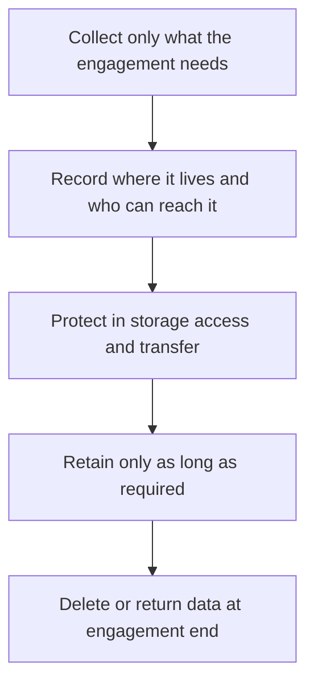

# Data Protection and Client Obligations

> **Core skill:** The independent handles client data as a custodian — knowing what rules apply, minimizing what is held, protecting it with real measures, and answering client due diligence truthfully.

## Why This Matters

Client data is simultaneously an asset, a responsibility, and a liability. When a client hands over personal data, credentials, or business records, obligations attach automatically: contractual confidentiality, and — depending on the jurisdiction, industry, and data involved — privacy rules with genuine consequences. The independent who treats data casually accumulates risk silently: production copies on laptops, credentials in chat, backups never tested, retention that lasts forever because nobody decided otherwise. None of it feels dangerous until a laptop is stolen, an account is compromised, or a client asks a question that cannot be answered honestly.

The custodian framing keeps this manageable without turning the independent into a privacy lawyer. The core discipline is knowing five things about any data held: what it is, why it is held, where it lives, how long it stays, and who can reach it — and being able to answer those questions calmly in a client security review. Minimization does most of the work: data not collected cannot leak, retention limits shrink the exposure window, and clean separation between clients keeps one incident from becoming several.

Specific obligations depend entirely on the legal regime that applies, and regimes differ meaningfully — data protection rules across jurisdictions, from European privacy regulation to Thailand's own data protection framework, impose different duties around transparency, security, retention, and cross border transfer. None of that can be inferred from a general guide: where a market like Thailand is involved, the required obligations must be confirmed with a qualified local lawyer. The commercial side is equally direct: enterprise clients run due diligence, and honest, organized answers — including stated gaps with remediation plans — win deals and keep them. Overpromising on a security questionnaire is not a sales tactic; it is an incident waiting for a date.

## Data Custodianship Principles

| Principle | In Practice | Why It Pays |
|-----------|-------------|-------------|
| Minimization | Collect only what the engagement needs | Less data means less exposure and simpler obligations |
| Purpose clarity | Every dataset has a stated reason to exist | Reviews become answerable; scope creep becomes visible |
| Separation | Client data stays in client designated environments | One incident stays contained |
| Traceability | Access is named, logged where possible, and reviewed | Accountability without surveillance drama |
| Retention limits | Data is deleted or returned when the reason ends | Old data is the expensive part of any incident |
| Honest disclosure | Gaps named with remediation dates, never hidden | Due diligence survives its own audit |

## Mapping an Engagement's Data

| Question | What to Record |
|----------|----------------|
| What data will this engagement touch? | Categories: personal, financial, business confidential, credentials |
| Where will it live during the work? | Client systems, your environments, backups, laptops |
| Who can reach it? | Named people and service accounts, including yours |
| What does the contract promise? | Confidentiality terms, permitted uses, deletion duties |
| Which rules apply? | Jurisdiction and industry regimes — confirmed with a local lawyer |
| What happens at the end? | Deletion or return, evidence of both |

## Answering Client Due Diligence

| Common Question | Good Answer Shape | Never |
|-----------------|-------------------|-------|
| Where is our data stored? | Specific environments with regions named | Vague "securely in the cloud" |
| Who has access? | Named roles, least privilege, no shared accounts | "Just me" without access controls described |
| How is it protected? | Encryption, backups, patching on a stated rhythm | Claims without practices behind them |
| What happens on breach? | A first hour plan and a notification commitment | Silence or "it will not happen" |
| What about subcontractors? | Who, what they touch, and the obligations back to back | Undisclosed tools and side services |

## The Data Custody Lifecycle

## Practical Applications

### Data Obligations Checklist

- [ ] Each engagement's data categories, locations, and access are documented
- [ ] Contractual confidentiality and deletion duties are known and scheduled
- [ ] Applicable privacy regimes are confirmed with a local lawyer, including for Thailand
- [ ] Due diligence questions can be answered from records within a day
- [ ] Engagement closures include deletion or return, with confirmation kept

## Common Pitfalls

| Pitfall | Why It Is a Problem | Better Approach |
|---------|---------------------|-----------------|
| **Keeping client data defensively** | Old data is the largest breach surface and an unneeded obligation | Delete or return promptly per the contract |
| **Guessing at legal duties** | Regimes differ; wrong assumptions are still violations | Confirm applicable rules with a local lawyer |
| **Security questionnaire optimism** | Promises become contractual expectations and audit items | Answer precisely; disclose gaps with plans |
| **Shared credentials across clients** | One compromise cascades into every relationship | Separate accounts and least privilege per engagement |
| **No record of disposal** | "We deleted it" is a claim without evidence | Keep confirmation of deletion or return |
| **Invisible subcontractors** | Third party tools quietly inherit access and duties | Disclose processing parties and back to back obligations |

## Success Indicators

- Due diligence questionnaires are answered truthfully and quickly from records
- Data inventories exist per engagement and shrink as engagements close
- Local legal advice is sought before work in a new jurisdiction begins
- No client data incidents, exfiltration scares, or unsafe retention
- Clients describe the practice as organized and trustworthy on data handling

## Related Topics

- [[01_Contracts_and_Professional_Agreements]]
- [[04_Insurance_Liability_and_Protections]]
- [[06_Business_Continuity_for_Solo_Operators]]
- [[career-path/08_Security_Engineer/00_overview|Security Engineer]]

## Summary

Data protection and client obligations are custodianship made practical: know what is held, minimize it, protect it with real measures, retain it only while justified, and dispose of it with evidence. The rules that apply depend on jurisdiction and must be confirmed with local counsel — including in markets like Thailand — while the commercial return comes from answering due diligence honestly, which is the same discipline that keeps the practice out of trouble.
