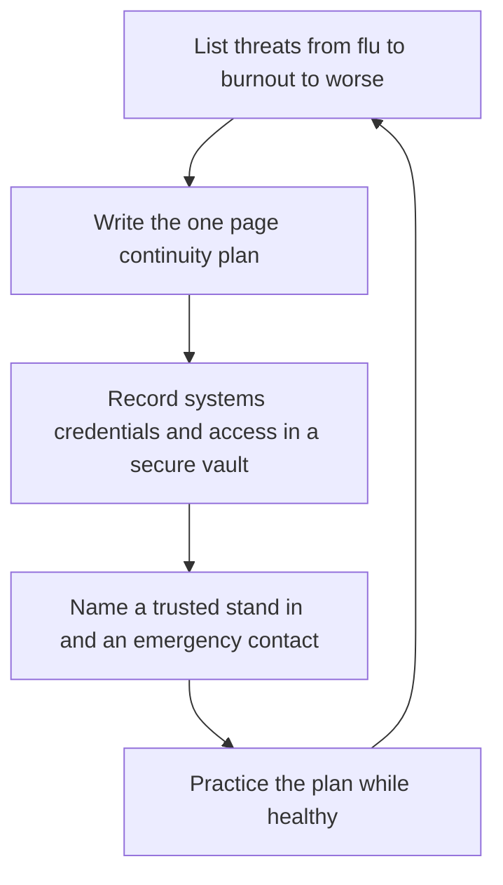

# Business Continuity for Solo Operators

> **Core skill:** The independent makes the business survivable through bad weeks — documented systems, financial reserves, client communication plans, and a written plan for illness, burnout, and worse.

## Why This Matters

An independent business is one person deep in every function: sales, delivery, administration, and support all route through the same human being. If that person stops — a bad flu, a family emergency, a burnout month, a longer illness — everything stops with them, including the client systems they maintain and the income that funds recovery. Companies absorb absence through redundancy; the solo operator must design it instead. Continuity planning is simply the acknowledgment that the operator is a single point of failure, followed by cheap ways to reduce the blast radius.

Most continuity costs almost nothing and works in layers. The personal layer is a financial reserve that buys decision time and rest without panic pricing. The operational layer is documentation: systems, credentials in a secure vault, obligations, and a simple index of what runs where and what breaks first. The human layer is a trusted peer or fellow contractor who could step in for a defined period, plus a client facing layer of prepared messages and reduced-scope options that keep commitments honest during a bad month. None of this requires predicting the specific bad day — only reducing how much depends on any single good one.

The uncomfortable part deserves the same professionalism as the comfortable part. Severe events — a long illness, a death, a disaster — should leave behind a folder someone could act on: where accounts are, what obligations exist, who must be told, and how to hand over or wind down cleanly. This is the duty independents already promise clients for their systems, turned inward. And the most likely continuity event is not a catastrophe but depletion: designing work rhythms that survive ordinary bad weeks — buffers in scope, no chronic overcommitment, rest treated as a business input — prevents more crises than any disaster plan.

## Continuity Threat Model

| Threat | Impact | Cheap Mitigation |
|--------|--------|------------------|
| Short illness | A week of missed commitments | Buffers in schedules; a stand in for urgent items |
| Burnout and depletion | Months of degraded capacity | Sustainable pace; variety in work; time off planned |
| Family or personal emergency | Unpredictable absence | Reserve funds; clients briefed on escalation paths |
| Long illness or worse | Business stops entirely | Written plan; credentials accessible; handover folder |
| Key tool or account loss | Access to everything stops | Vaulted credentials; recovery codes stored securely |
| Client concentration | One loss breaks the year | Pipeline discipline; no client over half of revenue |

## The One Page Continuity Plan

| Element | What It Records |
|---------|-----------------|
| Critical commitments | What must continue first — systems, deadlines, retained clients |
| Pause list | What can honestly wait, with notice templates ready |
| Access | Where credentials live, and who else can open them |
| Stand in | A trusted peer who can handle defined urgent items, with terms |
| Money | How many months the reserve covers and the freeze rules that apply |
| Communication | Who to tell, in what order, with what wording |
| Handover | The folder others would need for handover or wind down |

## Reduced Scope Options

| Situation | What Continues | What Pauses |
|-----------|----------------|-------------|
| One bad week | Urgent support commitments; critical system health | New work; meetings without decisions; marketing |
| One bad month | Contracted maintenance; revenue critical deadlines | New projects; optional enhancements; travel |
| Extended absence | Stand in covers defined urgent items; clients on notice | Everything else, per the plan and the contracts |

## The Continuity Planning Loop



## Practical Applications

### Continuity Checklist

- [ ] A written continuity plan exists and fits on one page
- [ ] Financial reserves are defined, and the freeze rules are decided in advance
- [ ] Credentials and recovery codes live in a secure vault someone trusted could open
- [ ] A stand in agreement exists with a peer, at least informally
- [ ] Client communication templates exist for pause, delay, and handover scenarios
- [ ] The plan is reviewed after any absence, however small

### Continuity Plan

```markdown
## Continuity Plan — <practice name>

| Field | Value |
|-------|-------|
| Critical commitments | Systems and clients that must continue first |
| Pause list | Work that can wait, with notice templates |
| Access | Vault location and named trusted access holders |
| Stand in | Peer or contractor, covered scope, and terms |
| Reserve | Months covered and spending rules during pause |
| Tell order | Who is notified, in what sequence, with what message |
| Handover folder | Location and contents for severe events |
```

## Common Pitfalls

| Pitfall | Why It Is a Problem | Better Approach |
|---------|---------------------|-----------------|
| **Heroic denial** | "I will not get sick" is a plan that fails silently | Plan for absence as a normal event |
| **No reserve** | Financial panic forces bad decisions exactly when judgment is weakest | Build the reserve before it is needed |
| **Credentials only in your head** | Absence becomes a lockout for clients too | Vault everything with recovery paths |
| **Overcommitting by design** | Schedule has no room for a bad week | Keep buffers; decline the work that removes them |
| **Treating burnout as personal weakness** | The most common continuity failure goes unpriced | Design pace as a business input; rest is maintenance |
| **Plan written once, never tested** | The crisis reveals the plan's gaps at the worst time | Walk through it during a calm month |

## Success Indicators

- A bad week passes without client impact or panic
- The reserve exists and the rules for using it were decided in advance
- Trusted access to credentials is possible without your presence
- Clients have never been surprised by an absence — they were informed first
- The most common continuity failure — depletion — is managed by design, not endurance

## Related Topics

- [[04_Insurance_Liability_and_Protections]]
- [[07_Risk_Management_and_Professional_Ethics]]
- [[04_Delivery_and_Client_Management/00_overview|Delivery and Client Management]]
- [[career-path/07_SRE_and_Platform_Engineer/00_overview|SRE and Platform Engineer]]

## Summary

Business continuity for solo operators turns the unavoidable single point of failure into a managed risk: a one page plan, financial reserves, vaulted credentials, a named stand in, prepared client communication, and pace designed to survive ordinary bad weeks. Its value is not for the worst day only — it is the confidence that lets the independent sell boldly, because the business has a plan for when the operator cannot.
