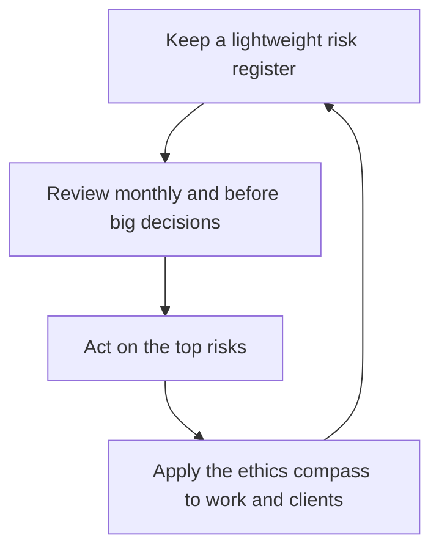

# Risk Management and Professional Ethics

> **Core skill:** The independent runs a lightweight risk practice — a register, regular review, honest judgment — guided by an ethics compass that bounds what work is taken and how clients and collaborators are treated.

## Why This Matters

Independents carry concentrated risk without the machinery companies use to manage it. There is no risk committee, no compliance function, and no legal department — the sole proprietor is all three. What replaces them is not a heavier process but a lighter one practiced consistently: a short register of the risks that actually matter, a monthly look at it, and the discipline to act on the top one or two. The register's value is attention allocation, not documentation; its job is to make sure the risks that could end the practice are seen while they are still small.

Ethics is the second half, and the more personal one. Without an employer's policies to hide behind, the independent's choices are visibly their own, and the market remembers. The compass is a small set of questions applied before action: Is this true? Does this genuinely serve the client? Would I be comfortable if this decision were public? Am I within my competence? Would I want this done to me? These questions operate upstream of most risks — declining work that would harm users, refusing to misrepresent capabilities or results, and treating subcontractors, competitors, and clients' staff fairly are all cheaper than the incidents they prevent.

Risk and ethics converge at the same place: judgment. The largest risks to an independent practice are rarely technical — they are a toxic client accepted out of desperation, an overpromise made to win a bid, a conflict of interest left undisclosed, a system sold beyond what one person can maintain. These are neither accidents nor bad luck; they are decisions taken under pressure. Naming the risk register and the ethics compass as one professional practice — reviewed on a calendar, not a mood — is what keeps the practice clean and durable.

## The Lightweight Risk Register

| Risk | Early Warning | Move |
|------|---------------|------|
| Client concentration | One client exceeds half of revenue | Grow pipeline before the loss, not after |
| Key person dependency | Clients depend on you alone for critical systems | Document, delegate, or price the dependency |
| Dispute or legal exposure | Ambiguous scope; terms signed in a hurry | Contracts, insurance, and clear change control |
| Data incident | Retention, access, or patching drifting | Custodianship routines and incident readiness |
| Reputational damage | A project delivered badly or a promise missed | Early disclosure and honest repair |
| Overcommitment | Calendar has no slack for weeks | Buffers, declines, and renegotiation |
| Skill obsolescence | The niche's work is shifting | Deliberate learning time inside the rhythm |

## The Ethics Compass

| Question | What It Tests |
|----------|---------------|
| Is this true? | Honesty of claims, estimates, and evidence |
| Does this serve the client? | Alignment of advice with the buyer's interest |
| Would I be comfortable if this were public? | Transparency and conduct under scrutiny |
| Is this within my competence? | Honesty about limits; stretching responsibly |
| Would I want this done to me? | Fairness in pricing, terms, and treatment |
| Who is affected but not in the room? | End users, future maintainers, third parties |

## Guardrails That Keep the Practice Clean

| Pressure | Common Temptation | Professional Stance |
|----------|-------------------|---------------------|
| A big contract from a bad fit client | Take it; money is money | Decline or price the true cost of the friction |
| A deadline that requires cutting testing | Ship and fix later | Reduce scope openly; never hide the trade |
| A capability question at a pitch | Round up the resume | Name the gap and how you would close it |
| A conflict of interest | Stay quiet; it is probably fine | Disclose; let the client decide |
| A competitor struggling publicly | Join the pile on | Compete on work; silence costs nothing |
| A client asking for something unwise | Build it without comment | Advise against it, once, on the record |

## The Risk Practice Loop

## Practical Applications

### Risk and Ethics Checklist

- [ ] The register lists the five to ten risks that could genuinely end the practice
- [ ] Review happens monthly and before every major commitment
- [ ] The top one or two risks each period get a concrete action, not just a note
- [ ] Conflicts of interest are disclosed proactively, in writing
- [ ] At least one declined engagement per year was declined for values, and it is documented

## Common Pitfalls

| Pitfall | Why It Is a Problem | Better Approach |
|---------|---------------------|-----------------|
| **Catastrophizing the register** | A giant list is never reviewed and protects nothing | Five to ten real risks, reviewed briefly and often |
| **Optimism as a strategy** | The risks that end practices are exactly the ones deferred | Act on the top risks while they are cheap |
| **Ethics only for big moments** | Small compromises compound into a reputation | Apply the compass to ordinary decisions |
| **Desperation decisions** | No pipeline forces accepting toxic work | Keep the bench alive; walk away strength depends on it |
| **Silent conflicts** | Discovery converts a manageable issue into betrayal | Disclose early; let the client choose |
| **Reviewing only in crisis** | The practice learns its risks from incidents | Calendar the review; celebrate quiet terms |

## Success Indicators

- The register is short, current, and shaped by real events and worries
- Major commitments are preceded by a look at the top risks
- Disclosed conflicts and declined work never come back as regrets
- Clients and peers describe the practice as straight with people
- Problems are usually caught in review, not in incidents

## Related Topics

- [[01_Contracts_and_Professional_Agreements]]
- [[04_Insurance_Liability_and_Protections]]
- [[05_Data_Protection_and_Client_Obligations]]
- [[06_Business_Continuity_for_Solo_Operators]]

## Summary

Risk management and professional ethics are one practice for the independent: a short register that keeps the practice-ending risks visible, a calendar review that forces action on the top ones, and a compass of plain questions that governs what work is taken and how everyone involved is treated. Neither part is bureaucratic — both are personal — and together they protect the only asset that cannot be insurance purchased or invoiced: a reputation for judgment, honesty, and conduct that clients remember long after the work is done.
