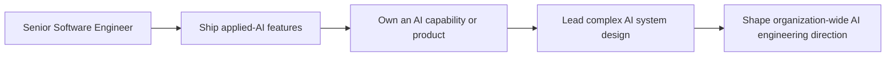

# Applied AI Engineer

> **Positioning:** A specialist engineering path focused on building reliable products and systems on top of foundation models — models the engineer usually does not train.

## What This Path Is

Applied AI engineering is the discipline of turning foundation models (LLMs, multimodal models) into dependable product capabilities: retrieval-augmented generation, tool use and agents, structured outputs, evaluation, guardrails, and controlled cost and latency. The applied AI engineer consumes models as building blocks — through APIs or open weights — and owns everything around them: context construction, retrieval quality, evaluation, security, operations, and product trade-offs.

This is related to, but distinct from, the [[career-path/09_Data_and_ML_Engineer/00_overview|Data and ML Engineer]] path. Data and ML engineers own data platforms and the model training and serving lifecycle. Applied AI engineers own applications whose intelligence comes from models they typically do not train. The boundary blurs when a team also fine-tunes or self-hosts models — that territory overlaps this path with path 09 and with the [[career-path/07_SRE_and_Platform_Engineer/00_overview|SRE and Platform Engineer]] path.

Unlike earlier specializations, this path has no mature BOK. Its de facto reference points are the OWASP LLM Top 10, vendor engineering guidance, and practitioner books such as *AI Engineering* (Chip Huyen, O'Reilly 2025). Capability areas below are therefore defined at the principle level on purpose — tool and framework details churn too fast to be a stable curriculum.

## Primary Outcomes

- AI features that are reliable, observable, and safe in production
- Retrieval and agent systems with measurable and defensible quality
- Evaluation that gates releases instead of relying on anecdote
- Defense in depth against prompt injection, data leakage, and model abuse
- Predictable cost and latency for model calls at product scale
- Clear communication of model limits and failure modes to non-specialists
- Honest product decisions about when AI is — and is not — the right tool

## Capability Areas (planned)

| Capability | Focus | Files |
|---|---|---|
| [[01_LLM_Application_Patterns/00_overview\|LLM Application Patterns]] | RAG, tool use and function calling, agents, context injection, when NOT to use a pattern | 1 overview + 6 topics |
| [[02_Context_and_Prompt_Engineering/00_overview\|Context and Prompt Engineering]] | Prompt design, structured outputs, context budgeting, templates, versioning | 1 overview + 6 topics |
| [[03_Evaluation_and_Observability/00_overview\|Evaluation and Observability]] | Offline eval suites, metrics, tracing, online monitoring, regression gates | 1 overview + 6 topics |
| [[04_AI_Security_and_Guardrails/00_overview\|AI Security and Guardrails]] | Prompt injection defense, OWASP LLM Top 10, input/output guardrails, blast-radius limits | 1 overview + 6 topics |
| [[05_Model_and_Inference_Operations/00_overview\|Model and Inference Operations]] | Model selection, API vs self-hosted, cost/latency trade-offs, caching, batching, fallbacks | 1 overview + 6 topics |
| [[06_Responsible_AI_and_Governance/00_overview\|Responsible AI and Governance]] | Ethics and bias, privacy, compliance, AI ROI, adoption roadmap, governance | 1 overview + 6 topics |

**Total:** 6 capability areas × 7 files = 42 topic files + 1 path overview = 43 files

## Typical Progression

## Signals for Moving Forward

- You enjoy engineering around probabilistic behavior instead of being paralyzed by it.
- You can reason about retrieval quality, context budgets, and model failure modes.
- You treat evaluation as a first-class engineering practice, not an afterthought.
- You can explain to non-specialists what a model can and cannot do.
- You care about cost, latency, safety, and user trust — not only demo quality.
- You can say "no AI needed here" when a deterministic solution is better.

## Evidence to Build

- RAG or agent system design: requirements, retrieval strategy, fallbacks, failure handling
- Evaluation suite with baseline metrics and release-regression gates
- Guardrail and threat review: prompt injection, data leakage, privilege escalation
- Model selection memo with cost and latency analysis
- Production monitoring and quality dashboard for an AI feature
- AI feature launch with user-facing metrics and measurable outcome
- Postmortem for a production model failure or abuse incident

## Nearby Paths

- [[career-path/09_Data_and_ML_Engineer/00_overview|Data and ML Engineer]]: owns the data platforms and trained models an applied AI engineer consumes; source of MLOps and serving depth
- [[career-path/08_Security_Engineer/00_overview|Security Engineer]]: shared application-security ground; AI adds prompt injection, model theft, and data-exfiltration surfaces
- [[career-path/07_SRE_and_Platform_Engineer/00_overview|SRE and Platform Engineer]]: reliability and operation of AI services
- [[career-path/06_Software_Architect/00_overview|Software Architect]]: system structure around AI-heavy workloads
- [[career-path/14_Product_Manager/00_overview|Product Manager]]: AI-native product decisions and outcome framing
- [[career-path/03_Staff_Engineer/00_overview|Staff Engineer]]: cross-team technical influence on AI direction

## Suggested Future Note Route

1. [[computing-foundation-note/Artificial_Intelligence/AI Overview]]
2. [[computing-foundation-note/Artificial_Intelligence/10_LLM_Production_Patterns]]
3. [[computing-foundation-note/Artificial_Intelligence/11_Prompt_Engineering_and_Security]]
4. [[computing-foundation-note/Artificial_Intelligence/13_LLM_Evaluation_and_Guardrails]]
5. [[computing-foundation-note/Artificial_Intelligence/12_AI_ROI_and_Roadmap]]
6. [[computing-foundation-note/Artificial_Intelligence/09_AI_SE_Intersection]]
7. [[career-path/09_Data_and_ML_Engineer/00_overview|Data and ML Engineer path]] for the boundary and overlap
8. Detailed area notes (phase 2 folders under this path)

## Sources

- [OWASP Top 10 for LLM Applications (2025)](https://genai.owasp.org/resource/owasp-top-10-for-llm-applications-2025/)
- [AI Engineering: Building Applications with Foundation Models — Chip Huyen (O'Reilly, 2025)](https://www.oreilly.com/library/view/ai-engineering/9781098166298/)
- [[computing-foundation-note/Artificial_Intelligence/AI Overview]] and notes 09–13 (vault AI curriculum)

## Related

- [[00_Career_Path_Overview]]
- [[career-path/02_Senior_Software_Engineer/00_overview|Senior Software Engineer]]
- [[career-path/09_Data_and_ML_Engineer/00_overview|Data and ML Engineer]]
- [[career-path/08_Security_Engineer/00_overview|Security Engineer]]
- [[career-path/07_SRE_and_Platform_Engineer/00_overview|SRE and Platform Engineer]]
