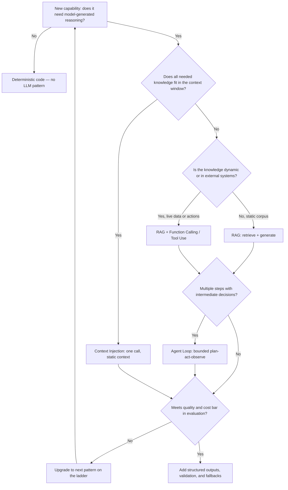

# LLM Application Patterns

> **Capability area:** Choosing and engineering the core application patterns — RAG, tool use, agent loops, structured outputs, and context injection — that turn foundation models into dependable product behavior.

## Why This Matters at Senior Level

A mid-level engineer wires up a framework's RAG chain or agent constructor and ships whatever it outputs. A senior applied AI engineer owns the architecture behind the pattern: why retrieval quality is what it is, when a tool call beats pre-computed context, where a loop must stop, what the output contract is, and how the system degrades when the model misbehaves. Pattern choice is a deliberate cost–latency–reliability trade-off, made against measured quality bars and defended with evaluation numbers.

Senior judgment shows in:
- Choosing the simplest pattern that clears the quality bar, not the most impressive one
- Knowing that retrieval quality — not model quality — is the binding constraint in most RAG failures
- Treating every tool call as a contract: exact schemas, argument validation, bounded blast radius
- Bounding every agent loop with iteration, token, and time limits and a defined failure exit
- Designing fallbacks at the pattern level so degradation is graceful and observable

## Topics in This Area

| # | Topic | Senior Focus |
|---|-------|-------------|
| 01 | [[01_Retrieval_Augmented_Generation]] | Owning retrieval quality end to end: chunking, hybrid search, reranking |
| 02 | [[02_Function_Calling_and_Tool_Use]] | Designing tool contracts the model can follow reliably |
| 03 | [[03_Agent_Loops_and_Orchestration]] | Bounding loops and sequencing multi-step work without runaway cost |
| 04 | [[04_Structured_Outputs_and_Schema_Enforcement]] | Making outputs machine-verifiable and retryable |
| 05 | [[05_Context_Injection_Patterns]] | Budgeting and composing context as an architecture decision |
| 06 | [[06_Pattern_Selection_and_Fallback_Design]] | Choosing the cheapest reliable pattern and degrading gracefully |

## Pattern Selection Flow

## Scope Boundary

This area covers the mechanics and architecture of LLM application patterns: how RAG retrieves and augments, how tool calls are contracted and executed, how agent loops are bounded, how outputs are constrained to schemas, how context is budgeted and injected, and how patterns are selected and failed over. It deliberately stops at the pattern boundary:

- Prompt wording and template craft: [[career-path/18_Applied_AI_Engineer/02_Context_and_Prompt_Engineering/00_overview|Context and Prompt Engineering]]
- Evaluation design and quality metrics: [[career-path/18_Applied_AI_Engineer/03_Evaluation_and_Observability/00_overview|Evaluation and Observability]]
- Injection defense and guardrails: [[career-path/18_Applied_AI_Engineer/04_AI_Security_and_Guardrails/00_overview|AI Security and Guardrails]]
- Serving infrastructure, model choice, caching, cost engineering: [[career-path/18_Applied_AI_Engineer/05_Model_and_Inference_Operations/00_overview|Model and Inference Operations]]
- Ethics, governance, compliance: [[career-path/18_Applied_AI_Engineer/06_Responsible_AI_and_Governance/00_overview|Responsible AI and Governance]]

## Key Principles

- Start with the simplest pattern that meets the quality bar, and upgrade only when evaluation says so
- Retrieval quality determines generation quality: debug the retriever before blaming the model
- Every tool call is a contract — validate arguments, bound side effects, log every invocation
- Agent loops get three bounds (iterations, tokens, time) and a defined failure exit, always
- Structured outputs are the norm; free text is the exception that must justify itself
- Fallbacks are architecture, designed per failure class, not an afterthought

## Common Anti-Patterns

| Anti-Pattern | Why It Fails | Better Approach |
|-------------|-------------|-----------------|
| Agent loop for a single retrieval | 5–10x cost and latency for one lookup | Context injection or plain RAG |
| Blaming the model for bad answers | Failure usually lives in retrieval or context | Measure retrieval and generation quality separately |
| Trusting LLM-chosen tool arguments | Hallucinated or malformed calls hit real systems | Schema plus a validation layer before execution |
| Loop with no iteration or budget limit | Runaway cost, hung requests | Hard limits with partial-result exit |
| Regex-parsing free-text output | Brittle, breaks silently on phrasing drift | Schema-constrained output plus validation |
| No fallback path | Provider outage becomes product outage | Per-failure-class fallbacks, tested by fault injection |

## Maturity Signals

- Pattern choice is documented with rationale and eval evidence, revisitable when data changes
- Retrieval quality is tracked independently of answer quality
- All tool contracts are schema-defined, validated, and audited
- Loops are bounded and their step/budget consumption is visible in dashboards
- Degradation paths are exercised by fault injection, not discovered by users

## Sources

- [[computing-foundation-note/Artificial_Intelligence/10_LLM_Production_Patterns]]
- [[computing-foundation-note/Artificial_Intelligence/13_LLM_Evaluation_and_Guardrails]]
- [[computing-foundation-note/Artificial_Intelligence/09_AI_SE_Intersection]]
- [OWASP Top 10 for LLM Applications (2025)](https://genai.owasp.org/resource/owasp-top-10-for-llm-applications-2025/)
- [AI Engineering: Building Applications with Foundation Models — Chip Huyen (O'Reilly, 2025)](https://www.oreilly.com/library/view/ai-engineering/9781098166298/)

## Related

- [[career-path/18_Applied_AI_Engineer/00_overview|Applied AI Engineer]]: this area's parent path
- [[computing-foundation-note/Artificial_Intelligence/AI Overview]]: AI fundamentals this area builds on
- [[career-path/18_Applied_AI_Engineer/03_Evaluation_and_Observability/00_overview|Evaluation and Observability]]: measures whether the chosen pattern works
- [[career-path/18_Applied_AI_Engineer/04_AI_Security_and_Guardrails/00_overview|AI Security and Guardrails]]: defends the pattern boundaries
- [[career-path/18_Applied_AI_Engineer/05_Model_and_Inference_Operations/00_overview|Model and Inference Operations]]: the infrastructure these patterns run on
