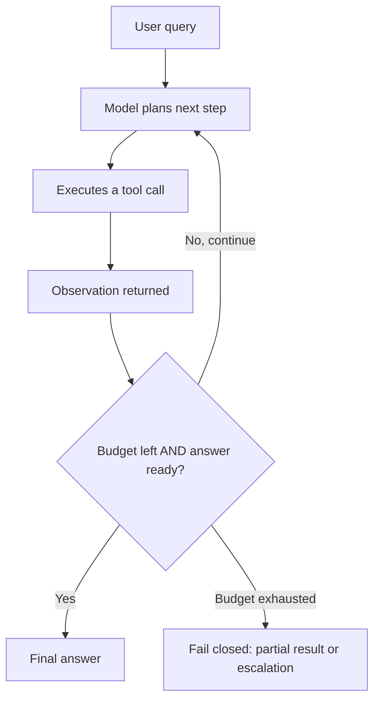

# Agent Loops and Orchestration

> The pattern where the model iterates — plan, act, observe — making multiple tool calls until it produces a final answer, instead of answering in a single shot.

## Why This Is a Senior Skill

A mid-level engineer ships an agent because the demo impressed someone, then discovers runaway loops, unpredictable cost, and hung requests in production. A senior engineer designs loops as bounded state machines: explicit stop conditions, iteration/token/time budgets, plan-then-execute structure, verified observations, and a defined failure exit. Equally senior: knowing when a loop is the wrong answer — a deterministic pipeline with model steps is cheaper, faster, and more predictable whenever the path is known in advance.

The senior challenge is disciplined autonomy: the loop buys generality, and the discipline is what makes that generality survivable in production. Autonomy without bounds is a cost incident waiting to happen.

## Core Frameworks

### Loop Anatomy (Plan → Act → Observe)

Each turn is one LLM call; cost and latency scale with the number of turns, so the stop condition is a first-class design element. The canonical reasoning-in-the-loop formulation is ReAct (Yao et al., 2023), where the model alternates explicit Thought, Action, and Observation steps.

### The Orchestration Spectrum

| Pattern | Structure | Predictability | Cost/Latency | When It Wins |
|---------|-----------|----------------|--------------|--------------|
| Single call plus injected context | One LLM call | Highest | Lowest | Known inputs, static knowledge |
| Deterministic pipeline with model steps | Code defines the steps; the model fills them in | High | Low–medium | Steps known, order fixed (extract → classify → generate) |
| Routed flow | Code branches between pre-built paths | High | Medium | A few well-separated cases |
| Bounded agent loop | Model chooses steps within limits | Medium | High | Path genuinely unknown per query |
| Multi-agent swarm | Several loops coordinate | Low | Highest | Decomposition pays off at scale — rare in practice |

The ladder is the point: each rung buys capability with predictability and cost, so climb only when the rung below demonstrably fails.

### Loop Governance

| Control | Typical Setting | What Happens on Breach |
|---------|----------------|------------------------|
| Max iterations | 5–15 | Exit with partial result plus status flag |
| Token budget | Fixed per query | Stop tool use; synthesize or refuse |
| Time budget | Latency SLA | Timeout with best partial answer |
| Stop condition | Explicit finish signal or schema | Required: "no answer" is a valid outcome |
| Escalation | Human or fallback path | Triggered when confidence is low after budget |

### Orchestration Frameworks (examples, not commitments)

| Framework | Strengths | Weaknesses |
|-----------|-----------|------------|
| LangGraph | Explicit graph/state machines, checkpoints | Steep learning curve; heavy abstraction |
| LlamaIndex Workflows | Event-driven steps | Younger API surface |
| OpenAI Agents SDK / Swarm | Minimal handoffs | Tied to provider conventions |
| DSPy | Optimizes prompts/weights, not control flow | Optimization framing, not loop plumbing |

## In Practice

**Every loop gets three bounds — iterations, tokens, time — and a defined failure exit.** Unbounded loops are outages waiting to happen: cost explodes and requests hang. On breach, fail closed: return the best partial result with a status flag, or escalate, but never let the loop silently keep spending. The exit path is part of the design, not configuration someone adds after the incident.

**Prefer a deterministic pipeline whenever the steps are known in advance.** If you know the flow is "fetch account → look up policy → draft reply," write that as code and let the model do each step well. Loops earn their cost only when the path depends on intermediate results you cannot enumerate — and evaluation should confirm that, not intuition.

**Plan first, then execute; verify observations before acting on them.** Plan-act-observe works because the plan constrains the action and the observation is checked against expectation. When a tool result contradicts the plan's assumption, the model should re-plan, not press on — build that check into the loop rather than hoping the model notices.

**Give the model an explicit finish condition and a default answer.** The most common loop failure is not knowing when to stop. A schema-shaped final output (or an explicit finish tool) plus a fallback answer ("here's what I found; I couldn't complete X") converts ambiguity into a bounded state machine.

**Make every step observable: log plan, tool call, observation, and cost per iteration.** When a loop misbehaves, the trace is the only way to see which step went wrong — and loop traces are the raw material for the evaluation and dashboard work in the observability area. If you cannot trace every step, you cannot run a loop in production.

**Restrict the tool surface per step.** A loop choosing among 30 tools stalls and wanders; one choosing among 3 relevant tools converges. Narrow the visible tool set by the current step, and prefer dedicated, narrow tools over general-purpose ones — the model's decision space is your cost surface.

## Practical Exercise

1. Take a multi-step task (e.g., "check the customer's plan, find their last ticket, draft a response") and write the loop as an explicit state machine: states, transitions, three budgets, failure exit.
2. Implement it and run 10 traces; record iterations, tokens, and wall time per trace.
3. Reimplement the same task as a deterministic pipeline with model steps; run the same 10 traces.
4. Compare quality, cost, and latency — decide which pattern the task actually earns.
5. Inject a tool failure mid-loop (timeout, error result) and verify the loop re-plans or exits instead of spinning.
6. Add a finish condition and a default answer; verify the loop never exceeds its budgets.
7. Tune limits from the trace data and document the escalation path.

## Knowledge Connections

- [[computing-foundation-note/Artificial_Intelligence/10_LLM_Production_Patterns]]: agent-loop fundamentals, ReAct, and loop risks
- [[02_Function_Calling_and_Tool_Use]]: the action primitive the loop composes
- [[06_Pattern_Selection_and_Fallback_Design]]: deciding when the loop is the right rung of the ladder
- [[career-path/18_Applied_AI_Engineer/03_Evaluation_and_Observability/00_overview|Evaluation and Observability]]: loop traces feed evaluation there
- [ReAct: Synergizing Reasoning and Acting in Language Models (arXiv:2210.03629)](https://arxiv.org/abs/2210.03629)

## Common Pitfalls

- Agent loop for a task a single call or pipeline handles: paying 5–10x cost for zero quality gain
- No iteration or budget limits: the classic production incident
- Tools with overlapping purposes: the model stalls choosing among near-duplicates
- Ignoring observations: the loop presses on after a contradictory tool result
- Testing only happy paths: loops fail in ways single calls never do

## Key Takeaways

- Bounded autonomy: budgets and stop conditions are part of the design, not afterthoughts
- The orchestration ladder is climbed by evidence: pipeline → routed → loop → multi-agent
- Plan-act-observe with verified observations is the reliable loop shape
- Observability is non-negotiable: every step traced, every budget visible
- When in doubt, write the workflow as code and let the model do the thinking at each step
