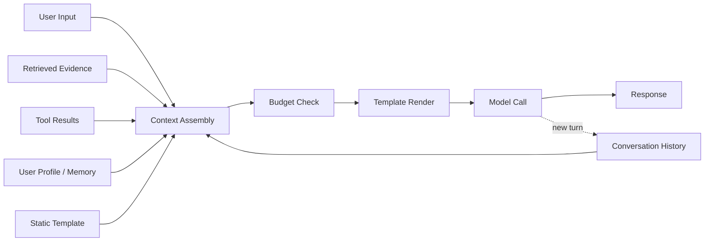

# Context and Prompt Engineering

> **Capability area:** Designing the instructions and assembled context that turn a foundation model into reliable product behavior — the engineered layer between your data and the model call.

## Why This Matters at Senior Level

A mid-level engineer writes a prompt that works on the demo and pastes it into code. A senior applied AI engineer owns the whole context pipeline: prompts as versioned artifacts with regression gates, a token budget allocated deliberately across instructions, memory, and evidence, and an assembly step reproducible enough to debug weeks later.

Prompt quality is the cheapest lever on model behavior — but also the most dangerous one, because a changed sentence can silently ship a policy change, a regression, or a jailbreak. Nobody will review your prompt unless you make it reviewable. That is engineering work, and it is this area's core.

Senior judgment shows in:
- Treating prompts as versioned code released through review, not ad-hoc strings edited in production dashboards
- Budgeting the context window like a scarce, billable resource across sections, not filling it until something breaks
- Designing system messages as durable contracts that keep working when inputs turn hostile or models get upgraded
- Knowing which instructions belong in the static template versus the per-request assembly
- Gating every prompt change behind regression tests before it reaches users

## Topics in This Area

| # | Topic | Senior Focus |
|---|-------|-------------|
| 01 | [[01_Prompt_Design_Principles]] | Writing instructions the model reliably follows, not ones that work by luck |
| 02 | [[02_System_and_User_Message_Design]] | Drawing durable, trust-aware boundaries between message roles |
| 03 | [[03_Context_Window_Management]] | Budgeting, compacting, and managing memory under hard token limits |
| 04 | [[04_Prompt_Templates_and_Versioning]] | Shipping prompt changes as releases with regression gates |
| 05 | [[05_Few_Shot_and_Chain_of_Thought_Techniques]] | Teaching by example and eliciting explicit reasoning |
| 06 | [[06_Dynamic_Context_Assembly]] | Composing the right sources, in the right order, at the right budget |

## Context Assembly Pipeline

## Scope Boundary

**In scope:** prompt design principles; system vs user message structure; context-window budgeting, compaction, and conversational memory; template versioning and prompt regression gating; few-shot and chain-of-thought techniques; and the per-request assembly of context sources, ordering, and budget allocation.

**Out of scope** (owned by sibling areas):
- RAG internals — chunking, embeddings, hybrid retrieval, reranking → [[career-path/18_Applied_AI_Engineer/01_LLM_Application_Patterns/00_overview|LLM Application Patterns]]
- Eval suite construction and prompt-quality metrics → [[career-path/18_Applied_AI_Engineer/03_Evaluation_and_Observability/00_overview|Evaluation and Observability]]
- Prompt injection defense and input/output guardrails → [[career-path/18_Applied_AI_Engineer/04_AI_Security_and_Guardrails/00_overview|AI Security and Guardrails]]
- Model selection, cost, and latency of the call itself → [[career-path/18_Applied_AI_Engineer/05_Model_and_Inference_Operations/00_overview|Model and Inference Operations]]
- Ethics, bias, and compliance of prompt content → [[career-path/18_Applied_AI_Engineer/06_Responsible_AI_and_Governance/00_overview|Responsible AI and Governance]]

## Key Principles

- The prompt is a contract, not a wish: every instruction must be one the model can verify it is following
- Every token in the context must be able to answer "what is this for?" — if not, it is noise that dilutes attention
- Untrusted input is data, never instructions; it enters the payload through the user role, delimited and framed
- Prompts are code: versioned, reviewed, rolled back, and attributed to the requests they served
- Assembly must be deterministic and observable: same inputs, same prompt; and you must be able to see what was sent

## Common Anti-Patterns

| Anti-Pattern | Why It Fails | Better Approach |
|-------------|-------------|-----------------|
| Prompt edited live in a production UI | No review, no rollback, no record | Template in version control, deployed through CI |
| Concatenating user input into the system prompt | User text reads as trusted instruction — injection surface | Pass user input as a separate, delimited user message |
| Filling the window "because it fits" | Attention dilutes, cost and latency rise, lost-in-the-middle errors | Fixed budget per section with explicit eviction order |
| One mega-prompt for every task | A change for one behavior regresses unrelated ones | Task-scoped templates with shared instruction blocks |
| Reasoning demanded on every call | Tokens and latency burned where a lookup suffices | Reasoning only on multi-step tasks; reasoning models for hard ones |

## Maturity Signals

- Every prompt version is traceable: which template version and assembled context served which conversation
- Prompt changes ship through review with regression results attached
- Context budgets are enforced in code, not by convention
- Failure triage starts from the recorded assembled prompt, not from guessing what the model saw
- Few-shot exemplars are curated and versioned like the templates they live in

## Sources

- [[computing-foundation-note/Artificial_Intelligence/11_Prompt_Engineering_and_Security]]
- [[computing-foundation-note/Artificial_Intelligence/10_LLM_Production_Patterns]]
- [[computing-foundation-note/Artificial_Intelligence/13_LLM_Evaluation_and_Guardrails]]
- [[career-path/18_Applied_AI_Engineer/00_overview|Applied AI Engineer]]

## Related

- [[career-path/18_Applied_AI_Engineer/00_overview|Applied AI Engineer]]
- [[computing-foundation-note/Artificial_Intelligence/11_Prompt_Engineering_and_Security]]
- [[career-path/18_Applied_AI_Engineer/01_LLM_Application_Patterns/00_overview|LLM Application Patterns]]
- [[career-path/18_Applied_AI_Engineer/03_Evaluation_and_Observability/00_overview|Evaluation and Observability]]
- [[career-path/18_Applied_AI_Engineer/04_AI_Security_and_Guardrails/00_overview|AI Security and Guardrails]]
- [[career-path/18_Applied_AI_Engineer/05_Model_and_Inference_Operations/00_overview|Model and Inference Operations]]
- [[career-path/09_Data_and_ML_Engineer/00_overview|Data and ML Engineer]]
