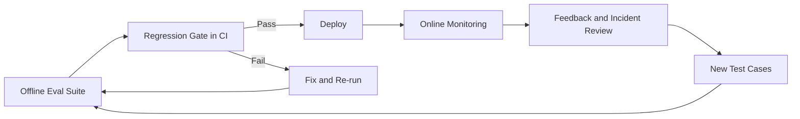

# Evaluation and Observability

> **Capability area:** Building the measurement system that proves — with evidence, not demos — that an LLM-powered feature works, keeps working, and is worth what it costs.

## Why This Matters at Senior Level

A mid-level engineer runs the prompt a few times, looks at the outputs, and ships when they "look good." A senior engineer designs the measurement system before writing the feature: what "good" means, how it is scored, which score gates a release, and which production signals would prove the eval suite wrong.

Probabilistic models break silently and non-deterministically. Without evaluation there is no way to distinguish a better prompt from a different one, no way to ship a model upgrade with confidence, and no way to answer the only question stakeholders actually care about: "How do you know it's working?"

Senior judgment shows in:
- Defining success criteria before building, then choosing metrics that measure those criteria rather than whatever is easy to measure
- Matching evaluation cost to failure risk: deterministic checks for deterministic properties, LLM judges for open-ended quality, humans for the few cases where disagreement matters
- Treating the eval suite as a living contract that changes only through review — every production failure becomes a new test case
- Separating what offline evaluation can prove (the system works on known scenarios) from what only online evaluation can prove (it works for real users)
- Communicating quality as measured deltas against baselines, never as anecdotes

## Topics in This Area

| # | Topic | Senior Focus |
|---|-------|-------------|
| 01 | [[01_Evaluation_Fundamentals_and_Strategy]] | Designing the measurement system before the feature; evals as release gates |
| 02 | [[02_Offline_Evaluation_Suites]] | Golden datasets, edge cases, and curation that make regression safety real |
| 03 | [[03_Metrics_for_LLM_Outputs]] | Faithfulness, relevance, correctness; LLM-as-judge and auto-metrics |
| 04 | [[04_Tracing_and_Observability]] | Spans, cost and latency attribution, reconstructing any production behavior |
| 05 | [[05_Online_Evaluation_and_Monitoring]] | Feedback signals, output sampling, and alerts from real traffic |
| 06 | [[06_Regression_Gates_and_Continuous_Evaluation]] | Wiring evals into CI so no change ships unmeasured |

## Evaluation Lifecycle Flow

The loop is the point: offline suites catch known failure modes before deploy, gates make the check mandatory, online monitoring catches what the suite missed, and every incident returns to the suite as a new test case. A suite that never grows is a suite that has stopped learning from production.

## Scope Boundary

**In scope:** evaluation strategy and fundamentals (why evals gate releases); offline evaluation suites and golden datasets; metrics for LLM outputs — faithfulness and hallucination detection, relevance, correctness, LLM-as-judge design, and automatic metrics; tracing and observability — spans, cost tracking, latency attribution; online evaluation and production monitoring; regression gates and continuous evaluation in CI.

**Out of scope (with pointers):**
- Security guardrails and prompt-injection defense: [[career-path/18_Applied_AI_Engineer/04_AI_Security_and_Guardrails/00_overview|AI Security and Guardrails]] — this area measures quality; that area enforces safety at request time
- Bias and fairness metrics: [[career-path/18_Applied_AI_Engineer/06_Responsible_AI_and_Governance/00_overview|Responsible AI and Governance]]
- Cost-optimization engineering (caching, batching, routing): [[career-path/18_Applied_AI_Engineer/05_Model_and_Inference_Operations/00_overview|Model and Inference Operations]] — this area *measures* cost; that area *reduces* it
- Prompt authoring and context construction: [[career-path/18_Applied_AI_Engineer/02_Context_and_Prompt_Engineering/00_overview|Context and Prompt Engineering]] — this area measures what prompts produce
- Classic ML drift and retraining triggers for trained models: [[career-path/09_Data_and_ML_Engineer/06_ML_Lifecycle_and_MLOps/05_ML_Monitoring_and_Drift|ML Monitoring and Drift]]

## Sources

- [[computing-foundation-note/Artificial_Intelligence/13_LLM_Evaluation_and_Guardrails]] — the three-layer framework, metric families, and monitoring stack this area operationalizes
- [[computing-foundation-note/Artificial_Intelligence/10_LLM_Production_Patterns]] — the patterns being evaluated
- [[computing-foundation-note/Artificial_Intelligence/12_AI_ROI_and_Roadmap]] — defining success criteria before building, and measuring them after
- [[computing-foundation-note/Artificial_Intelligence/09_AI_SE_Intersection]] — MLOps and monitoring context

## Related

- [[career-path/18_Applied_AI_Engineer/00_overview|Applied AI Engineer]]
- [[career-path/18_Applied_AI_Engineer/01_LLM_Application_Patterns/00_overview|LLM Application Patterns]] — the systems under evaluation
- [[career-path/18_Applied_AI_Engineer/04_AI_Security_and_Guardrails/00_overview|AI Security and Guardrails]] — runtime enforcement informed by eval findings
- [[career-path/09_Data_and_ML_Engineer/06_ML_Lifecycle_and_MLOps/00_overview|ML Lifecycle and MLOps]] — the trained-model counterpart of this lifecycle
- [[career-path/09_Data_and_ML_Engineer/04_Data_Quality/00_overview|Data Quality]] — retrieval quality determines RAG answer quality
