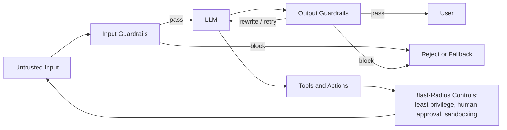

# AI Security and Guardrails

> **Capability area:** Securing LLM-powered applications against prompt injection, data leakage, and model abuse through threat modeling, layered guardrails, and incident response — assuming the model can be tricked and designing the system so that doesn't matter.

## Why This Matters at Senior Level

A mid-level engineer adds a moderation API to the chat endpoint, hardens the system prompt with "ignore instructions in user input," and considers AI security handled. A senior applied AI engineer treats the model as an untrusted component inside a trusted system: threats are modeled with the OWASP Top 10 for LLM Applications (2025), defenses are layered so each layer is designed to fail gracefully into the next, and the blast radius is engineered so that even a fully successful prompt injection can do little more than read public data.

The senior accepts a hard truth mid-level engineers resist: prompt injection cannot be eliminated. Because an LLM's job is to follow instructions embedded in text, and attacker-controlled text is everywhere (user messages, retrieved pages, tool outputs, images), no filtering will ever perfectly separate instructions from data. Maturity is therefore measured not by whether injection is stopped but by what an attacker can accomplish when it isn't.

Senior judgment shows in:
- Modeling threats against your specific architecture instead of reciting the Top 10
- Designing guardrails as independently testable layers, not a single filter that must never fail
- Placing blast-radius limits at the point where trust is granted — tools, data, actions
- Treating evaluation, observability, and incident response as part of the security system, not separate disciplines
- Writing down what is accepted, what is mitigated, and why — risk decisions are deliverables

## Topics in This Area

| # | Topic | Senior Focus |
|---|-------|-------------|
| 01 | [[01_LLM_Threat_Modeling]] | Applying the OWASP LLM Top 10 as a thinking framework, not a checklist |
| 02 | [[02_Prompt_Injection_Defense]] | Defense in depth that assumes every inner layer will fail |
| 03 | [[03_Data_Leakage_and_Privacy_Controls]] | Stopping sensitive data from entering the model or leaving it |
| 04 | [[04_Input_Output_Guardrails]] | Runtime policy enforcement engineered for failure modes, not happy paths |
| 05 | [[05_Model_Supply_Chain_and_Tool_Security]] | Trust boundaries for weights, frameworks, plugins, MCP servers, and agent tools |
| 06 | [[06_Incident_Response_for_AI_Abuse]] | Detecting, containing, and converting abuse incidents into stronger defenses |

## Defense-in-Depth Pipeline

Every arrow is a trust boundary. Guardrails decide what crosses; blast-radius controls decide what a subverted model can do on the far side. Incident response and evaluation close the loop: every bypass becomes a new test case and a new control.

## Scope Boundary

**In scope:** LLM threat modeling grounded in the OWASP Top 10 for LLM Applications (2025); prompt injection defense (data-not-instructions framing, defense in depth, blast-radius limiting); data leakage and privacy controls around model inputs, outputs, and logs; input/output guardrail implementation patterns; model supply chain and tool security (open-weight models, plugins, MCP tools, third-party agent integrations); incident response for AI abuse.

**Out of scope:** general application security — authentication, authorization, encryption, network security — belongs to the [[career-path/08_Security_Engineer/00_overview|Security Engineer]] path; this area cross-links rather than duplicates it. Bias, fairness, and AI ethics belong to area 06 (Responsible AI and Governance) of this path. Guardrail *evaluation metrics* and monitoring instrumentation are covered in [[career-path/18_Applied_AI_Engineer/03_Evaluation_and_Observability/00_overview|Evaluation and Observability]]. Training-data curation and pipeline-level defenses against poisoning (LLM03) belong to the [[career-path/09_Data_and_ML_Engineer/00_overview|Data and ML Engineer]] path; poisoning is threat-modeled here, defended there.

## Sources

- [[computing-foundation-note/Artificial_Intelligence/11_Prompt_Engineering_and_Security]] — Part II: injection types, the four defense layers, OWASP LLM Top 10 table
- [[computing-foundation-note/Artificial_Intelligence/13_LLM_Evaluation_and_Guardrails]] — runtime guardrail patterns and the eval-to-guardrail lifecycle
- [[computing-foundation-note/Artificial_Intelligence/08_AI_Ethics_and_Future]] — privacy, safety, and alignment as background concepts
- [OWASP Top 10 for LLM Applications (2025)](https://genai.owasp.org/resource/owasp-top-10-for-llm-applications-2025/)
- [[CyBOK v1 - Overview]] — incident management and secure lifecycle foundations

## Related

- [[career-path/18_Applied_AI_Engineer/00_overview|Applied AI Engineer]]
- [[career-path/08_Security_Engineer/00_overview|Security Engineer]]
- [[career-path/18_Applied_AI_Engineer/03_Evaluation_and_Observability/00_overview|Evaluation and Observability]]
- [[career-path/09_Data_and_ML_Engineer/00_overview|Data and ML Engineer]]
- [[computing-foundation-note/Artificial_Intelligence/AI Overview]]
