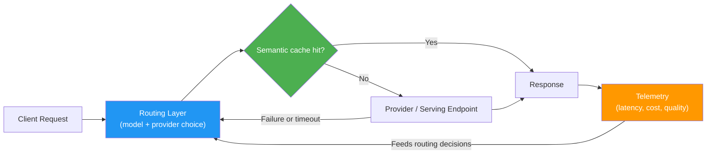

# Model and Inference Operations

> **Capability area:** Selecting the right models and running them in production at the intersection of quality, cost, latency, and reliability — the operating discipline of applied AI.

## Why This Matters at Senior Level

A mid-level engineer calls the biggest available model from one provider and moves on, then reacts to the bill and the p95 latency after they arrive. A senior applied AI engineer treats inference as a production system to be engineered: they choose models by measured evidence against their own workload, buy or run compute with explicit unit economics, and design routing, caching, and scaling so that quality, cost, and latency stay inside budget as traffic grows.

Senior judgment shows in:

- Matching model class and size to task difficulty instead of defaulting to the frontier model
- Knowing the break-even utilization at which self-hosting beats API pricing — and re-checking it as prices and hardware move
- Budgeting cost per task and latency per request before building, not after the first bill
- Designing model routing and fallbacks so a provider outage degrades the product, not breaks it
- Treating provider health, rate limits, and queue depth as capacity problems to be engineered, not surprises to be survived

## Topics in This Area

| # | Topic | Senior Focus |
|---|-------|-------------|
| 01 | [[01_Model_Selection_and_Benchmarks]] | Choosing model class and size by measured evidence, not leaderboards |
| 02 | [[02_API_vs_Self_Hosted_Tradeoffs]] | Deciding API vs self-hosted on unit economics, control, and privacy |
| 03 | [[03_Cost_Optimization]] | Cutting cost per task through caching, batching, compression, and cascades |
| 04 | [[04_Latency_Engineering]] | Engineering TTFT, streaming, parallelism, and graceful degradation |
| 05 | [[05_Serving_Infrastructure_and_Scaling]] | Building serving stacks that scale with autoscaling, rate limits, and queues |
| 06 | [[06_Provider_Management_and_Model_Routing]] | Routing across providers with fallbacks, A/B, and eval-gated promotion |

## The Inference Request Path

Every stage of this path is a decision surface. The routing layer chooses model and provider per request; the cache absorbs repeat work; the provider call is where rate limits, latency, and cost materialize; telemetry feeds the next routing decision. Each topic in this area engineers one or more of these stages.

## Scope Boundary

**In scope:** model selection and benchmarking against your own workload; API versus self-hosted economics; cost reduction that holds quality (caching, batching, prompt compression, small-model cascades, routing); latency engineering (TTFT, streaming, timeouts, parallel calls, fallbacks); serving infrastructure and scaling (GPU serving stacks, autoscaling, rate limits, queueing); multi-provider routing and provider-health management.

**Out of scope — with cross-area pointers:**

- Model cards, governance, and AI ROI framing belong to area 06 (Responsible AI and Governance); this area consumes their outputs — cost targets, usage policies — rather than producing them.
- Classic MLOps for models you train — experiment tracking, training pipelines, drift — belongs to [[career-path/09_Data_and_ML_Engineer/00_overview|Data and ML Engineer]]. Here the model is usually a given; only its operation is ours.
- SLO definitions, incident command, and deep capacity engineering belong to [[career-path/07_SRE_and_Platform_Engineer/00_overview|SRE and Platform Engineer]]; this area touches them only as consumer requirements.
- Observability tooling specifics — tracing, eval dashboards, online quality monitoring — belong to [[career-path/18_Applied_AI_Engineer/03_Evaluation_and_Observability/00_overview|Evaluation and Observability]]; this area treats telemetry as a routing input.

## Sources

- [[computing-foundation-note/Artificial_Intelligence/10_LLM_Production_Patterns]]: patterns whose cost and latency characteristics drive model choice
- [[computing-foundation-note/Artificial_Intelligence/12_AI_ROI_and_Roadmap]]: cost-per-task targets and build-vs-buy framing
- [[computing-foundation-note/Artificial_Intelligence/AI Overview]]: AI fundamentals
- [[SWEBOK v4 - Overview]]: software engineering discipline applied to inference operations

## Related

- [[career-path/18_Applied_AI_Engineer/00_overview|Applied AI Engineer]]
- [[career-path/09_Data_and_ML_Engineer/00_overview|Data and ML Engineer]]
- [[career-path/07_SRE_and_Platform_Engineer/00_overview|SRE and Platform Engineer]]
- [[career-path/18_Applied_AI_Engineer/03_Evaluation_and_Observability/00_overview|Evaluation and Observability]]
