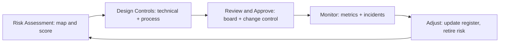

# Responsible AI and Governance

> **Capability area:** Making AI systems trustworthy in production — managing risk, measuring fairness, documenting models, meeting regulation, justifying investment, and running the governance machinery that keeps all of it honest.

## Why This Matters at Senior Level

A mid-level engineer treats governance as paperwork someone else owns: a checklist to complete before launch, a review board to be endured. A senior engineer treats governance as design input: risk assessment shapes architecture before code is written, model documentation gates releases, the ROI case decides whether a project exists at all, and the operating model makes safe releases faster rather than slower.

Senior judgment shows in:
- Translating abstract frameworks (NIST AI RMF) into concrete, executable controls for an LLM application
- Quantifying risk in probability and money so leadership can make real trade-offs
- Knowing when compliance blocks a launch — and when it is the moat that wins enterprise deals
- Writing model documentation that regulators, customers, and the next engineer can actually use
- Designing review and change-control processes that catch real failure modes without becoming bureaucracy

## Topics in This Area

| # | Topic | Senior Focus |
|---|-------|-------------|
| 01 | [[01_AI_Risk_Management]] | Running a defensible risk program, not a checklist |
| 02 | [[02_Bias_and_Fairness_Assessment]] | Detecting and mitigating harms users actually experience |
| 03 | [[03_Transparency_and_Model_Cards]] | Documentation that travels with the model through its life |
| 04 | [[04_Regulation_and_Compliance]] | Reading law into engineering requirements (EU AI Act, PDPA) |
| 05 | [[05_AI_ROI_and_Business_Case]] | Justifying AI investment in money and risk, not hype |
| 06 | [[06_Governance_Operating_Model]] | Review boards, change control, and accountability that scale |

## Governance Lifecycle

## Scope Boundary

This area covers the governance layer around AI systems: risk frameworks, fairness assessment, transparency and model cards, regulation and compliance (EU AI Act, Thailand PDPA), ROI and business-case framing, and the governance operating model.

It does not cover:
- **Technical prompt-injection defense** (input/output guardrails, red-teaming tactics): see [[career-path/18_Applied_AI_Engineer/04_AI_Security_and_Guardrails/00_overview|AI Security and Guardrails]] — this area defines *which* risks matter; that area covers *how* to defend them technically
- **Technical evaluation metric design** (LLM-as-judge, eval suites, regression gates): the Evaluation and Observability area (03) — this area consumes evaluation results for documentation and risk decisions
- **Cost engineering** (token optimization, caching, model tiering): the Model and Inference Operations area (05) — this area uses cost numbers in the business case

## Sources

- [[computing-foundation-note/Artificial_Intelligence/08_AI_Ethics_and_Future]]
- [[computing-foundation-note/Artificial_Intelligence/12_AI_ROI_and_Roadmap]]
- [NIST AI Risk Management Framework](https://www.nist.gov/itl/ai-risk-management-framework)
- [EU AI Act — regulatory framework (European Commission)](https://digital-strategy.ec.europa.eu/en/policies/regulatory-framework-ai)

## Related

- [[career-path/18_Applied_AI_Engineer/00_overview|Applied AI Engineer]] — parent path
- [[computing-foundation-note/Artificial_Intelligence/AI Overview]] — AI fundamentals hub
- [[career-path/14_Product_Manager/00_overview|Product Manager]] — product decisions and outcome framing this area supports
- [[career-path/18_Applied_AI_Engineer/04_AI_Security_and_Guardrails/00_overview|AI Security and Guardrails]] — technical enforcement of the controls defined here
