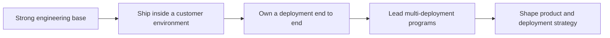

# Forward Deployed Engineer

> **Positioning:** A customer-facing engineering path where the engineer embeds with a customer, builds and ships real solutions inside the customer's own environment, and carries field learning back to the product.

## What This Path Is

Forward deployed engineering is the discipline of making technology work *where the customer actually is*. Instead of building general products and hoping customers can adopt them, the forward deployed engineer (FDE) sits inside the customer's world: their data, their legacy systems, their security constraints, their workflows, their politics. The FDE writes production code, integrates with systems nobody outside the customer has ever documented, deploys into controlled environments, and stays until the outcome is real.

The role was invented at Palantir — where FDEs are known for the "one customer, many capabilities" model — and became a strategic category in 2025–2026 when enterprise AI created a deployment gap: models and demos work, but pilots stall. MIT's NANDA research found that roughly 95% of enterprise AI pilots produced no measurable business impact. The bottleneck is not intelligence; it is deployment — integration, access, data reality, adoption, and trust. OpenAI, Anthropic, and a growing list of vendors now run dedicated forward-deployed organizations to close exactly that gap.

This path is distinct from its neighbors. The [[career-path/15_Solutions_and_Enterprise_Architect/00_overview|Solutions and Enterprise Architect]] designs solutions and governs architecture, typically from the vendor's or enterprise's design side, without living in the customer's codebase. The [[career-path/16_Developer_Advocate_and_Technical_Consultant/00_overview|Developer Advocate and Technical Consultant]] succeeds through enablement, content, and community — influence rather than deployment ownership. The [[career-path/17_Independent_Consulting_and_Technical_Founder/00_overview|Independent Consulting and Technical Founder]] runs their own business with many clients and their own risk. The FDE is an engineer on the vendor's payroll, temporarily embedded with one customer at a time, accountable for production outcomes in that customer's environment — and for feeding what they learn back into the product.

## Primary Outcomes

- Production systems running inside customer environments with real users and real data
- Integrations that survive contact with legacy systems, security reviews, and procurement
- AI and software capabilities adapted to customer constraints rather than demo conditions
- Customer stakeholders who trust the engineer and defend the deployment
- Field evidence — patterns, blockers, failure modes — flowing back into product priorities
- Deployments that renew and expand because the outcome was measured, not assumed

## Capability Areas (planned)

| Capability | Focus | Files |
|---|---|---|
| [[01_Field_Discovery_and_Problem_Framing/00_overview\|Field Discovery and Problem Framing]] | Immersion, shadowing, framing the real problem, stakeholders, scoping, working with sales | 1 overview + 7 topics |
| [[02_Solution_Design_and_Rapid_Prototyping/00_overview\|Solution Design and Rapid Prototyping]] | Demo-driven development, constraints, reusable components, feasibility, hardening path | 1 overview + 7 topics |
| [[03_Integration_and_Deployment_Engineering/00_overview\|Integration and Deployment Engineering]] | Enterprise integration, customer-side data pipelines, deployment models, field debugging, change control, handover | 1 overview + 7 topics |
| [[04_AI_Systems_in_Customer_Environments/00_overview\|AI Systems in Customer Environments]] | LLM applications on customer data, field evaluation, residency constraints, human-in-the-loop, cost and scale | 1 overview + 7 topics |
| [[05_Enterprise_Navigation_Security_and_Compliance/00_overview\|Enterprise Navigation: Security and Compliance]] | Security reviews, access and identity, data protection, procurement, compliance evidence, risk communication | 1 overview + 7 topics |
| [[06_Customer_Communication_and_Executive_Influence/00_overview\|Customer Communication and Executive Influence]] | Demos that land, executive communication, training, expectations, difficult conversations, adoption | 1 overview + 7 topics |
| [[07_Field_to_Product_and_Commercial_Awareness/00_overview\|Field to Product and Commercial Awareness]] | Feedback loops, cross-deployment patterns, roadmap influence, deployment economics, renewal and expansion | 1 overview + 7 topics |

**Total:** 7 capability areas × 8 files = 56 topic files + 1 path overview = 57 files

## Typical Progression

## Signals for Moving Forward

- You enjoy being in the room with the customer, not only in the codebase.
- You are energized, not drained, by messy constraints: legacy systems, approvals, ambiguity.
- You can write production code and explain it to a non-technical executive in the same afternoon.
- You judge your own success by customer outcomes, not by merged pull requests.
- You notice patterns across deployments and want to fix the product, not just the account.
- You can hold a high engineering bar while accepting the customer's reality.

## Evidence to Build

- A deployment you owned end to end: scope, integrations, rollout, adoption, measured outcome
- An integration story: legacy system, undocumented behavior, security constraint, and how you shipped anyway
- Field evaluation and quality evidence for an AI capability running on customer data
- Security and compliance trail you produced yourself: review packet, data-flow diagram, access model
- Executive-facing artifacts: demo script, status memo, outcome report, risk register
- Field-to-product feedback artifact: pattern write-up that changed a roadmap item
- A handover package: runbooks, training, operational readiness checklist

## Nearby Paths

- [[career-path/18_Applied_AI_Engineer/00_overview|Applied AI Engineer]]: builds the AI capability on the product side; the FDE deploys it into customer reality
- [[career-path/15_Solutions_and_Enterprise_Architect/00_overview|Solutions and Enterprise Architect]]: solution design and enterprise architecture without deployment ownership
- [[career-path/16_Developer_Advocate_and_Technical_Consultant/00_overview|Developer Advocate and Technical Consultant]]: enablement and ecosystem influence; helpful for the teaching side of deployments
- [[career-path/14_Product_Manager/00_overview|Product Manager]]: consumes the field signal the FDE produces
- [[career-path/12_Technical_Program_Manager/00_overview|Technical Program Manager]]: coordination patterns for multi-team deployments
- [[career-path/17_Independent_Consulting_and_Technical_Founder/00_overview|Independent Consulting and Technical Founder]]: the FDE skill set, applied without a vendor behind you

## Sources

- [Fortune: One of the fastest-growing jobs in Silicon Valley sends engineers to integrate AI with customers (Sep 2026)](https://fortune.com/2026/09/03/forward-deployed-engineers-fast-growing-six-figure-silicon-valley-job-integrate-ai-with-customers-tech-careers-palantir/)
- [LatamCent: Who's Hiring Forward Deployed Engineers in 2026? (demand data)](https://latamcent.com/research-insights/forward-deployed-engineer-hiring-trends/)
- [MIT NANDA: The GenAI Divide — State of AI in Business 2025](https://mlq.ai/media/quarterly_decks/v0.1_State_of_AI_in_Business_2025_Report.pdf)
- [OWASP Top 10 for LLM Applications (2025)](https://genai.owasp.org/resource/owasp-top-10-for-llm-applications-2025/)
- [AI Engineering: Building Applications with Foundation Models — Chip Huyen (O'Reilly, 2025)](https://www.oreilly.com/library/view/ai-engineering/9781098166298/)

## Related

- [[00_Career_Path_Overview]]
- [[career-path/18_Applied_AI_Engineer/00_overview|Applied AI Engineer]]
- [[career-path/15_Solutions_and_Enterprise_Architect/00_overview|Solutions and Enterprise Architect]]
- [[career-path/16_Developer_Advocate_and_Technical_Consultant/00_overview|Developer Advocate and Technical Consultant]]
- [[career-path/17_Independent_Consulting_and_Technical_Founder/00_overview|Independent Consulting and Technical Founder]]
