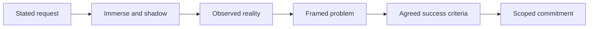

# Field Discovery and Problem Framing

> **Core capability:** The FDE learns the customer's world from the inside — their workflows, systems, incentives, and politics — and frames the real problem before a single line of solution code is written.

## Why This Matters

Forward deployment begins with immersion, not implementation. The customer's stated request ("build us an AI assistant") is rarely the actual problem, and it is never the whole problem. The FDE's first weeks are spent understanding how work really happens: who does what, which systems hold the truth, where the process breaks, and who benefits or loses if it changes.

This is product discovery executed under field conditions. Unlike a product manager studying a market, the FDE studies one customer's reality in depth — with direct access to users, artifacts, and edge cases that no survey would surface. Getting this wrong is the most expensive mistake in the role: a well-built solution to a mis-framed problem still fails, and it fails inside the customer's production environment where failure is public.

The capability also includes the commercial frame. FDEs work alongside sales and account teams, and discovery is often what turns an excited prospect into a scoped, winnable deployment. The FDE must be able to walk into ambiguity, produce a defensible problem statement with success criteria, and get the customer to agree to it in writing.

## Topics in This Capability Area

| Topic | Core Skill | When It Matters |
|-------|------------|-----------------|
| [[01_The_FDE_Role_and_Operating_Model]] | Understanding the FDE operating model and where it fits | Before the first deployment, and at every role transition |
| [[02_Customer_Domain_Immersion]] | Learning a customer's business, vocabulary, and incentives fast | First weeks of every engagement |
| [[03_Field_Discovery_and_Shadowing]] | Observing real work: shadowing users, mapping workflows, finding pains | Before scoping anything |
| [[04_Problem_Framing_Under_Ambiguity]] | Turning vague asks into a well-framed, testable problem | Throughout discovery and re-scoping |
| [[05_Stakeholder_and_Political_Mapping]] | Identifying champions, blockers, and the real decision path | From day one through rollout |
| [[06_Scoping_and_Success_Criteria]] | Defining what done means — measurable and agreed | Before build commitments |
| [[07_Working_with_Sales_and_Account_Teams]] | Buying, expansion, and trust co-owned with commercial teams | Throughout the account relationship |

## From Request to Framed Problem

Each step down the chain is cheaper than committing to a build — do not skip a rung.

## Practical Applications

### Field Discovery Checklist

- [ ] I have watched at least three real users do the work I am being asked to improve
- [ ] I can describe the customer's workflow using their vocabulary, not mine
- [ ] The systems of record and their data-quality reality are documented
- [ ] The problem statement fits on one page and names the user, the pain, and the measurable change
- [ ] Success criteria and out-of-scope items are written down and acknowledged by the customer
- [ ] The stakeholder map covers champion, decision-maker, operators, and likely blockers

## Common Pitfalls

| Pitfall | Why It Is a Problem | Better Approach |
|---------|---------------------|-----------------|
| **Building from the brief** | The written requirement hides the real workflow | Shadow users before accepting the problem statement |
| **Solutions in the first meeting** | Kills trust and contaminates discovery | Ask about the problem; defer solution language |
| **One-stakeholder discovery** | Sponsors describe an idealized process | Talk to operators and skeptics too |
| **Scope creep for momentum** | Every ungoverned yes becomes a delivery debt | Convert requests into scoped, sequenced work |
| **Ignoring organizational politics** | A correct solution can still be blocked | Map decision paths and incentives early |

## Success Indicators

- Customers say "you understand our process better than our own documentation"
- The framed problem differs from — and is smaller than — the initial ask
- Success criteria are measurable and were agreed before build started
- Operators become advocates before the solution ships
- Re-scoping conversations are routine and calm, not crises

## Related Capabilities

- [[02_Solution_Design_and_Rapid_Prototyping/00_overview|Solution Design and Rapid Prototyping]]: discovery feeds what gets designed and shown
- [[06_Customer_Communication_and_Executive_Influence/00_overview|Customer Communication and Executive Influence]]: framing is a communication act
- [[career-path/14_Product_Manager/01_Problem_Discovery/00_overview|Problem Discovery (PM)]]: the product-side discovery discipline
- [[career-path/15_Solutions_and_Enterprise_Architect/01_Business_Analysis_and_Capability_Mapping/00_overview|Business Analysis and Capability Mapping (Solutions Architect)]]: enterprise-scale analysis
- [[body-of-knowledge/BABOK/02_Elicitation_and_Collaboration|Elicitation and Collaboration (BABOK)]]: structured elicitation techniques

## Summary

Field discovery and problem framing is the entry point of every forward deployment: immersing in the customer's world, observing real work, framing the actual problem, mapping the humans around it, and converting it into scoped commitments with measurable success criteria. The FDE who frames well builds the right thing once; the FDE who skips this step rebuilds the wrong thing repeatedly, in public.
