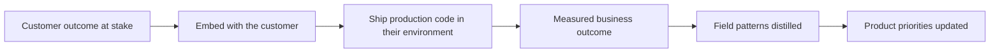

# The FDE Role and Operating Model

> **Core skill:** Understanding the FDE operating model and where it fits — an engineer embedded with one customer, accountable for a production outcome inside that customer's environment, and responsible for carrying what the field teaches back to the product.

## Why This Matters

Forward deployed engineering is not consulting with a different job title, and it is not product engineering done at a distance. The operating model is specific, and it carries three simultaneous commitments: deliver a production outcome for one customer, learn for the product, and protect the commercial relationship that funds both. An engineer who understands only one of the three will optimize in the wrong direction — shipping flawless code nobody relies on, or solving every problem as a bespoke request while the product never gets smarter.

The model matters most at the points of tension between those commitments. The customer asks for something that belongs in the product; the product team asks for something the customer cannot operate; sales asks for a promise engineering cannot yet keep. The operating model is the set of defaults that resolves these collisions quickly — who owns the outcome, what "done" means, when the field speaks for the customer and when it speaks for the vendor.

The role exists because enterprise technology has a deployment gap. Models, platforms, and demos increasingly work in isolation, but value only appears when systems run inside real environments — with real data, real permissions, real operations, and real users. Closing that gap is not a patch to the product; it is a discipline of its own, and the operating model is what makes that discipline repeatable rather than heroic. The difference between an FDE organization that scales and one that burns out is whether the model is explicit.

## What the Operating Model Actually Contains

| Loop | What the FDE does | What it produces | Failure if neglected |
|------|-------------------|------------------|----------------------|
| Delivery | Builds and ships the solution inside the customer's environment | A running system with real users and measured outcomes | A demo that never reaches production |
| Learning | Distills field reality into patterns, blockers, and failure modes | Prioritized product feedback with evidence attached | Every deployment starts from zero |
| Commercial | Works the account with sales and success teams, honestly and early | Trust, renewal, and expansion grounded in delivered outcomes | Engineering surprises erode the account |

The loops are not phases. A healthy deployment runs all three from week one, and the FDE is usually the only person positioned to see them whole at once.

## Boundaries with Neighboring Roles

| Dimension | Forward Deployed Engineer | Solutions Architect | Professional Services | Product Engineer | Independent Consultant |
|-----------|---------------------------|---------------------|-----------------------|------------------|------------------------|
| Employer | Vendor | Vendor or enterprise | Vendor or consultancy | Vendor | Self |
| Primary artifact | Production system in the customer environment | Architecture and solution design | Configured rollout of an existing product | The product itself | Deliverables per engagement |
| Accountability | Customer outcome end to end | Design approved and adopted | Acceptance and utilization | Product metrics | Contract outcomes and own pipeline |
| Code contribution | Production code in the customer environment | Rarely | Occasionally | Product code | Whatever the client needs |
| Relationship to product | Feeds product priorities from the field | Advises design decisions | Escalates product gaps | Owns product decisions | Works across many products |

The boundaries blur in practice, which is exactly why they must be named. An FDE who drifts into pure consultancy loses the product loop; one who drifts into pure product work loses the field loop.

## The Operating Model in Motion



The arrow from field patterns back to product priorities is the one most often missing. Without it, the organization pays field prices for lessons it never keeps.

## Practical Applications

### Operating Model Checklist

- [ ] I can name, in one sentence, the production outcome I am accountable for
- [ ] I know who can approve access, data, and deployment inside the customer's organization
- [ ] I know which product team owns the capability I am extending, and how my feedback reaches them
- [ ] The commercial team and I have agreed what delivery signals they need and when
- [ ] The boundary between customer-specific work and product work is written down, not assumed
- [ ] A customer-side counterpart is named for every workstream I own

### Deployment Charter Skeleton

```markdown
## Deployment Charter — <customer>

| Element | Statement |
|---------|-----------|
| Outcome | <the production result we are accountable for> |
| Success measures | <baseline, target, measurement source> |
| Out of scope | <what this deployment will not do> |
| Field-to-product channel | <how learning reaches the product team> |
| Commercial frame | <deal stage, renewal or expansion link> |
| Review cadence | <who reviews progress, and when> |
```

## Common Pitfalls

| Pitfall | Why It Is a Problem | Better Approach |
|---------|---------------------|-----------------|
| **Consulting drift** | Success slowly redefines itself as billable activity inside the account | Anchor every engagement to a production outcome with a go-live horizon |
| **Order-taking mode** | Working through the customer's ticket queue optimizes symptoms, not the outcome | Co-own the problem statement; propose the smallest change that reaches the outcome |
| **Field work with no feedback loop** | The product pays field prices for lessons it never keeps | Schedule a standing feedback cadence with the owning product team |
| **Product work with no field time** | Design decisions drift away from the customer's operating reality | Protect recurring time in the customer's environment |
| **Hiding bad news** | Surprises damage both the account and engineering credibility | Surface risks early with options, not verdicts |
| **Ignoring the deal clock** | Procurement, renewal, and budget cycles shape what is deliverable when | Understand the commercial timeline and plan the delivery cadence around it |

## Success Indicators

- The customer can state what I own and how my success is measured
- Product teams ship changes traceable to field feedback I produced
- Deployments I own reach production users with measured outcomes
- Commercial colleagues actively pull me into scoping and renewal conversations
- A short absence does not stall the deployment because ownership is documented, not personal

## Related Topics

- [[02_Customer_Domain_Immersion]]
- [[01_Field_Discovery_and_Problem_Framing/00_overview|Field Discovery and Problem Framing]]
- [[career-path/15_Solutions_and_Enterprise_Architect/00_overview|Solutions and Enterprise Architect]]
- [[career-path/16_Developer_Advocate_and_Technical_Consultant/00_overview|Developer Advocate and Technical Consultant]]
- [[career-path/17_Independent_Consulting_and_Technical_Founder/00_overview|Independent Consulting and Technical Founder]]

## Summary

The FDE operating model is a three-loop system — deliver for the customer, learn for the product, protect the commercial relationship — run simultaneously by one embedded engineer. Understanding it as an explicit model, with hard boundaries against neighboring roles, is what keeps the work accountable to outcomes instead of drifting into pure consulting or pure product engineering. Everything else in this capability area is an application of it.
