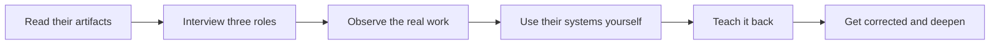

# Customer Domain Immersion

> **Core skill:** Learning a customer's business, vocabulary, and incentives fast — fast enough to read their documents, follow their arguments, and predict what they will and will not accept.

## Why This Matters

You cannot frame a problem in a domain you do not understand, and in the field there is no months-long onboarding to wait for. The customer's world — its business model, its regulation, its internal language, and its political history — is the raw material of every framing decision that follows. The FDE's first weeks decide whether the customer experiences a vendor who asks basic questions or an engineer who can soon argue about their problem on their terms, and that perception colors every scoping conversation afterward.

Domain immersion is also what turns requirements into evidence. When you understand the vocabulary, you notice that "case," "claim," and "matter" are not synonyms but distinct workflow objects with distinct owners and rules. When you understand incentives, you can predict that a technically obvious improvement will be resisted by the team whose work it rearranges. Immersion is what lets the FDE challenge a brief instead of transcribing it.

The discipline has a trap on both sides. Too little immersion and you build on misunderstandings; pretending to full expertise closes the questions you most need open. The goal is fluency with humility — to speak the customer's language accurately while still asking to be corrected, because domains shift with every regulatory window and reorganization.

## What to Learn First

| Domain element | Where the truth usually lives | Fast verification question |
|----------------|-------------------------------|----------------------------|
| Business model | Annual reports, strategy decks, the person who owns the revenue number | Can I draw their money flow in three boxes? |
| Users and roles | Org chart, floor walks, ticket queues | Can I name who does what, and who approves what? |
| Vocabulary | Meetings, internal documents, their acronyms | Can I use their terms correctly without translation? |
| Incentives | How people are measured, targets, KPIs | Can I explain why the obvious fix has not happened? |
| Regulatory frame | Compliance teams, audit findings, past incidents | Can I name the rules that constrain the design? |
| Systems of record | IT landscape documents, shadowing | Do I know which system wins when two disagree? |
| History | The last two failed improvement attempts | Can I say what burned before, and why? |

The history row is the one engineers skip and regret. A domain's scars explain its constraints better than any architecture diagram.

## The Immersion Method

| Step | Action | Output | Time box |
|------|--------|--------|----------|
| 1 | Read the artifacts: strategy decks, process documents, tickets | A list of terms I cannot yet use correctly | First days |
| 2 | Interview three roles: operator, manager, skeptic | Their descriptions of work and friction | First week |
| 3 | Walk the floor: watch work where it happens | Observed reality versus documented process | First two weeks |
| 4 | Use the systems: get read-only access, click through real screens | First-hand understanding of tooling and friction | First month |
| 5 | Teach it back: explain the domain to my own team | Corrections from the customer; gaps exposed | Ongoing |



Teaching the domain back to your own team is the fastest honesty test available: the place where your explanation bends under correction is exactly where your understanding was borrowed rather than built.

## Language as an Instrument

| Their term | What it usually encodes | Common misreading |
|------------|-------------------------|-------------------|
| "The deadline" | A regulatory or contractual consequence | A preference that can be negotiated |
| "Our process" | How work officially runs | How work actually runs |
| "That team owns it" | An organizational boundary and a budget line | A routing hint |
| "We tried that" | Political history with named losers and winners | A technical failure |
| "It's simple" | Their view from one seat in the workflow | A small engineering scope |

Adopt their vocabulary, but verify the meaning behind it before using it in a design argument. Misused insider language destroys credibility faster than open questions ever will.

## Practical Applications

### Immersion Checklist

- [ ] I can explain the customer's business model and where their money comes from
- [ ] I can use their vocabulary correctly in their meetings without being corrected
- [ ] I can name every role involved in the workflow I am improving
- [ ] I understand the incentive each stakeholder answers to
- [ ] I know which system holds the authoritative data for each data type
- [ ] I can summarize the history of at least two prior improvement attempts

### Domain Brief Template

```markdown
## Domain Brief — <customer, industry>

| Field | Notes |
|-------|-------|
| Business model | <how they make money> |
| Key roles | <who does the work, who approves it> |
| Vocabulary | <terms to use, terms to avoid> |
| Incentives | <how each stakeholder is measured> |
| Constraints | <regulatory, contractual, technical> |
| Systems of record | <authoritative source per data type> |
| Prior attempts | <what failed before, and why> |
| Open questions | <what I still do not know> |
```

## Common Pitfalls

| Pitfall | Why It Is a Problem | Better Approach |
|---------|---------------------|-----------------|
| **Skipping to the build** | Immersion feels slow; building feels productive | Spend the first days learning; the frame depends on it |
| **Parroting vocabulary without meaning** | Using their words wrongly erodes trust faster than asking | Verify each term's workflow meaning before reusing it |
| **Learning from documents only** | Documents describe the intended process, not the real one | Confirm every document against observation |
| **Ignoring incentives** | A correct improvement can threaten the people who must adopt it | Ask how each role is measured before proposing change |
| **Single-role view** | Any one role describes only a slice of the workflow | Triangulate across operator, manager, and skeptic |
| **Pretending fluency** | Overclaiming domain knowledge closes the questions you need open | Stay in learner mode; explicitly ask to be corrected |

## Success Indicators

- Customer stakeholders stop translating their own vocabulary for me
- My questions shift from "what does this mean" to "why is it this way"
- I can predict which proposals will be blocked, and by whom, before proposing them
- The domain brief survives review by customer staff with only minor corrections
- Colleagues ask me to brief them on the customer's world

## Related Topics

- [[01_The_FDE_Role_and_Operating_Model]]
- [[03_Field_Discovery_and_Shadowing]]
- [[career-path/15_Solutions_and_Enterprise_Architect/01_Business_Analysis_and_Capability_Mapping/00_overview|Business Analysis and Capability Mapping (SA)]]
- [[career-path/14_Product_Manager/01_Problem_Discovery/00_overview|Problem Discovery (PM)]]
- [[body-of-knowledge/BABOK/02_Elicitation_and_Collaboration]]

## Summary

Customer domain immersion is the FDE's compression of years of institutional knowledge into weeks of deliberate learning: the business model, the vocabulary, the incentives, the systems of record, and the scars. Done well, it converts an outsider's brief into an insider's understanding — the precondition for framing problems, challenging requirements, and earning the trust on which every later deployment decision depends.
