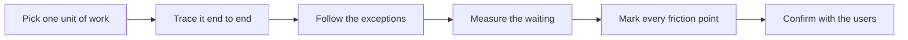

# Field Discovery and Shadowing

> **Core skill:** Observing real work — shadowing users, mapping the workflow as it actually runs, and finding the pains worth solving before scoping anything.

## Why This Matters

Every request arrives with an implied process diagram, and almost none of those diagrams match the floor. The customer's stated workflow describes how work is supposed to happen; shadowing reveals how it actually happens — the workarounds, the double entry, the spreadsheet that has quietly become a system of record, the approvals that route around the official tool. In forward deployment, this gap between the documented process and the observed one is where the real problem usually lives.

Shadowing is also the FDE's cheapest form of risk reduction. A week spent watching three users do the work surfaces edge cases, data quality problems, and organizational friction that no requirements document will ever contain — before any solution design commits to assumptions. The cost of a shadowing hour is trivial compared to the cost of hardening a solution to a workflow that does not exist.

There is a discipline to it, though. Done badly, shadowing becomes a series of interruptions, an interview conducted over someone's shoulder, or a tour of the happy path. Done well, it is silent, structured, and slightly uncomfortable — because the FDE's job is to see the work as it is, including the parts the team is not proud of, and to record what is seen rather than what was hoped for.

## Shadowing Done Right

| Practice | Why it helps | Anti-pattern to avoid |
|----------|--------------|-----------------------|
| Watch first, ask later | Interruptions change how people perform the work | Live interrogating every click |
| Follow one unit of work end to end | Reveals handoffs, queues, and rework loops | Sampling only individual screens |
| Note timestamps of friction | Turns "it is slow" into evidence with frequency | Recording impressions without counts |
| Watch for workarounds | Personal spreadsheets and side channels mark the real pain | Dismissing unofficial tooling as mess |
| Ask "what did you do next" not "why" | Keeps the story factual rather than justificatory | Getting explanations before observations |
| Shadow the new hire too | Novices expose implicit knowledge insiders no longer see | Assuming the expert view is the whole view |

One end-to-end walk-through of a single case is worth more than a week of meetings about the process.

## Mapping the Real Workflow

| Step | What to capture | What it usually reveals |
|------|-----------------|-------------------------|
| Pick the unit of work | A case, order, claim, ticket, patient, shipment | The atom everything else orbits |
| Trace the happy path | Each actor, system, handoff, and wait in order | The official process and its gaps |
| Follow the exceptions | What happens when data is wrong or missing | Manual repair loops nobody documents |
| Count the queue time | How long work waits between steps | The real source of delay, often not the work itself |
| Locate the truth | Where each field actually gets its final value | Systems of record versus systems of practice |
| Mark the friction | Every moment of copy, chase, retype, or reconcile | The pain inventory worth scoping |



The last step matters: present the friction map back to the people you shadowed. Their corrections are themselves discovery, and their confirmation turns observation into shared evidence.

## Reading What You See

| What you observe | What it usually means | What to do next |
|------------------|-----------------------|-----------------|
| Data copied between systems by hand | An integration gap the process absorbs | Quantify frequency and error cost before proposing a fix |
| A spreadsheet that everything depends on | An unowned critical system | Find who maintains it and what breaks when they are away |
| Approvals with no queue, or queues with no approvals | A control that exists on paper only | Test which controls regulators actually check |
| Users avoiding a recently deployed tool | Adoption failure with a local explanation | Ask what the tool forces on them before judging |
| "We just know it" tribal knowledge | Risk concentrated in a few individuals | Capture the decision rules while the person is available |
| Nobody owns an obvious step | A boundary between teams, not an oversight | Identify the inter-team tension before assigning fault |

## Practical Applications

### Field Discovery Checklist

- [ ] At least three different users observed doing the work I am asked to improve
- [ ] One unit of work followed end to end, including at least one exception
- [ ] Friction points logged with frequency and duration, not just description
- [ ] The friction map presented back to users and corrections recorded
- [ ] Systems of record identified per data type, including unofficial ones
- [ ] Pain inventory ranked by who feels it and how often

### Shadowing Notes Template

```markdown
## Shadowing Notes — <user, role, date>

| Field | Notes |
|-------|-------|
| Unit of work observed | <case type and identifier> |
| Steps and actors | <who touches it, in what order> |
| Systems used | <official and unofficial> |
| Friction observed | <what, how often, how long> |
| Workarounds | <side tools, manual steps, verbal approvals> |
| Quote worth keeping | <verbatim user language> |
| Follow-up question | <what I still need to see> |
```

## Common Pitfalls

| Pitfall | Why It Is a Problem | Better Approach |
|---------|---------------------|-----------------|
| **Happy path only** | Exceptions are where most manual effort and cost concentrate | Deliberately ask to see a messy case |
| **Interviewing instead of watching** | Explanations describe the ideal, not the observed | Watch silently first; clarify afterward |
| **Trusting the desk procedure** | Documented process hides the real workflow | Verify every step against observation |
| **Stopping at the first pain** | The loudest complaint is often not the costliest | Keep mapping until the whole loop is visible |
| **Ignoring quiet roles** | Back office and night shifts carry heavy friction invisibly | Shadow whoever touches the work, not just the sponsor's team |
| **Shadowing once** | Work varies by day, month end, and season | Sample across at least one full business cycle |

## Success Indicators

- Users say the friction map matches their reality, including details they had stopped noticing
- The observed workflow differs meaningfully from the documented one, and both are now written down
- Later solution design cites specific shadowing evidence for its assumptions
- Users volunteer access to further cases and time periods after the first session
- Edge cases found during shadowing are already represented in the problem frame

## Related Topics

- [[02_Customer_Domain_Immersion]]
- [[04_Problem_Framing_Under_Ambiguity]]
- [[career-path/14_Product_Manager/01_Problem_Discovery/00_overview|Problem Discovery (PM)]]
- [[body-of-knowledge/BABOK/02_Elicitation_and_Collaboration]]
- [[software-engineering-note/01_Software_Requirements/Software Requirements Overview]]

## Summary

Field discovery and shadowing is the FDE's ground truth: watching real users run the real workflow, tracing work from end to end, counting the friction, and mapping the gap between the process on paper and the process in practice. It converts assumptions into evidence while the evidence is still cheap, and it produces the pain inventory from which an honest, scoped problem statement can finally be built.
