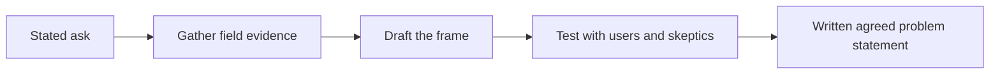

# Problem Framing Under Ambiguity

> **Core skill:** Turning vague asks into a well-framed, testable problem — naming the user, the pain, the evidence, and the measurable change — and getting the customer to agree to it.

## Why This Matters

Customers rarely hand over problems; they hand over solutions they have already imagined. "Build us a chatbot," "give us a dashboard," "automate the intake process" — each ask contains a buried theory about where the pain lives and what will fix it, and that theory is often wrong in the details that matter most. The FDE's job in a deployment's first weeks is to dig out the real problem underneath the requested artifact, because a well-built solution to a mis-framed problem fails inside the customer's production environment, where failure is public and expensive.

Framing is also an act of compression. Field reality is messy: dozens of observed frictions, competing accounts from different roles, a decade of scar tissue. A frame that cannot fit on a page cannot be agreed to, and a problem that cannot be agreed to cannot be scoped, measured, or defended when priorities shift. The discipline is to keep the frame small enough to hold in a meeting and honest enough to survive contact with the operators.

Ambiguity itself is not the enemy. Ambiguity is data: it marks the places where the customer has not yet decided, where two teams tell different stories, or where the answer genuinely is not knowable yet. The FDE who tries to eliminate ambiguity prematurely gets a clean-looking restatement that nobody believes; the FDE who surfaces it, names it, and converts the answerable parts into a testable frame is doing the work that de-risks everything downstream.

## From Ask to Frame

| Raw ask | Hidden assumption | Reframing question |
|---------|-------------------|--------------------|
| "Build us an AI assistant" | The bottleneck is access to information | Where do people wait the longest today, and for what? |
| "Give us a dashboard of everything" | Seeing the numbers changes the behavior | Which decision is currently made without data, by whom? |
| "Automate this approval flow" | The flow as designed is the right flow | What does the approval actually protect against? |
| "Make the process faster" | Speed is the constraint | Where does the work actually stall — waiting, rework, or search? |
| "The other team needs to share their data with us" | Access is the problem | What breaks downstream when the data arrives late or wrong? |
| "We need this in three months" | The date is a requirement | What event drives the date, and what is the smallest thing that must be true by then? |

Every one of these reframing questions is answerable with evidence. That is the test of a question worth asking in discovery.

## The Anatomy of a Strong Frame

| Element | Question it answers | Weak version | Strong version |
|---------|---------------------|--------------|----------------|
| User | Whose work changes? | "The business" | "Claims adjusters handling complex cases" |
| Pain | What costs them today? | "Inefficiency" | "Forty minutes per case spent re-keying the same data" |
| Evidence | How do we know? | "They told us so" | Shadowing plus system logs plus three role interviews |
| Baseline | Where do we start from? | Unstated | "Today: 40 minutes and 6 percent rework rate" |
| Change | What outcome, how measured? | "Improve productivity" | "Cut handling time by a third without raising error rate" |
| Boundary | What is out of scope? | Unstated | "Not changing the intake system or approval policy" |

A frame that fills every row is testable: someone could later falsify it with data, which is exactly what makes it useful.

## Testing the Frame

| Step | Action | Bar to pass |
|------|--------|-------------|
| 1 | Write the frame on one page | Every claim traceable to observed evidence |
| 2 | Read it back to operators | They correct details, not fundamentals |
| 3 | Read it to the skeptic | Objections are about priorities, not facts |
| 4 | Check against the budget line | The pain touches money, hours, or risk already being spent |
| 5 | Get written acknowledgment | Sponsor and operating lead both sign the page |



Re-testing happens whenever evidence changes. A frame is a working hypothesis about what is worth solving, not a document to be filed and defended.

## Practical Applications

### Problem Statement One-Pager

```markdown
## Problem Statement — <customer>

| Element | Statement |
|---------|-----------|
| User | <whose work changes, precisely> |
| Pain | <what costs them, with numbers> |
| Evidence | <how we know: shadowing, data, interviews> |
| Baseline | <current measured state> |
| Target change | <measurable outcome and horizon> |
| Out of scope | <what we are deliberately not touching> |
| Agreed by | <sponsor, operating lead, date> |
```

### Framing Checklist

- [ ] The frame differs from the original ask, and the customer can explain why
- [ ] Every claim in the frame traces to evidence, not to the brief
- [ ] A baseline exists for each measure the frame commits to
- [ ] At least one operator and one skeptic have reviewed the wording
- [ ] The out-of-scope list is explicit and acknowledged
- [ ] The frame fits on one page and is testable by a future observer

## Common Pitfalls

| Pitfall | Why It Is a Problem | Better Approach |
|---------|---------------------|-----------------|
| **Accepting the solution-shaped ask** | The requested artifact embeds an untested theory of the pain | Separate the request from the problem before committing |
| **Framing around what you can build** | The frame bends toward familiar technology, not the actual constraint | Frame from evidence first; choose technology later |
| **No baseline** | Without a starting number, success can never be proven | Measure the current state before designing the change |
| **Sponsor-only framing** | Executives describe an idealized process their teams do not live | Validate the frame with front-line and skeptical roles |
| **Vague outcome nouns** | "Efficiency," "insight," and "transformation" cannot be tested | Replace with numbers, time, error rates, or risk levels |
| **Treating the frame as final** | Field evidence keeps arriving after the kickoff | Revisit the frame at every phase gate and re-agree it |

## Success Indicators

- The agreed frame is smaller and more specific than the original ask
- Operators say the problem statement sounds like their work, not like a vendor document
- Later scope debates reference the frame to settle what is in and out
- The baseline numbers in the frame survive audit by the customer's own analysts
- Re-framing, when needed, is a calm explicit conversation rather than a silent drift

## Related Topics

- [[03_Field_Discovery_and_Shadowing]]
- [[05_Stakeholder_and_Political_Mapping]]
- [[06_Scoping_and_Success_Criteria]]
- [[career-path/14_Product_Manager/01_Problem_Discovery/00_overview|Problem Discovery (PM)]]
- [[software-engineering-note/01_Software_Requirements/Software Requirements Overview]]

## Summary

Problem framing under ambiguity is the FDE's core intellectual move: taking the customer's solution-shaped ask, gathering field evidence, and compressing reality into a one-page, testable problem statement that names the user, the pain, the baseline, and the measurable change — then getting it agreed in writing. The frame is what converts an ambiguous field situation into something that can be scoped, designed, and honestly measured.
