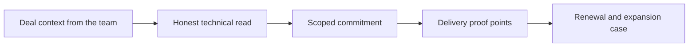

# Working with Sales and Account Teams

> **Core skill:** Co-owning buying, expansion, and trust with commercial teams — giving sales technical truth early and getting the account context that shapes what is worth building.

## Why This Matters

The FDE sits on the seam between two systems that rarely share a clock: the commercial relationship, which moves on quarters, renewals, and signature dates, and the engineering reality, which moves on access approvals, data quality, and hardening estimates. Left unmanaged, that seam tears — sales promises what engineering has not scoped, engineering delivers what the deal cannot wait for, and the customer watches both. Managed well, the seam is where the FDE becomes the most credible voice in the account: the person who tells the truth early and is believed because of it.

Commercial context is not a distraction from engineering; it is an input to it. Why the customer is buying, what they promised their board, which budget line pays, when the fiscal year closes, and what a competitor demonstrated last month — each of these changes which solution is worth building first and how much scope is actually fundable. An FDE who does not know the deal shape will optimize the wrong slice, and will find out at the renewal conversation instead of the design conversation.

The relationship also runs in the other direction. Sales teams need honest technical reads: what is feasible, what it will really take, what the risks are, and which promises are safe to make. An FDE who dodges that role leaves a vacuum that optimism fills, and the person who pays for the optimism is the customer — and then the FDE, in the environment where the shortfall is publicly visible.

## What the Commercial Side Needs from Engineering

| Moment | What the team needs | What only the FDE can give |
|--------|---------------------|----------------------------|
| Pre-sale discovery | Confidence the claimed value is real | Evidence from customer-observed pain and data |
| Scoping | A commitment that can be delivered and defended | Feasibility judgment with named risks |
| Proposal | Words about the solution that survive scrutiny | Concrete architecture at the right altitude |
| Pilot design | Criteria that will prove value if value exists | Measures and baselines engineered to be honest |
| Renewal | Proof the last promised outcome happened | Outcome evidence from the running system |

The rule of thumb: the FDE supplies facts and feasibility; the commercial team supplies timing and terms. Neither role improvises the other's half in front of the customer.

## What Engineering Needs from the Commercial Side

| Context | Why it changes the build | When to ask |
|---------|--------------------------|-------------|
| Deal history | Explains trust level and past friction | Before the first customer call |
| Budget owner and cycle | Determines scope size and decision windows | During scoping |
| Evaluation criteria | Shapes what the pilot must demonstrate | Before pilot design |
| Competitive frame | Reveals which capabilities the customer will scrutinize | During solution design |
| Promises already made | Anything promised becomes engineering's backlog invisibly | Immediately, and in writing |
| Expansion strategy | Where the deal can grow and what the next step is | Before hardening choices are finalized |

That fourth column is a real meeting, not a wish list: a short monthly sync between the FDE and the account team gives both sides what they need to stop guessing.

## Working the Seam Honestly

| Tension | Commercial instinct | Engineering instinct | Working rule |
|---------|--------------------|----------------------|--------------|
| Delivery date | Commit to the close date | Estimate from the work | The FDE gives a range; the commercial owner chooses what to promise |
| Early enthusiasm | Share the demo story widely | Avoid publicity before production | Agree announcement milestones on delivered evidence |
| Bad news | Contain it until certain | Surface it with options | Disclose early with a mitigation path, never as a bare verdict |
| Scope pressure | Add the request to close | Hold the agreed frame | Every addition is priced and traded, never silently absorbed |
| Customer blame | Protect the relationship | Document the blocker | Escalate facts internally; resolve externally as one team |



The loop completes at renewal: delivered evidence becomes the expansion case, and the FDE's delivery history becomes the account team's most valuable asset.

## Practical Applications

### Account Collaboration Ground Rules

- [ ] I am briefed on the deal history and decision process before customer-facing discovery
- [ ] No commitment is made to the customer that I have not seen in writing
- [ ] Every promise already made to the customer has been surfaced to me and logged
- [ ] The account team knows the top three delivery risks and the mitigation for each
- [ ] Outcome evidence flows to the team on a schedule, not only when asked
- [ ] Bad news reaches the account team before it reaches the customer

### Delivery-to-Commercial Handoff Snippet

```markdown
## Deployment Status — <customer, date>

| Element | Statement |
|---------|-----------|
| Promised outcome | <what the customer is expecting, per the agreement> |
| Status | <on track, at risk, blocked; with evidence> |
| Top risks | <risk, likelihood, mitigation, owner> |
| Next decision needed | <what, from whom, by when> |
| Proof points available | <evidence the account team may share, and with whom> |
```

## Common Pitfalls

| Pitfall | Why It Is a Problem | Better Approach |
|---------|---------------------|-----------------|
| **Promising in the room** | Improvised commitments become inherited obligations with no scope behind them | Defer, price, and confirm every new promise in writing |
| **Withholding bad news** | Surprises hit the account at the worst moment and cost more than the truth | Disclose risks early with options attached |
| **Skipping deal context** | Engineering optimizes the wrong slice of a fundable solution | Ask about the deal before designing for it |
| **Treating the champion as the buyer** | Enthusiastic users rarely hold the budget that sustains the deployment | Learn who signs, and what they will need to see |
| **Us-versus-them drift** | Blaming commercial urgency or engineering caution corrodes the team the customer sees | One account narrative; argue internally, deliver externally |
| **Vanishing until renewal** | The account team loses the delivered-outcome story it needs to expand | Keep a lightweight, scheduled evidence flow |

## Success Indicators

- Commercial colleagues brief me before promising anything technical to a customer
- I can explain the deal's decision process, budget cycle, and success framing in one minute
- Promises made to the customer match what engineering scoped and planned
- Renewal and expansion conversations cite outcome evidence I produced
- Disagreements with the account team are resolved internally and never leak as discord

## Related Topics

- [[06_Scoping_and_Success_Criteria]]
- [[01_The_FDE_Role_and_Operating_Model]]
- [[07_Field_to_Product_and_Commercial_Awareness/00_overview|Field to Product and Commercial Awareness]]
- [[career-path/15_Solutions_and_Enterprise_Architect/00_overview|Solutions and Enterprise Architect]]
- [[06_Customer_Communication_and_Executive_Influence/00_overview|Customer Communication and Executive Influence]]

## Summary

Working with sales and account teams is a deliberate partnership: the FDE gives the account its honest technical voice — feasibility, risks, and deliverable commitments — and receives the deal context that determines what is worth building and when it must land. The discipline is truth-in-the-room plus early disclosure of risk, kept in a lightweight rhythm so that delivered outcomes, not hope, become the story the account team tells at renewal.
