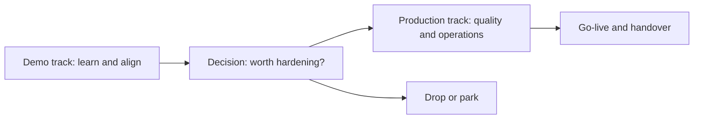

# Solution Design and Rapid Prototyping

> **Core capability:** The FDE designs and prototyped solutions in days, under the customer's constraints, using demos as instruments of alignment — and knows exactly what it will take to harden each one for production.

## Why This Matters

In forward deployment, the first artifact is rarely a specification — it is a working demo. Customers align around what they can see and touch, and field time is too expensive to spend on design debates in the abstract. The FDE's prototyping skill is therefore a communication skill: a tight prototype converts a week of requirements meetings into one focused conversation.

But speed creates a dangerous illusion. Prototypes built in a demo-grade environment hide the work that production demands: error handling, data quality, permissions, scale, and operations. The FDE must hold two modes in mind at once — "what can I show this week" and "what would it actually take to run this for real". Confusing the two is how deployments die in the gap between a successful pilot and an unshipped production system.

Designing under constraints is also the daily condition. The customer does not control their vendors, cannot upgrade their database, will not get budget for infrastructure, and cannot move data across a border. The best design in these environments is not the theoretically elegant one; it is the one that respects constraints while still reaching the outcome — and that can be explained to both engineers and executives in the same breath.

## Topics in This Capability Area

| Topic | Core Skill | When It Matters |
|-------|------------|-----------------|
| [[01_Demo_Driven_Development]] | Using prototypes as alignment instruments, not throwaway shows | Every iteration with the customer |
| [[02_Designing_Under_Customer_Constraints]] | Working within technical, legal, and organizational limits | Every design decision in the field |
| [[03_Reusable_Components_and_Platform_Thinking]] | Building once, deploying many times without copying debt | From the second customer onward |
| [[04_Iterating_with_Field_Feedback]] | Running tight feedback loops with real users | Throughout the deployment |
| [[05_Technical_Feasibility_Assessment]] | Judging quickly what is possible and what it will cost | Before commitments are made |
| [[06_From_Prototype_to_Production]] | The hardening path: quality, security, operations, ownership | Between pilot success and go-live |
| [[07_Choosing_the_Right_Engineering_Bar]] | Matching rigor to stakes instead of habit | Constantly, under time pressure |

## The Two-Track Build

Run both tracks consciously — a prototype that cannot become production is a demo, and should be named as one.

## Practical Applications

### Prototype-to-Production Checklist

- [ ] Every prototype has a named demo purpose and an explicit "what this does not do yet" list
- [ ] Feasibility is assessed against the customer's real constraints, not the lab environment
- [ ] The hardening path is estimated before the prototype becomes a commitment
- [ ] Reusable components are extracted only when a second use is real, not hypothetical
- [ ] Real users from the customer side have touched the prototype before go-live decisions
- [ ] A production-readiness review covers security, operations, data, and ownership gaps

## Common Pitfalls

| Pitfall | Why It Is a Problem | Better Approach |
|---------|---------------------|-----------------|
| **Demo as product** | Demo-grade code becomes production debt | Name the gap openly; schedule hardening explicitly |
| **Building for one customer only** | Every deployment starts from zero | Extract reusable components when the second use is real |
| **Ignoring constraints to show art** | Impressive prototypes that can never ship | Design inside the customer's actual limits |
| **Waterfall scoping in the field** | Field reality changes faster than specs | Iterate with demos and written scope updates |
| **Skipping production discipline** | Pilots that never go live burn trust | Treat hardening as a first-class phase with criteria |

## Success Indicators

- Prototypes change the customer's mind — or confirm their assumptions — within days, not weeks
- Customers can articulate the difference between what they saw in the demo and what production requires
- The hardening estimate is trustworthy: production ships close to what was forecast
- A second deployment starts from components, not from scratch
- Field solutions reach production users, not just evaluation committees

## Related Capabilities

- [[01_Field_Discovery_and_Problem_Framing/00_overview|Field Discovery and Problem Framing]]: design follows a framed problem
- [[03_Integration_and_Deployment_Engineering/00_overview|Integration and Deployment Engineering]]: where prototypes become running systems
- [[04_AI_Systems_in_Customer_Environments/00_overview|AI Systems in Customer Environments]]: prototyping with models and customer data
- [[career-path/18_Applied_AI_Engineer/01_LLM_Application_Patterns/00_overview|LLM Application Patterns (Applied AI Engineer)]]: product-side patterns the FDE adapts
- [[career-path/06_Software_Architect/00_overview|Software Architect]]: structural judgment behind field design decisions

## Summary

Solution design and rapid prototyping is how the FDE converts understanding into alignment: fast, demo-driven design under the customer's real constraints, conscious iteration with field users, honest feasibility judgment, and a disciplined hardening path from pilot to production. The skill is not building fast; it is building fast without lying to yourself — or the customer — about what still stands between the demo and production.
