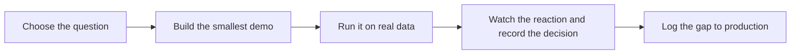

# Demo Driven Development

> **Core skill:** Using prototypes as alignment instruments, not throwaway shows — every demo answers a question, moves a decision, and leaves an honest account of what still stands between it and production.

## Why This Matters

In forward deployment the first artifact is rarely a specification; it is a working demo. Customers align around what they can see and touch, and field time is too expensive to spend on design debates in the abstract. A tight prototype running on the customer's own data converts a week of requirements meetings into one focused conversation — and it produces that conversation with evidence instead of adjectives.

But speed creates a dangerous illusion. A prototype built for a demo hides the work that production demands: error handling, data quality edge cases, permissions, scale, and operations. The FDE must hold two modes at once — "what can I show this week" and "what would it actually take to run this for real" — and must never let the first impersonate the second. Confusing the two is how deployments die in the gap between a successful pilot and an unshipped production system.

Demo-driven development is therefore a discipline of intent. Each demo has a question it exists to answer, an audience whose decision it is meant to move, and a written list of what it does not yet do. A demo that changes a decision has done its job; a demo that merely impresses has cost the customer trust it will have to lend back with interest.

## A Demo Is an Instrument

| Demo type | Question it answers | Typical audience | What it must not pretend |
|-----------|--------------------|------------------|--------------------------|
| Possibility demo | Is this approach worth pursuing at all? | Sponsor, business lead | That the hard data or integration work is solved |
| Workflow demo | Does this fit how people actually work? | Operators, team leads | That the sample data resembles production data |
| Data-quality probe | Is the underlying data even usable? | Data owners, analysts | That clean demo data means clean real data |
| Integration proof | Can we reach the systems that hold the truth? | IT, security | That one connector implies a supported architecture |
| Executive demo | Should we fund the next phase? | Budget owners | That the prototype runs without supervision |

Naming the type out loud keeps everyone honest. "This is a possibility demo" sets a different expectation than "this is a pilot," and expectations are the actual product of any demo.

## The Demo Loop

| Step | Action | Exit condition |
|------|--------|----------------|
| 1 | Define the question and the decision it should move | Someone can state what changes if the demo lands |
| 2 | Build the smallest thing that answers it | The demo covers one path well, not five poorly |
| 3 | Run it on the customer's real data | Known gaps documented before showing |
| 4 | Watch the reaction, capture the decision | Decision recorded with owner and date |
| 5 | Log the gap to production | Gap list named honestly at the demo itself |



The gap list is not an apology; it is the most valuable artifact the demo produces for engineering. It is also what protects the FDE when the demo is remembered as more than it was.

## Demo Hygiene

| Practice | Why it matters | Failure if skipped |
|----------|----------------|--------------------|
| Use real data, or clearly labeled synthetic data | Data reality is where most field risk lives | A demo that proves only the curated sample works |
| Name the mocked parts | Hidden mocks become accidental promises | Scope built on sand the customer thought was stone |
| Script the happy path, but prepare for one edge | The audience will ask about their hardest case | A live failure that poisons the demo's message |
| Have a named decision to seek | A demo without a decision is entertainment | Enthusiasm with nothing to attach it to |
| Keep demo code separate and labeled | Demo shortcuts must not leak into production paths | Hidden demo debt discovered during hardening |
| Never demo what you cannot explain | Questions about mechanics expose understanding gaps | Credibility loss at the exact moment of attention |

## Practical Applications

### Demo Brief Template

```markdown
## Demo Brief — <customer, date>

| Element | Detail |
|---------|--------|
| Question | <what this demo exists to answer> |
| Audience | <who attends, and what decision they face> |
| Data used | <real or synthetic, source, scope> |
| Path shown | <the one workflow demonstrated> |
| Known gaps | <what this does not do yet, written plainly> |
| Decision sought | <what we ask the audience to decide> |
| Follow-up | <actions, owners, dates> |
```

### Demo Readiness Checklist

- [ ] The demo answers one named question, not a tour of features
- [ ] The decision being sought is written down before the session
- [ ] Real data used wherever possible; synthetic parts labeled as such
- [ ] The gap-to-production list is prepared and will be shared at the demo
- [ ] One credible edge case rehearsed alongside the happy path
- [ ] Demo environment isolated from anything resembling production behavior

## Common Pitfalls

| Pitfall | Why It Is a Problem | Better Approach |
|---------|---------------------|-----------------|
| **Demo as product** | Demo shortcuts quietly become production debt | Name the gap openly at every showing; schedule hardening explicitly |
| **Curated-data illusion** | A demo on clean data teaches nothing about real readiness | Probe real data early; show what the messy version does |
| **Demo without a decision** | Applause is not alignment; the plan has not moved | Define the decision sought and record the outcome |
| **Skipping the gap list** | Silence about limitations reads as a promise of completeness | State limitations in the room, in writing, every time |
| **Polishing the wrong thing** | Time spent on visuals is time not spent on the risky path | Invest the demo budget in the riskiest technical seam |
| **Letting the demo become the spec** | Audiences anchor on incidental details they saw | Frame the demo as a question, not a preview of the final system |

## Success Indicators

- Demos change or confirm a decision within days, and the decision is recorded
- The gap-to-production list is requested by the customer, not just offered by me
- Post-pilot surprise is rare because limitations were stated from the first showing
- Operators say the demo felt like their work, not a vendor's imagination of it
- Hardening estimates made after a demo hold up when the hardening actually starts

## Related Topics

- [[02_Designing_Under_Customer_Constraints]]
- [[06_From_Prototype_to_Production]]
- [[04_AI_Systems_in_Customer_Environments/00_overview|AI Systems in Customer Environments]]
- [[career-path/14_Product_Manager/07_Technical_Partnership/00_overview|Technical Partnership (PM)]]
- [[career-path/18_Applied_AI_Engineer/01_LLM_Application_Patterns/00_overview|LLM Application Patterns (Applied AI)]]

## Summary

Demo-driven development treats the prototype as an alignment instrument: each demo answers one named question, seeks one real decision, runs on the customer's actual data wherever possible, and ends with an honest gap list between what was shown and what production demands. Done this way, demos collapse weeks of debate into single conversations — and never quietly mortgage the customer's trust to fund the next standing ovation.
