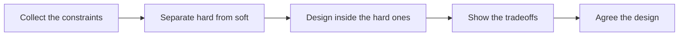

# Designing Under Customer Constraints

> **Core skill:** Working within technical, legal, and organizational limits — designing the best solution the customer can actually run, not the best solution in the abstract.

## Why This Matters

The architecture that a lab or a greenfield side project would produce is almost never available in the field. The customer does not control their vendors, cannot upgrade the database this year, will not get budget for new infrastructure, cannot move data across a border, and cannot change a process that a regulator examines. Every design decision in forward deployment is made inside a box — and the FDE's job is not to wish the box away, but to find the best solution that fits inside it and still reaches the outcome.

This constraint realism is what separates field design from theoretical design. An elegant solution that requires a cloud service the security team will never approve is not elegant; it is fiction. A beautiful data pipeline across a legal boundary the company cannot cross is not a design, it is a liability. The FDE learns to treat constraints the way civil engineers treat gravity: not as obstacles to argue with, but as forces that shape every valid structure.

The skill has a second half, though, because constraints are not uniform. Some are immovable — physics, law, contract. Others are soft: policy defaults, ossified habits, decisions nobody has revisited since a reorganization. Telling hard constraints from soft ones is where judgment lives, and the FDE who can move a soft constraint with evidence creates design space for everyone. The rule is simple: design inside the hard limits, but never accept a soft limit without asking who owns it and what would change their mind.

## The Constraint Taxonomy

| Constraint type | Typical examples | Who owns it | How movable |
|-----------------|------------------|-------------|-------------|
| Technical | Legacy systems, no version upgrades, bandwidth, latency | IT and platform owners | Slow; sometimes workable around |
| Data | Residency, quality, access rights, retention rules | Data owners, legal | Rarely, without formal approval |
| Security | Network zones, identity model, tooling allowlists | Security leadership | With evidence and patience |
| Legal and regulatory | Privacy law, industry rules, audit obligations | Compliance and legal | Essentially fixed |
| Organizational | Skills available, change fatigue, team boundaries | Business leadership | Movable with sponsorship |
| Budgetary | Capex versus opex rules, procurement thresholds | Finance | Cyclical; plan around cycles |
| Contractual | Vendor terms, exclusivity, existing licenses | Procurement and legal | Fixed until renewal windows |

Most failed "technical" objections in the field are, on inspection, one of the other rows wearing a technical costume. Classify before you argue.

## Working the Constraint Set

| Step | Action | Output |
|------|--------|--------|
| 1 | Collect constraints from every owner, not just the sponsor | A full list, including the ones nobody mentioned |
| 2 | Classify each as hard, soft, or unknown | A ranking with sources for each judgment |
| 3 | Design inside the hard set first | A base design that cannot be invalidated |
| 4 | Test soft constraints with the owner and evidence | Design space recovered where owners agree |
| 5 | Show trade-offs to decision makers | Explicit choices, not designer whims |
| 6 | Revisit when the environment changes | A design that tracks reality |



Presenting trade-offs is not weakness; it is the opposite. "Given three constraints we cannot move, here are two viable designs and what each costs" is the most credible design conversation there is.

## Trade-Off Conversations

| Customer demand | Why it is genuinely hard | Honest options to present |
|-----------------|--------------------------|---------------------------|
| "On-premises only, no external connectivity" | Model and dependency updates, telemetry, vendor support all assumed connectivity | Frozen versions with a manual update path; or an approved egress channel for updates only |
| "No data leaves the region" | Cross-region processing and centralized operations break | In-region deployment with local operations; or derived data only crossing the line |
| "Keep the existing system as the screen of record" | The old interface limits workflow imagination | Build around it behind the scenes; or phased replacement |
| "No new infrastructure this year" | Scale-out, HA, and isolation options shrink sharply | Design for the annual budget cycle; stage readiness for next cycle |
| "The process cannot change" | The current process encodes audit and control obligations | Automate within the process; reduce steps that are controls in name only |

Each row should end in a decision the customer makes with their eyes open. A trade-off hidden is a surprise scheduled for later.

## Practical Applications

### Constraint Register Template

```markdown
## Constraint Register — <customer, initiative>

| Constraint | Source or owner | Hardness | Impact on design | Who could move it, what it would take |
|------------|-----------------|----------|------------------|----------------------------------------|
| <statement> | <name, policy, law> | hard or soft or unknown | <what it forces> | <owner, evidence needed> |
```

### Design-Under-Constraints Checklist

- [ ] Constraints collected from IT, security, legal, finance, and operations — not just the sponsor
- [ ] Each constraint classified with a source, not with folklore
- [ ] The base design violates no hard constraint
- [ ] Soft constraints challenged once with evidence and their owners
- [ ] Every significant trade-off presented to a named decision maker
- [ ] The register is re-checked at each phase gate for changed conditions

## Common Pitfalls

| Pitfall | Why It Is a Problem | Better Approach |
|---------|---------------------|-----------------|
| **Designing the ideal, then subtracting** | Subtracting from a fantasy produces fragments, not fit solutions | Start from the constraint set and design upward |
| **Treating every constraint as hard** | Soft constraints ossify into false physics | Ask each owner what would change their mind |
| **Fighting unchangeable constraints** | Energy spent re-litigating law and contract is wasted departmentally and politically | Route effort to the constraints that can actually move |
| **Hiding trade-offs** | The customer discovers the cost after commitment, in production | Present trade-offs before design sign-off, in their terms |
| **Forgetting the operator** | A design that needs skills or staffing the customer lacks fails at adoption | Design for the people who will actually run it |
| **Re-litigating settled questions** | Each retrofit of a decided constraint burns trust and calendar | Record decisions with their rationale; revisit only on trigger |

## Success Indicators

- The customer's security, legal, and IT teams recognize their constraints in my design without re-explaining them
- At least one soft constraint per engagement has been moved or deliberately confirmed as fixed
- Trade-off decisions are on record with named owners
- The deployed solution runs on infrastructure the customer already operates
- Nobody at go-live says "we never discussed that limitation"

## Related Topics

- [[05_Technical_Feasibility_Assessment]]
- [[06_From_Prototype_to_Production]]
- [[05_Enterprise_Navigation_Security_and_Compliance/00_overview|Enterprise Navigation: Security and Compliance]]
- [[career-path/06_Software_Architect/00_overview|Software Architect]]
- [[career-path/15_Solutions_and_Enterprise_Architect/05_Security_Risk_and_Compliance/00_overview|Security Risk and Compliance (SA)]]

## Summary

Designing under customer constraints means treating the customer's real limits — technical, legal, contractual, and organizational — as the space in which every valid solution must live. The FDE collects the full constraint set, separates hard from soft, designs inside the immovable bounds, moves what can legitimately move with evidence, and presents trade-offs as explicit decisions for named owners. The result is not the theoretically best design; it is the best design that can actually run.
