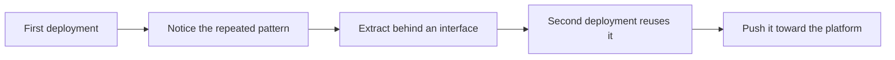

# Reusable Components and Platform Thinking

> **Core skill:** Building once, deploying many times without copying debt — extracting reusable components from field solutions and pushing them toward the platform.

## Why This Matters

Every deployment generates artifacts that a different customer will eventually need: a connector to a common enterprise system, a data-quality checker, an access-pattern scaffold, an evaluation harness, a rollout pattern. The FDE who carries these forward multiplies their velocity with each engagement; the FDE who starts from zero every time burns the same weeks over and over. The difference compounds — not linearly, but with every customer in the portfolio whose deployment begins one step ahead.

The naive alternative is copy-paste: fork the previous deployment, rename the customer, adjust the details. It works once, and it hides its cost. Two forks become four, then ten; a fix applied to one does not reach the others; the differences between customers become invisible until an upgrade breaks half the fleet. Copying is the fastest way to slow down, because it trades a visible present cost for an invisible future one.

Platform thinking in the field is disciplined, though. The trap on the other side is premature abstraction — building a grand framework on top of one customer's idiosyncratic needs, then dragging it through every subsequent deployment. The working rule is economic, not aesthetic: extract at the second real use, not the first hypothetical one, and push the component toward the product at the third. Field components earn their way into the platform through evidence, not through enthusiasm.

## The Copying Debt Problem

| Pattern | Short-term appeal | Long-term cost |
|---------|-------------------|----------------|
| Fork the previous deployment repo | Saves days at kickoff | Fixes stop propagating; forks diverge silently |
| Hardcode the customer's mappings | Avoids config design | Every new customer re-encounters the same general problem |
| One-off scripts per deployment | Fast to write, no ceremony | Nobody can operate them except their author |
| A private "field toolkit" | Personal velocity feels high | Knowledge stays personal; the team cannot scale |
| Grand framework from one data point | Feels like platform thinking | Rigid abstraction fights every subsequent customer |

The question to ask before any copy: is this the second time this exact problem has appeared? If yes, it is a component candidate. If no, it may honestly be one-off work.

## What Deserves to Be a Component

| Candidate | Signal it is reusable | Signal it is not |
|-----------|----------------------|------------------|
| System connectors | Second customer, same system or protocol | Bespoke endpoint with customer-specific semantics |
| Data-quality checks | Same class of defect across sources | One legacy system's unique quirk |
| Access and identity scaffolds | The pattern constrains every deployment | Customer's org model is genuinely singular |
| Evaluation harnesses | Quality must be proven the same way everywhere | Metric definitions differ fundamentally |
| Rollout and training patterns | Same adoption mechanics repeat | Custom change management is the point |
| Reporting and export shapes | Same outputs demanded repeatedly | One report for one executive |

Two tests gate every extraction: the interface can be stated simply, and the behavior is stable enough to promise. A component with a sprawling interface or a shifting contract is a burden wearing a platform costume.

## The Extraction Path

| Step | Action | Guardrail |
|------|--------|-----------|
| 1 | Mark the seam while building the second use | Do not generalize during the first build |
| 2 | Factor behind a narrow interface | Customer-specific details live outside the component |
| 3 | Keep configuration declarative | No per-customer code branches inside |
| 4 | Track every divergence in a ledger | Forks are visible, counted, and owned |
| 5 | Propose the component to the product team | Include usage evidence from real deployments |
| 6 | Retire the field fork once upstream absorbs it | One maintained implementation, not two |



The path ends upstream. A component that lives only in the field organization is a private library; a component that reaches the platform becomes leverage for everyone.

## Practical Applications

### Divergence Ledger Template

```markdown
## Divergence Ledger — <component>

| Deployment | Divergence | Reason | Owner | Disposition |
|------------|------------|--------|-------|-------------|
| <customer> | <what differs from the base> | <why it was necessary> | <name> | plan to upstream or permanently fork |
```

### Reuse Checklist

- [ ] Before copying anything, I checked whether this is the second occurrence of the pattern
- [ ] Customer-specific values live in configuration, not in component code
- [ ] Every live fork appears in the divergence ledger with an owner
- [ ] The component's interface is documented and narrow
- [ ] The product team has seen usage evidence from at least two deployments
- [ ] Extraction time was budgeted in the deployment plan, not stolen from hardening

## Common Pitfalls

| Pitfall | Why It Is a Problem | Better Approach |
|---------|---------------------|-----------------|
| **Copy-paste deployment** | Forked bases diverge until fixes cannot propagate | Extract shared parts on second use; configure the rest |
| **Premature platform** | One customer's needs produce an abstraction that fights all others | Wait for the second real use before generalizing |
| **Component without a home** | A reusable piece nobody owns rots at the first staff change | Give every component an owner and a home team |
| **Hidden divergence** | Undocumented forks defeat the purpose of sharing | Keep a ledger; treat forks as decisions, not accidents |
| **Generalizing for a hypothetical third customer** | Speculative flexibility adds cost and confusion now | Generalize when demand is real, not when it is imaginable |
| **Field-only forever** | The platform never benefits from field-proven patterns | Push components upstream with usage evidence |

## Success Indicators

- A second deployment starts from shared components rather than a fresh repository
- Component divergence across customers is documented and small
- The product team has absorbed at least one field component with field usage evidence
- Deployment kickoff time for repeat solution types measurably drops
- Field engineers outside my deployments reuse the components and report issues back

## Related Topics

- [[01_Demo_Driven_Development]]
- [[07_Field_to_Product_and_Commercial_Awareness/00_overview|Field to Product and Commercial Awareness]]
- [[career-path/06_Software_Architect/00_overview|Software Architect]]
- [[career-path/07_SRE_and_Platform_Engineer/00_overview|SRE and Platform Engineer]]
- [[03_Integration_and_Deployment_Engineering/00_overview|Integration and Deployment Engineering]]

## Summary

Reusable components and platform thinking turn field work from a sequence of one-off builds into a compounding practice: noticing the patterns that recur across customers, extracting them behind narrow interfaces at the second real use, tracking divergence honestly, and pushing proven components back toward the product platform. The FDE's portfolio gets faster with every deployment — but only if the lessons are carried forward as components rather than memories.
