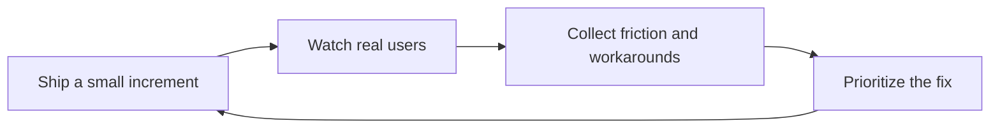

# Iterating with Field Feedback

> **Core skill:** Running tight feedback loops with real users — putting working software into operators' hands early and letting their observed friction, not the plan, drive the next iteration.

## Why This Matters

The plan is a guess about a workflow, and the field is where guesses get corrected. Feedback loops are the mechanism by which a deployment stays honest: small increments reach real users quickly, their behavior — not their politeness — is studied, and the next increment answers what the last one revealed. In an environment where requirements shift with every reorganization and regulation, an iteration cadence is not a methodology preference; it is the only way the solution remains aimed at the actual problem.

Field feedback is also where adoption is won or lost. Users who watch a tool take shape around their real work become its advocates; users who receive a finished system built from meeting notes become its audience, and audiences defect quietly. The FDE who routes each iteration through the people doing the work is compounding trust with every cycle, and trust is the currency that buys the benefit of the doubt when something misbehaves in production.

The discipline is discrimination: separating what users say from what they do, and separating one loud opinion from a real pattern. Feedback arrives in many forms — meeting comments, usage telemetry, support tickets, the silent workaround that appears three weeks after launch — and each has a different evidentiary weight. The FDE's job is to gather all of it, trust behavior over enthusiasm, and record decisions so that direction changes are visible choices rather than drift.

## Feedback That Counts

| Feedback type | How to collect it | Why it is weak alone |
|---------------|-------------------|----------------------|
| Stated opinion in meetings | Direct questions, review sessions | Reflects the speaker's role and confidence, not usage reality |
| Structured observation | Watching users run the tool on real work | Narrow sample unless repeated across roles |
| Usage telemetry | Instrumented events and paths | Shows what happened, not why or whether it mattered |
| Support tickets and questions | Help channels, ticket queues | Measures confusion, not the absence of need |
| Silent workarounds | Watching for exports, side spreadsheets, paper | Strong signal of failure, easy to miss if not looked for |
| Adoption changes over time | Weekly active use by role and task | Needs interpretation; novelty effects distort early readings |

Behavior beats opinion when they disagree. A user who says the tool is great while exporting everything to a spreadsheet is telling the truth with their hands.

## The Iteration Cadence

| Rhythm | What happens | Who participates |
|--------|--------------|------------------|
| Weekly | A small increment reaches a user group; friction is collected | Operators, FDE |
| Weekly | Triage of observed friction into fix, defer, or reject | FDE, customer counterpart |
| Biweekly | Release notes in the customer's language reach users | Users, team leads |
| Monthly | Findings against success criteria reviewed | Operating lead, sponsor's office |
| At each phase gate | Scope and frame revisited; direction confirmed or changed | Sponsor, operating lead, FDE |

The cadence is deliberately pedestrian. Deployments that depend on heroic pushes produce heroic stalls; steady loops survive vacations, reorganizations, and quarter-end.

## Triaging Field Feedback

| Observed signal | Likely interpretation | Action |
|-----------------|-----------------------|--------|
| Users keep exporting results to spreadsheets | The in-product output does not match their real next step | Study the spreadsheets; fix the output or integrate the handoff |
| Questions in chat instead of using the feature | Discoverability or trust gap, not necessarily missing function | Improve the path to the feature before building more |
| The tool is used heavily during review season only | The tool serves a periodic job; expectations should match | Align success measures and support model to the cycle |
| One team posts detailed complaints, others silent | Either a real defect cluster or a role-specific need | Check telemetry per role before responding to volume |
| Workarounds appearing in parallel spreadsheets | Adoption failure with a concrete cause | Ask what forces the workaround; fix the forcing condition |
| Nobody uses a feature built to spec | The spec missed the workflow | Re-observe the workflow before patching the feature |



Every loop should end with a recorded decision — fix now, defer with a trigger, or reject with a reason. Feedback that changes nothing is a survey, not a loop.

## Practical Applications

### Feedback Log Template

```markdown
## Feedback Log Entry — <date, source>

| Field | Notes |
|-------|-------|
| Who and role | <user, team, observed or reported> |
| Behavior observed | <what they did, in the tool or around it> |
| Friction or need | <in their words> |
| Frequency and impact | <how often, who is affected> |
| Decision | fix now or defer with trigger or reject with reason |
| Follow-up | <what changes next increment> |
```

### Field Loop Checklist

- [ ] Working increments reach real users at least every two weeks
- [ ] Behavior is collected alongside opinions, including workaround sightings
- [ ] Every change to direction has a recorded reason
- [ ] Success criteria are checked against evidence at each monthly review
- [ ] Users see their feedback turn into visible changes and are told when it did
- [ ] Loud single voices are checked against telemetry before they set direction

## Common Pitfalls

| Pitfall | Why It Is a Problem | Better Approach |
|---------|---------------------|-----------------|
| **Feedback theater** | Asking for input and never acting trains users to disengage | Close the loop visibly: every cycle ships something traceable to feedback |
| **Anecdote-driven roadmap** | The loudest user redefines the product for everyone | Weigh against telemetry and role-level patterns |
| **Ignoring silent evidence** | Workarounds and drop-offs speak without complaining | Watch behavior and exports, not only feedback channels |
| **Batching releases** | Quarterly mega-releases obscure cause and effect | Ship small increments so learning stays attributable |
| **Champion-only loops** | Enthusiasts diverge from the wider user base | Include quiet and skeptical users in observation |
| **Changing direction without a record** | Silent pivots read as chaos to sponsors and engineers | Log each decision: what changed, why, with what evidence |

## Success Indicators

- Users cite specific changes that came from their feedback, unprompted
- Workaround sightings decline cycle over cycle as friction is removed
- The monthly review can compare measured progress against the agreed criteria
- Direction changes are rare, recorded, and evidence-backed
- Adoption grows among users who were not part of the original pilot group

## Related Topics

- [[01_Demo_Driven_Development]]
- [[06_From_Prototype_to_Production]]
- [[06_Customer_Communication_and_Executive_Influence/00_overview|Customer Communication and Executive Influence]]
- [[career-path/14_Product_Manager/00_overview|Product Manager]]
- [[career-path/18_Applied_AI_Engineer/03_Evaluation_and_Observability/00_overview|Evaluation and Observability (Applied AI)]]

## Summary

Iterating with field feedback means running the deployment as a series of small, observable loops: ship an increment, watch real users, collect friction including the silent sort, and let recorded evidence — not the plan or the loudest voice — choose the next move. It is simultaneously engineering practice, adoption strategy, and quality mechanism, and it is the difference between a system that was delivered and a system that is used.
