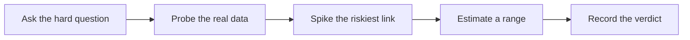

# Technical Feasibility Assessment

> **Core skill:** Judging quickly what is possible and what it will cost — probing the customer's real data, systems, and constraints before commitments are made, and recording an honest verdict.

## Why This Matters

Every commitment in forward deployment should trace back to an assessment made with eyes open: can this actually work here, with this data, under these constraints, and what will it take? The pace of field work pressures the question to be answered early and cheaply — a prospect asks in a workshop, a sponsor asks in a steering meeting — yet the cost of a wrong answer is paid in production. Feasibility assessment is the FDE's instrument for answering the question fast without answering it dishonestly.

The lab is the enemy of honest assessment. Prototypes built with clean sample data, modern dependencies, and administrator access demonstrate what is possible in a world the customer does not inhabit. In their world, the table has twelve million rows with four naming conventions, the API rate-limits aggressively, the identity provider rejects service accounts, and the network path crosses a zone nobody mentioned. Feasibility lives in that world, and the only way to read it is to touch the customer's real artifacts — their data, their systems, their people.

An honest verdict is a professional asset. "Not feasible as stated, here is what would make it feasible" is one of the most valuable sentences an FDE can say, because it arrives before money and reputation are committed. The pattern to avoid is the silent no — doubt held privately, hope replacing judgment, until the discovery surfaces during hardening when its cost has multiplied. Fast, recorded, revisitable judgments are what make the fast pace safe.

## The Feasibility Questions

| Question | How to probe it | Red flag |
|----------|-----------------|----------|
| Does the required data exist? | Sample the actual fields, not the data dictionary | Documentation describes fields production does not populate |
| Is the data usable? | Inspect quality: nulls, duplicates, formats, drift | Quality varies by team or has never been measured |
| Can we get access? | Test the credential path with a service account | Approvals verbal but undocumented; owners unspecified |
| Does the integration hold? | Call the real endpoint or read the real export | Vendor documentation is the only evidence available |
| Can the customer operate it? | Check skills, staffing, and runbooks | No named operator; "IT will figure it out" |
| Do security and legal allow it? | Review flow with the actual reviewers | "Probably fine" from anyone but the accountable owner |
| What accuracy is achievable? | Measure against a labeled sample | No agreement on what good enough means |

Each question has a cheap probe and an expensive alternative. Choose the cheap probe before commitments, and re-probe whenever the evidence changes.

## The Probe Sequence

| Step | Time box | Output |
|------|----------|--------|
| 1 | Desk check against documentation and prior deployments | Hypotheses and the riskiest unknown named |
| 2 | Data sampling with real extracts | Quality findings with specific examples |
| 3 | Spike the riskiest link end to end | Proof or disproof of the critical path |
| 4 | Path test through the customer's environment | Environment-specific blockers exposed |
| 5 | Estimate with ranges and named assumptions | A defensible range, not a point figure |
| 6 | Write the verdict with conditions | Something sponsors and engineers can act on |



The spike earns its name by being disposable. Its value is the knowledge it buys — about the customer's reality — and its code is usually thrown away, which is precisely why it can be honest.

## Verdict, Not Vibes

| Verdict | Meaning | Commitment allowed |
|---------|---------|--------------------|
| Feasible | Probes passed on real artifacts; no unretired risks | Scope and timeline may be committed with normal reserves |
| Feasible with named risks | Works if stated conditions hold | Commit with conditions written down and owners assigned |
| Uncertain — needs a deeper spike | The critical link is untested at sufficient depth | Time-boxed investigation before any commitment |
| Not feasible as stated | A hard constraint blocks the ask | Present alternative framings that could become feasible |

The last row is not a failure; it is the assessment working. "Not feasible as stated" followed by two viable reframings is more valuable than a disguised yes that collapses during delivery.

## Practical Applications

### Feasibility Note Template

```markdown
## Feasibility Note — <topic, date>

| Element | Statement |
|---------|-----------|
| Question assessed | <what was actually being judged> |
| Evidence gathered | <data sampled, endpoints tested, people consulted> |
| Riskiest link | <what could invalidate everything above> |
| Verdict | feasible or feasible with risks or uncertain or not feasible as stated |
| Estimate range | <low to high, with assumptions named> |
| Conditions | <what must hold; who owns each> |
| Revisit trigger | <what new information would change the verdict> |
```

### Assessment Checklist

- [ ] The riskiest assumption was probed against real artifacts, not documentation
- [ ] Data quality was inspected on actual extracts with examples recorded
- [ ] Access paths were tested, not assumed
- [ ] Estimates are ranges with assumptions, never single numbers
- [ ] The verdict names conditions and owners where it is anything less than clean
- [ ] A revisit trigger is set for every uncertain finding

## Common Pitfalls

| Pitfall | Why It Is a Problem | Better Approach |
|---------|---------------------|-----------------|
| **Lab-condition optimism** | Laboratory success predicts nothing about the customer's environment | Probe inside the customer's constraints from the first day |
| **Estimating without touching the data** | Assumptions about quality collapse at the worst moment | Sample the real data before any number is offered |
| **Confusing demo with feasibility** | A demo shows a path; feasibility shows this path here, at cost | Keep the demo question and the feasibility question separate |
| **The silent no** | Doubt held privately becomes a delivery crisis later | Say "not feasible as stated" early, with alternatives |
| **Ignoring operability** | Technically possible but unoperable solutions fail at run time | Assess who will run it, with what skills and tools |
| **One-shot verdicts** | Environments change; a stale verdict is a trap | Set revisit triggers and re-probe when conditions shift |

## Success Indicators

- Commitments cite a recorded feasibility verdict with evidence
- Delivery surprises trace to named risks rather than unknown ones
- At least one "not feasible as stated" assessment per portfolio saved budget or reputation
- Estimates are ranges that hardening costs land within
- Sponsors ask for the feasibility note before approving scope

## Related Topics

- [[02_Designing_Under_Customer_Constraints]]
- [[06_From_Prototype_to_Production]]
- [[career-path/18_Applied_AI_Engineer/03_Evaluation_and_Observability/00_overview|Evaluation and Observability (Applied AI)]]
- [[career-path/06_Software_Architect/00_overview|Software Architect]]
- [[03_Integration_and_Deployment_Engineering/00_overview|Integration and Deployment Engineering]]

## Summary

Technical feasibility assessment is the FDE's fast, evidence-based answer to "can this work here, and what will it take": probing the customer's real data, systems, and access paths, spiking the riskiest link before commitments, estimating in ranges with named assumptions, and recording a verdict with conditions and revisit triggers. Its output is not a demonstration of possibility but a defensible judgment — and the honesty of that judgment is what the deployment's credibility is built on.
