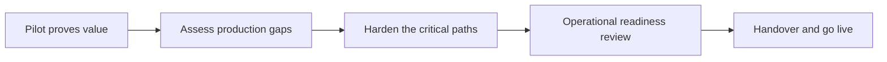

# From Prototype to Production

> **Core skill:** The hardening path — quality, security, operations, and ownership — closing the gap between a successful pilot and a system the customer runs without you.

## Why This Matters

Pilot success is a midpoint, not a finish line. A prototype that delighted a working group has proven the idea; it has not proven that it can run under load, survive bad data, respect permissions, explain its behavior to auditors, recover from failure, or be maintained by anyone other than its author. The distance between those two states is the hardening path, and it is where most enterprise deployments quietly die — not in a dramatic failure, but in a widening gap between a demo everyone liked and a production system nobody quite commits to shipping.

The gap exists because prototypes are optimized for learning and production systems are optimized for standing up to reality. Field prototypes skip error handling because errors interrupt the story; they use admin credentials because access models slow the demo; they avoid scale questions because sample data is small. Each shortcut is rational in its moment and fatal if it silently persists — the same code path that ignored a malformed record in a demo will meet thousands of malformed records in production, in front of users whose trust was earned by the demo.

Hardening is therefore treated as a first-class phase with its own plan, estimates, gates, and ownership — not as cleanup squeezed in after go-live. The FDE's promise to the customer is not that the prototype is production-ready; it is that the path from one to the other is understood, estimated, and resourced before anyone is surprised by it. And the last component of that path, handover, is the true test: production is reached when the customer can operate the system without the FDE in the room.

## What Hardening Actually Adds

| Dimension | Prototype reality | Production requirement |
|-----------|-------------------|------------------------|
| Data | Curated sample; happy path shapes | Full volume, messy cases, drift over time |
| Errors | Interrupting errors suppressed or ignored | Every failure path defined, logged, and recoverable |
| Access | Admin credentials; whoever is nearby | Least-privilege roles mapped to the customer's identity model |
| Scale | Single user, small data | Concurrency, volume, and growth tested at expected bounds |
| Observability | Console logs on the FDE's laptop | Metrics, logs, and alerts the customer's operators can read |
| Audit | Not considered | Actions traceable to actors, per the compliance regime |
| Cost | Someone's cloud sandbox | Metered under the customer's budget with forecasts |
| Ownership | The FDE knows how it works | Customer team owns it, with documentation and escalation paths |

Each row converts a demonstration confidence into an operational one. Hardening estimates should be derived from exactly this table, row by row, for the specific solution.

## The Hardening Path

| Step | Gate | Who signs |
|------|------|-----------|
| 1 | Gap assessment against the production table | FDE and customer technical lead |
| 2 | Hardening plan with estimates and sequencing | Sponsor and vendor delivery lead |
| 3 | Quality, security, and scale work completed | Engineering review or designated approver |
| 4 | Operational readiness review passed | Customer operations and security |
| 5 | Handover package delivered and walked through | Named system owner |
| 6 | Go-live with a defined monitoring window | Change board or equivalent |



The monitoring window after go-live is part of the FDE's commitment, not a courtesy. Systems reveal their real failure modes in the first weeks of actual use, and the FDE should be present for them.

## Handover as a Design Goal

| Element | Weak handover | Strong handover |
|---------|---------------|-----------------|
| Documentation | A README by the author | Runbooks written with the future operator, tested by them |
| Training | One recorded walkthrough | Hands-on sessions where the customer's team operates the system |
| Escalation | "Message me" | Named support path with severity definitions |
| Changes | FDE patches quietly | Change process the customer owns, with FDE as reviewer during transition |
| Knowledge risk | Everything in one head | Two customer engineers can perform every critical operation |

Handover quality is measurable: ask the customer's team to run the critical operations while the FDE watches silently. Whatever they cannot do without help is the remaining scope.

## Practical Applications

### Production Readiness Checklist

- [ ] Every error path defined, logged, and recoverable by an operator
- [ ] Access model uses least privilege and the customer's identity system
- [ ] Volume and concurrency tested at or above expected production bounds
- [ ] Monitoring and alerting target the customer's existing operational tooling
- [ ] A named customer owner exists for every component, with escalation paths
- [ ] Rollback and degradation behavior defined and rehearsed
- [ ] Cost model documented against the customer's budget process
- [ ] Handover exercises passed: the customer operates, the FDE observes

### Go-Live Readiness Memo Snippet

```markdown
## Go-Live Readiness — <system, date>

| Element | Status |
|---------|--------|
| Residual gaps | <what is knowingly not done, with risk and owner> |
| Monitoring window | <dates, coverage, who is on point> |
| Rollback plan | <trigger, steps, decision owner> |
| Owner after handover | <name, team, support path> |
| Accepted risks | <what was consciously accepted, by whom> |
```

## Common Pitfalls

| Pitfall | Why It Is a Problem | Better Approach |
|---------|---------------------|-----------------|
| **Pilot success treated as done** | Enthusiasm about the demo substitutes for production evidence | Run the production gap table before any go-live claim |
| **Hardening underfunded** | The most expensive phase is the least planned | Estimate hardening before the prototype becomes a commitment |
| **Demo-grade identity and permissions** | Admin credentials spread; least privilege arrives too late | Build the access model as part of hardening, not after it |
| **No rollback story** | The first bad release becomes an outage with no retreat | Define and rehearse rollback before go-live |
| **Handover to nobody** | Without a named owner, the system decays at the first staff change | Name the owner before the readiness review, not after |
| **Hiding residual gaps** | Unstated gaps resurface as incidents owned by the FDE | Publish residual gaps and accepted risks with owners |

## Success Indicators

- The hardening estimate and the actual hardening cost land close together
- The customer's own team performs critical operations unaided within weeks of go-live
- Incidents in the monitoring window are handled through the defined paths, not heroics
- The system owner can describe residual risks and accepted trade-offs from memory
- A follow-up release ships through the customer's change process without FDE rescue

## Related Topics

- [[05_Technical_Feasibility_Assessment]]
- [[07_Choosing_the_Right_Engineering_Bar]]
- [[03_Integration_and_Deployment_Engineering/00_overview|Integration and Deployment Engineering]]
- [[05_Enterprise_Navigation_Security_and_Compliance/00_overview|Enterprise Navigation: Security and Compliance]]
- [[software-engineering-note/12_Software_Quality/Software Quality Overview]]

## Summary

From prototype to production is the disciplined hardening path that closes the gap between a pilot people liked and a system the customer runs: a gap assessment against real operational requirements, a resourced plan for quality, security, scale, and observability, an operational readiness gate, and a handover that succeeds only when the customer operates the system without the FDE. The prototype earns the right to harden; the hardening, done honestly and on the record, is what actually ships.
